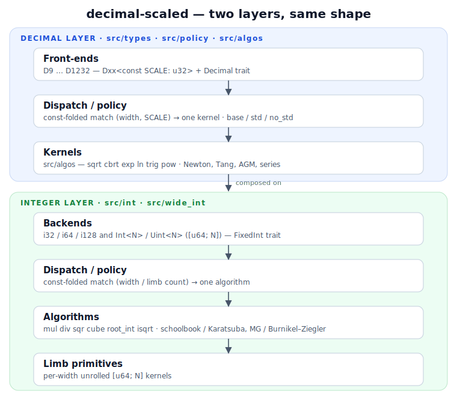

# Architecture

This page is a map of how `decimal-scaled` is put together: the two
layers (integer **backends** and decimal **front-ends**), how a method
call is routed to one specific algorithm with **zero runtime dispatch**,
how unused algorithm variants are **pruned** at compile time, and how the
correctness and performance guarantees are **enforced by testing**.

## The model in one sentence

Every value is a plain integer that encodes `real_value × 10^SCALE`. All
core arithmetic is integer arithmetic, so results are **bit-identical on
every platform**, and the transcendental functions are computed with
integer-only kernels that are **correctly rounded** — within 0.5 ULP of
the true real value at the type's last representable place.

## Two layers, same shape

The crate is **two layers that mirror each other** — a decimal layer on
top of an integer layer. Each has the *same three tiers*: a typed
surface, a **const-folded width dispatch**, and an **algorithm library**.
A decimal kernel expresses its math in integer operations and never
reaches into limb internals directly.



The key point the older sketch hid: **the integer layer is not just
primitives — it has its own dispatch policy and algorithm library**,
mirroring the decimal layer. A `BigInt` method (`mul`, `div`,
`root_int`, …) routes on the compile-time width / limb count to one
matched algorithm — schoolbook below the Karatsuba threshold and the
non-allocating Karatsuba above it, Möller–Granlund divide at the narrow
tiers and Burnikel–Ziegler at the wide ones — and the compiler prunes
the rest, exactly as the decimal policy keys on `(width, SCALE)`. Both
layers compile to a single direct call per monomorphisation.

## A call through the layers

`D57<20>::sqrt_strict()` traverses **both layers' dispatch + kernels**:
the front-end dispatches on `(width, SCALE)` to one decimal algorithm, which
calls the integer layer — itself dispatching on width to a matched
algorithm down to the limb primitives — and hands back a
correctly-rounded raw value.

```mermaid
sequenceDiagram
  autonumber
  participant U as caller
  participant FE as D57 front-end
  participant DP as decimal policy
  participant DK as sqrt algorithm
  participant IP as int policy
  participant IK as int algorithm
  participant L as limb primitives
  U->>FE: sqrt_strict()
  FE->>DP: dispatch (width 192, SCALE 20)
  DP->>DK: const select → matched algorithm
  DK->>IP: root_int / isqrt on Int<3> (BigInt)
  IP->>IK: const-folded → width-matched isqrt
  IK->>L: limb ops on [u64; 3]
  L-->>IK: limbs
  IK-->>DK: integer root + residual
  DK-->>FE: correctly-rounded raw
  FE-->>U: D57 value
```

## Integer backends

The storage under a decimal type is an integer wide enough to hold
`10^MAX_SCALE`:

| Decimal tier | Storage |
|---|---|
| D18 / D38 | `Int<1>` / `Int<2>` |
| D57 … D1232 | `Int<3>` … `Int<64>` |

Every tier is built on a single const-generic pair —
`Uint<const N: usize>` and `Int<const N: usize>` — stored as `[u64; N]`
little-endian limbs (`N` = number of 64-bit limbs; bit width is `N·64`).
Choosing the **limb count** as the one type parameter sidesteps the
`LIMBS = ⌈BITS/64⌉` derivation that a bits-parameterised type cannot
express on stable Rust.

The arithmetic itself lives once, as **reusable width-matched limb
algorithms** (add/sub/mul/div/shift/compare, plus `sqr`, `cube`,
`root_int`, `isqrt`, …) operating over `&[u64]` slices. Because `N` is a
compile-time constant, the limb loops unroll per width and there is no
runtime length to carry. A `BigInt` trait exposes this surface with the
**same method names** as the decimal arithmetic trait, so the two layers
read as one vocabulary.

`src/`:

```
int/                const-generic integer layer
  types/            Int<N>/Uint<N>; the BigInt trait
  policy/           per-width / limb-count algorithm-selection dispatch
  algos/            reusable width-matched algorithms
  limbs/            raw slice limb primitives
```

## Decimal front-ends

Each width is a `Dxx<const SCALE: u32>` newtype around its storage
integer. The number in the name is `MAX_SCALE` (the largest `SCALE` the
storage can hold); `SCALE` is a const-generic so `D38<2>` (cents) and
`D38<18>` are distinct, zero-overhead types. Because a value has exactly
one representation at a fixed scale, `Eq`/`Ord`/`Hash` are derived
straight from the storage bits.

The cross-width API is four traits (`src/types/traits/`):

- `DecimalArithmetic` — operators, sign, integer methods, the
  checked/wrapping/saturating/overflowing families, reductions.
- `DecimalConvert` — round-trip, integer and float bridges.
- `DecimalTranscendental` — `sqrt`/`cbrt`/`exp`/`ln`/trig/hyperbolic/`pow`.
- `Decimal` — marker supertrait combining the above.

The typed method shells (`D57::<20>::sqrt_strict_with(mode)`) are emitted
by macros in `src/macros/` and immediately hand off to the dispatch layer.

## Work-width scratch — exact `ComputeInt`, never build-max

Many algorithms compute in a width *wider* than the value's own `N` u64
limbs: a multiply's `2N` product, a `sqrt` radicand (`2N`), a `cbrt`
radicand (`4N`), the `÷10^w` magnitude (`⌈N/2⌉` u128). Stable Rust cannot
name `[u64; 2N]` from a generic `N`, so the width lives on an
**associated-type buffer** on the storage integer: the `ComputeInt` trait
(`src/int/types/compute_int.rs`) exposes per-`N` constructors —
`single_limbs()` (`N + 2`), `double_limbs()` (`2N`-family), `quad_limbs()`
(`4N`-family), `u128_limbs()` (`⌈N/2⌉` u128). The size is fixed in the
`impl` where `N` is concrete and **never appears in a function signature**:
a kernel bounds on `Int<N>: ComputeInt`, calls the method, and gets an
exactly-sized stack buffer that folds away per monomorphisation.

**The algorithm sources its own exact scratch.** A kernel that needs a
wider width takes `where Int<N>: ComputeInt` and calls the *normal* per-`N`
method (`Int::<N>::double_limbs()`, …). It must **not** pass a work width as
a const-generic argument (`fn f<W, const LW: usize>` where `LW == W::U128_LIMBS`
is a defect — that const-work-width parameter is exactly the wall `ComputeInt`
exists to remove), and it must **not** reach for the build-max blanket.

**The build-max blanket is the fallback of last resort — NOT for
algorithms.** `MAX_SINGLE_LIMBS` / `MAX_DOUBLE_LIMBS` / `MAX_QUADRUPLE_LIMBS`
/ `MAX_U128_LIMB` (and the `max_*_limbs()` constructors), feature-gated via
`MAX_WORK_N`, are sized to the widest tier the build enables. They exist
**only** for the few paths that *structurally cannot* carry a concrete `N`
on stable:

- the blanket `Int<N>` `/` / `%` operators and the `BigInt` methods — `impl
  <const N>` over every `N`; they can neither name `[u64; N + 2]` nor carry a
  `ComputeInt` bound (`ComputeInt: BigInt` is the supertrait, so requiring
  `ComputeInt` on the `BigInt`/operator impl would be a cycle);
- `Display` / radix formatting (`int_fmt`) — blanket over every `N`;
- the runtime-variable-length reciprocal divide (`newton_reciprocal`), whose
  operand limb counts are functions of a runtime `scale`, not any `N`.

Everywhere a concrete `N` is in scope — every algorithm kernel, every
decimal policy and decimal kernel — **use the normal `ComputeInt` methods,
never a `MAX_*` variant.** A `MAX_*` / `max_*_limbs()` use on a concrete-`N`
path is the build-max blanket leaking onto a tier that can size itself
exactly: that is the cross-tier size pollution the Constitution (rule 6)
forbids, and it is a defect to be migrated to `single_limbs()` /
`double_limbs()` / `quad_limbs()` / `u128_limbs()`.

## Algorithm choosing — and pruning

A single function (say `sqrt`) has several possible algorithms — a
small-width kernel, a wide generic kernel, a bespoke kernel for one scale
band, and so on. The choice is made by a **per-function policy**: a
`const fn select`, keyed on the compile-time width(s) and scale(s), that
returns which **`Algorithm`** to run. The exact file shape is in
*Policy file structure* below; the gist:

```rust
const fn select<const N: usize>() -> Select<N> {
    match N {
        0..=2 => Select::ByAlgorithm(Algorithm::Newton),     // small-width kernel
        3..=8 => Select::ByValue(/* the value decides */),   // value-dependent band
        _     => Select::ByAlgorithm(Algorithm::Zimmermann), // the chosen default
    }
}
```

The arms express the levels of choice: a **default** (the algorithm in the
`_` arm), **width/scale-range overrides** (a band picks a different
algorithm), and — where the best algorithm depends on the operand's
*value* rather than its width — a **value matcher** (`ByValue`). Top
matching arm wins.

### Pruning = dead-arm elimination

`W` and `SCALE` are *constants in every monomorphisation*. So for the
concrete type `D57<20>`, the compiler evaluates the match at compile time,
**discards every arm that doesn't match**, and inlines the one that does.
`D57<20>::sqrt` compiles to a direct call to exactly one kernel — no
branch, no table, no vtable. Every other candidate kernel is pruned out
of that type's machine code. This is what makes the rich policy table
**zero runtime cost**.

**What the `const` buys is compile-away, specifically.** `select` is
`const` and keyed only on the const generics, so the inline
`const { select::<…>() }` block evaluates at compile time and the
dispatcher *disappears* — the caller shortcuts straight to the chosen
algorithm. That is all `const` is for here; it is **not** about exposing a
`const fn` public API (a method keeps or loses its own `const`-ness on its
own merits).

**The policy/seam itself has more purposes than compile-away**, and they
are why **every function fits this shape — there is no op that cannot**,
even a single-algorithm one:

- **zero-cost dispatch** — the compile-away above;
- **one obvious place to choose and swap the algorithm** per
  `(width, scale)` cell — the algorithm choice lives in `select`, not
  scattered through the call sites, so swapping or adding a kernel is a
  one-file edit;
- **an isolated, testable dispatch** — the seam is a clean unit to test
  and to **microbenchmark**, so comparing algorithm choices for a cell is
  easy.

A single-algorithm op is therefore still worth a policy: it is a pure
`ByAlgorithm` matcher that folds to one direct kernel call today, and it
gives that op a ready seam to add/swap/bench an algorithm later.

**Layering direction.** The call graph only ever points *down*: a type
method delegates to its `policy::<fn>::dispatch`, the dispatch selects an
**algorithm fn**, and the algorithm computes via **kernels** (or another
tier's policy/method surface). An algorithm fn must **never** call a method
back on its own type (`x.cube()` from inside the cube algorithm is the
inversion — the method and the algorithm have swapped roles). The impl
lives in the algorithm/kernel; methods are thin delegators down. Each
algorithm — even a trivial schoolbook — is a named `<function>_<method>`
in its own file under `algos/<function>/` (int: `int/algos/<function>/`),
not inlined in the policy and not dismissed for being simple.

**The property holds through `ByValue` too — it is a residue, not an
exception.** Where the algorithm depends on the runtime *value*, the const
`select` has *already* pruned every other arm and folded the cell down to
the one value-matcher it picked **before** any value is examined. So the
only thing surviving into the binary is the irreducible value check
itself: one non-capturing `fn(&…) -> Algorithm` returning a tag, then the
`match` on that tag — about as cheap as a plain function call. The
selection was const; only the value-dependent choice (which genuinely
*needs* the value) remains.

### Feature-flagging a variation

A feature- or platform-specific variation lives in the policy file, gated where
it belongs:

- a `#[cfg(feature = "…")]` arm inside `select` — pick a different `Algorithm`
  for some widths when the flag is on;
- a cfg-gated value-matcher — a different runtime split under the flag;
- a cfg-gated `Algorithm` variant (plus its dispatch arm) — an algorithm that
  only exists under the flag.

```rust
// a `std`-only algorithm — variant, chosen kernel, and dispatch arm are gated
// together, so the policy stays exhaustive in BOTH configs.
enum Algorithm { Newton, Zimmermann, #[cfg(feature = "std")] StdSeeded }

#[cfg(feature = "std")]      const fn small() -> Algorithm { Algorithm::StdSeeded }  // with `std`
#[cfg(not(feature = "std"))] const fn small() -> Algorithm { Algorithm::Newton }     // core default

const fn select<const N: usize>() -> Select<N> {
    match N {
        0..=2 => Select::ByAlgorithm(small()),                 // std-swapped via the gated fn
        _     => Select::ByAlgorithm(Algorithm::Zimmermann),
    }
}
// in the dispatch, the std arm is gated to match the variant:
//   #[cfg(feature = "std")] Algorithm::StdSeeded => isqrt_std_seeded::<N>(x),
```

The unflagged policy is the default; the flag adds or overrides arms beside it,
in the same file. If a flagged variation uses `f64`, it is only ever a **seed**
to a self-correcting integer iteration — the exact integer termination pins the
unique result, so determinism holds regardless of the platform's `f64`.

### Policy file structure (the per-function matcher)

Each dispatched function (`sqrt`, `mul`, `exp`, …) has **one policy file** with a
fixed shape. Agents implementing or extending a policy follow this template
exactly. The dispatch key is the compile-time width(s) and scale(s) —
`N` (int unary), `(N, M)` (int binary), `(N, SCALE)` (decimal unary), or
`(N, M, S1, S2)` (decimal binary).

```rust
// 1. the real algorithms for this function — NAMED, paper-based, no `Default`.
#[derive(Clone, Copy, PartialEq, Eq)]
enum Algorithm { Newton, Zimmermann }

// 2. the const verdict: a settled algorithm, or "the value decides".
#[derive(Clone, Copy)]
enum Select<const N: usize> {
    ByAlgorithm(Algorithm),                // width/scale settled it
    ByValue(fn(&Int<N>) -> Algorithm),     // value-dependent (non-capturing fn / closure)
}

// 3. the matcher: a `const fn`, keyed ONLY on the const generics, total over the key.
const fn select<const N: usize>() -> Select<N> {
    match N {
        0..=2 => Select::ByAlgorithm(Algorithm::Newton),
        3..=8 => Select::ByValue(|v: &Int<N>|           // value-matcher (see placement rule)
            if v.bit_length() <= 128 { Algorithm::Newton } else { Algorithm::Zimmermann }),
        _     => Select::ByAlgorithm(Algorithm::Zimmermann),   // the chosen default (a real algorithm)
    }
}

// 4. the public function: resolve the verdict, then dispatch — exhaustively, no panic.
pub fn isqrt<const N: usize>(x: Int<N>) -> Int<N> {
    let algo = match const { select::<N>() } {          // inline const block: folds at compile time, can see `N`
        Select::ByAlgorithm(a) => a,
        Select::ByValue(f)     => f(&x),                // the ONE place a runtime value enters
    };
    match algo {                                        // exhaustive over `Algorithm` — no `_`, no `unreachable!()`
        Algorithm::Newton     => isqrt_newton::<N>(x),
        Algorithm::Zimmermann => isqrt_zimmermann::<N>(x),
    }
}
```

Rules that make this work:

- **`Algorithm` lists real algorithms only — no `Default` variant.** Completeness
  is structural: `select` is total over the key, and `match algo` is exhaustive
  over `Algorithm` (both compiler-enforced). The "default" for unspecialised
  widths is simply the real algorithm named in `select`'s `_` arm.
- **Algorithm fn/module naming = `<function>_<method>[_with_<method2>][_variant]`.**
  Prepend the function it performs (`sqrt_`, `cbrt_`, `div_`, `mul_`, `exp_`, …),
  then the literature/paper method (`newton`, `knuth`, `karatsuba`, `mg_divide`,
  `burnikel_ziegler`, `tang`, `series`, …). Hybrids keep the other method's **full
  name**: `div_tang_with_mg_divide`, `div_newton_with_mg_divide`. Append a sensible
  `_variant` only to disambiguate. **Widths are const-generic params: PREFER one
  algorithm generic over `N`, serving a *range* of limb counts via the matcher's
  range arms (`min..=max`).** A width-encoded name is a **last resort** — only when
  the algorithm genuinely cannot be generic *and* the method / `_with_` / variant
  names can't disambiguate; then suffix the **limb count** as `<N>_limb` (e.g.
  `mul_karatsuba_4_limb` for `Int<4>`), never `_int2`, bit-width, or `dXX`. The `Algorithm` *enum variant*
  = **CamelCase of the fn name minus its function prefix** (`sqrt_newton`→`Newton`,
  `sqrt_newton_with_table_seed`→`NewtonWithTableSeed`) — a strict 1:1 variant↔fn mapping.
- **`select` is `const`, called via an inline `const { … }` block, keyed only on
  the const generics.** Per monomorphisation `const { select::<N>() }` evaluates
  to a constant `Select`, so the matches fold and every unchosen arm is
  dead-arm-eliminated (the pruning above). The policy is zero runtime cost; a
  `ByValue` arm leaves only the irreducible value check (the const selection of
  *which* matcher still folds away — see "Pruning" above). _(Use the
  inline `const { }` block, not a `const SEL: Select<N>` item — a `const` item may
  not reference the function's generic `N`; the inline block can.)_
- **Value matcher** (`ByValue`) — for the rare case where the best algorithm
  depends on the operand's *value* (e.g. actual magnitude), not just its width:
  - **non-capturing**, takes the value, and **returns an `Algorithm` tag** (never
    a function pointer — the tag keeps dispatch a direct call);
  - **placement by size:** ≤2 outcomes → inline closure `if`/`else`; 3–10 →
    inline closure `match`; >10 (or shared / unit-tested) → a named `#[inline]`
    fn `<function_name>_<applicable_preconditions>`;
  - **the suffix names the arm's applicable preconditions — its count/shape
    varies with the matcher:** a single int width is `sqrt_N5`, an int width-range
    is `sqrt_N5_to_N10`, a decimal arm adds scale (e.g. `sqrt_N2_S0_to_S9`). Encode
    exactly the preconditions that apply.
- **`core`-only.** One policy per function, compiling on every platform;
  feature- or platform-specific variations are gated inside it (see
  *Feature-flagging a variation* above).
- **Acceptance gate:** the zero-runtime-branch property is a *release* property;
  it is proven per function by inspecting the release IR/asm (one direct call, no
  branch/table/vtable on the const path).

### Keeping the alternatives

Algorithms that lose at today's widths (FFT/NTT multiplication, AGM below
~D1232, …) are not deleted. They are preserved as documented references
and, where the implementation is genuinely different, as compiled-out
code — because a future CPU/LLVM instruction or a platform-specific build
can flip a today-loser into a winner. See `ALGORITHMS.md`.

## How the guarantees are enforced — by testing

The architecture's two headline promises are **platform determinism** and
**correct rounding**, and both are nailed down by tests rather than
asserted by hope.

**Determinism** falls out of the design (integer-only core, no floating
point in results) and is exercised by the cross-platform CI matrix and
bit-exact fixtures.

**Correct rounding** is the contract that the strict transcendentals
return the value within 0.5 ULP of the true real value — equivalently,
the **exact correctly-rounded value at the storage scale (0 LSB of
error)**, under *every* rounding mode and at *every* width. It is checked
by independent layers (see `precision-testing.md`):

1. **Hand-computed truth tables** at D38 — the smallest, human-audited net.
2. **Cross-witness** — compute at a tier, recompute the reference at a
   wider storage and rescale; catches storage-bit divergences.
3. **mpmath golden tables** — an external oracle (computed at working
   precision far wider than any tier) for every (function, tier); the
   kernel must match the correctly-rounded oracle **exactly (delta == 0)**
   for all six rounding modes across all widths.
4. **Property fuzz** — identities like `exp(ln x) ≈ x`, `sin²+cos² ≈ 1`,
   and sign symmetries, with deterministic seeds.

The integer backends carry their own bit-exact tests (each algorithm
checked against a schoolbook oracle across widths and edge cases). A
performance change can never silently cost accuracy: the delta == 0
precision suite is a permanent regression gate, so a faster kernel that
rounds wrong turns CI red.

## Where the rounding actually happens

The kernels compute at a wider *working scale* (`SCALE + GUARD` digits)
and then round to the storage scale. For the three nearest modes a fixed
guard is enough; for the directed modes (toward zero / ±∞) the rounding
decision needs the *sign and stickiness* of the sub-LSB residual — which
the divide already computes — and, on the rare inputs sitting within the
kernel's error of a tie, an adaptive widening step (Ziv iteration) settles
it. The result is correct rounding under all six modes with the common,
nearest-mode path paying nothing extra.

## Map of the source tree

```
src/
  int/        const-generic integer layer
    types/    Int<N>/Uint<N> — the [u64; N] limb integers; the BigInt trait
    policy/   per-function `select` dispatch (keyed on limb count N)
    algos/    the algorithms — limb-slice arithmetic (add/mul/divmod/…) + width-matched kernels
  types/      Dxx<SCALE> typed shells, the Decimal trait family, consts
  policy/     per-function `select` dispatch (keyed on width N, SCALE)
  algos/      the algorithms (sqrt cbrt exp ln trig pow …)
  macros/     code generation for the per-type method shells
  support/    rounding modes, errors, display, serde helpers
```
