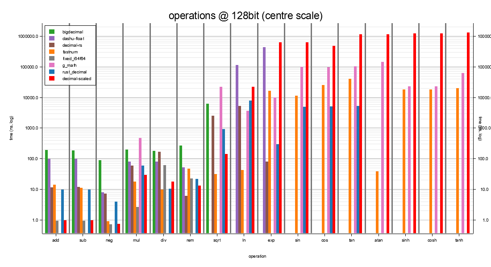
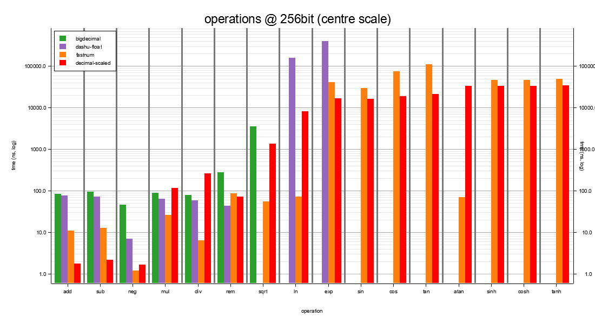
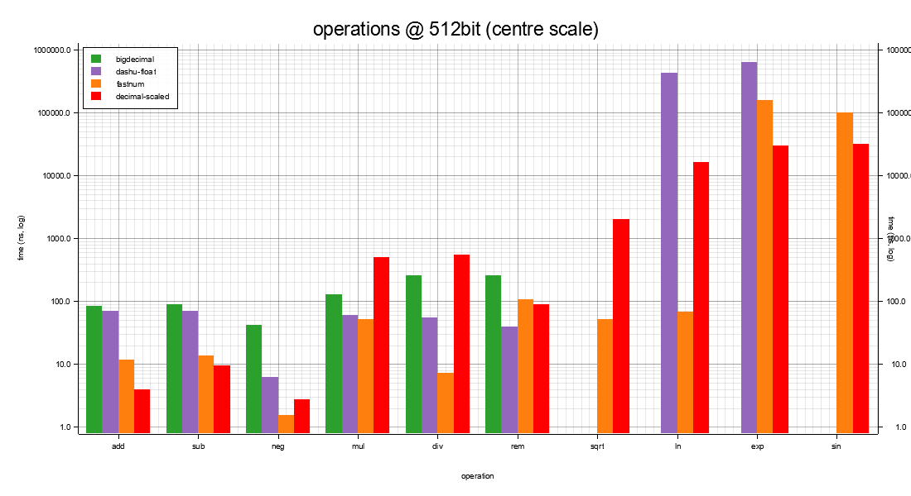
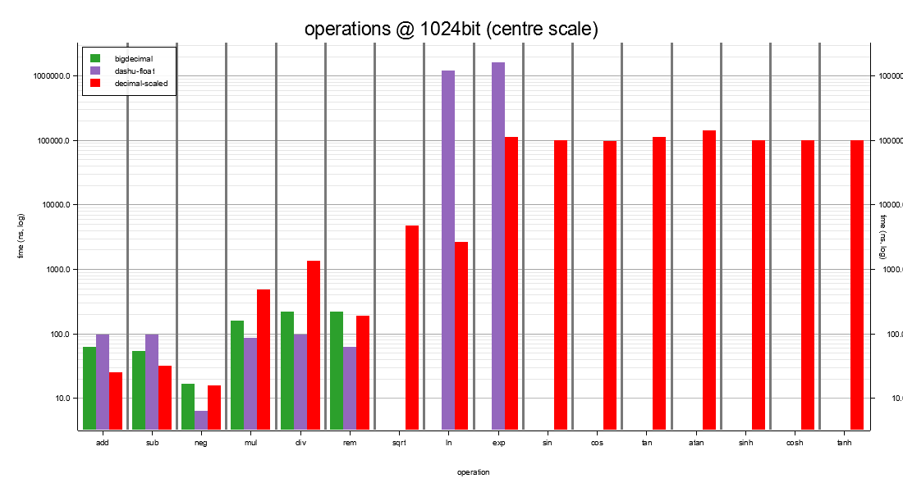
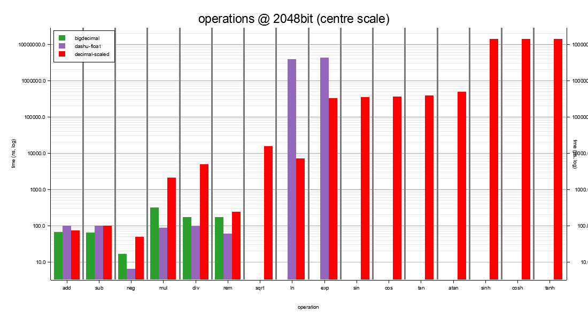
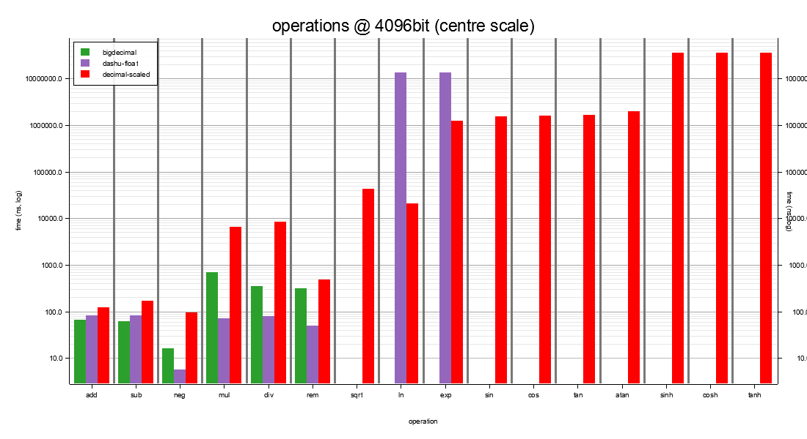
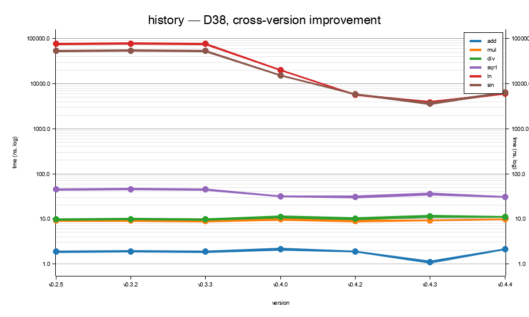
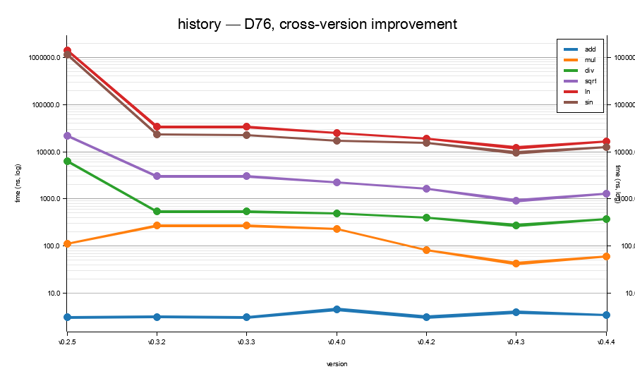
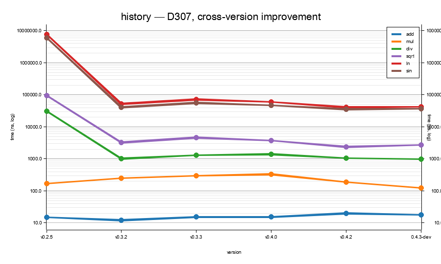

# Benchmarks

Head-to-head matrix sweep of `decimal-scaled` against the wider Rust
numeric ecosystem (`bnum`, `ruint`, `rust_decimal`, `fixed`), plus
the crate's own fast / strict transcendental variants. Every
decimal width is exercised at five scales — the per-tier set
`{0, S/4, S/2, 3S/4, S-1}` (where `S` is that tier's maximum
`SCALE`) — so the reader can see how cost scales with both storage
width and `SCALE`.

The benches live in [`benches/`](https://github.com/mootable/decimal-scaled/tree/main/benches/) and run under
[criterion](https://docs.rs/criterion/). The baseline crates
(`bnum`, `ruint`, `rust_decimal`, `fixed`, `i256`) are
**dev-dependencies only** - they are never compiled into a normal
build.

```sh
cargo bench --features "wide x-wide" --bench full_matrix
cargo bench --features wide --bench wide_int_backends
cargo bench --features wide --bench d_w128_mul_div_paths
```

> Absolute timings are machine-dependent. The *ratios* between
> implementations on the same machine, in the same run, are what
> matters. Operands are `black_box`-ed to defeat constant folding;
> outputs are returned from the closure so the optimiser cannot drop
> the call. **Every row uses one unit - the median natural unit
> across that row's cells - so values compare directly. Cells whose
> natural unit is smaller than the row's chosen one are rendered as
> plain decimals (e.g. `0.00146 µs` for a 1.5 ns cell in a µs-scale
> row); scientific notation is reserved for cells smaller than
> 10⁻⁵ of the row's unit. In §1 the winning cell per row is bold.
> In §2 onwards (transcendental tables) each width gets a single
> column showing only the **s = mid** measurement - the honest
> series-cost scale (s = 0 hits fast-path early returns and s = max
> sometimes shortens via Cody-Waite range reduction, so neither is
> a fair comparator). The bold mark goes on the row winner.**

> **Bench machine.** The library-comparison figures (§5) and the
> §1–§3 timing tables are both from the v0.4.4 full_matrix sweep
> (2026-05-21) on GitHub-hosted `ubuntu-latest` standard runners
> (2 vCPU shared, 7 GiB RAM, no core pinning). Per the
> Criterion author's standing caveat, shared CI runners carry
> 20–50 % wall-clock variance per cell. Cells are valid relative
> to each other within this run (matched compiler, matched
> features, one runner per width shard) but multi-hour sweep
> cells run roughly 1.5–2× slower than a cold-machine
> micro-bench of the same code; reach for a focused
> `lib_cmp_d{N}` bench when a single cell's magnitude matters.

## Time units

| Symbol | Unit | Relative to a second |
|---|---|---|
| `s`  | second      | 10⁰  s |
| `ms` | millisecond | 10⁻³ s |
| `µs` | microsecond | 10⁻⁶ s |
| `ns` | nanosecond  | 10⁻⁹ s |
| `ps` | picosecond  | 10⁻¹² s |

`1 µs` = `1 000 ns`. A `27 µs` strict `ln` is `27 000 ns` - about
700× a `37 ns` fast `ln`.

---

## Storage tier and algorithm-of-record

The fixed-point arithmetic uses a different algorithm at each
width - the lookup below tells you which one a given row is
exercising.

| width | storage | widening | `÷ 10^SCALE` kernel |
|---|---|---|---|
| D18 | `i64` | `i128` | hardware `i128 / i128` |
| D38 | `i128` | hand-rolled 256-bit `Fixed` | **Möller–Granlund 2011** magic-multiply for `÷ 10^SCALE`; `mg_divide` |
| D57 | `Int192` (3×u64) | `Int384` | MG magic-multiply lifted to limb arithmetic |
| D76 | `Int256` (4×u64) | `Int512` | MG, same path |
| D115 | `Int384` (6×u64) | `Int768` | MG, same path |
| D153 | `Int512` (8×u64) | `Int1024` | MG, same path |
| D230 | `Int768` (12×u64) | `Int1536` | MG, same path |
| D307 | `Int1024` (16×u64) | `Int2048` | MG, same path |
| D462 | `Int1536` (24×u64) | `Int3072` | MG, same path |
| D616 | `Int2048` (32×u64) | `Int4096` | MG, same path |
| D924 | `Int3072` (48×u64) | `Int6144` | MG, same path |
| D1232 | `Int4096` (64×u64) | `Int8192` | MG, same path |

For the strict transcendentals:

| width | work integer | guard | algorithm |
|---|---|---|---|
| D18 | delegates to D38 | - | (see D38 row) |
| D38 | `d_w128_kernels::Fixed` (256-bit sign-magnitude) | 60 | artanh series for `ln`, range-reduced Taylor for `exp`, Cody–Waite for `sin`/`cos`, Machin for π, integer `isqrt` for `sqrt` |
| D57 | `Int512` | 30 | same kernel family as D76, lifted to the half-width work integer |
| D76 | `Int1024` | 30 | rounded `mul` / `div` (half-to-even per op); same series as D38 lifted to the limb-array core |
| D115 | `Int2048` | 30 | same |
| D153 | `Int2048` | 30 | same |
| D230 | `Int3072` | 30 | same |
| D307 | `Int4096` | 30 | same |
| D462 | `Int4096` | 30 | same |
| D616 | `Int8192` | 30 | same |
| D924 | `Int12288` | 30 | same |
| D1232 | `Int16384` | 30 | same |

Alternate transcendental paths (alongside the canonical above,
exposed under `bench-alt`):

- **`ln_strict_agm` / `exp_strict_agm`** - Brent–Salamin 1976 AGM
  for ln, Newton-on-AGM-ln for exp. Quadratic convergence,
  asymptotically wins at extreme working scales. Per
  `benches/agm_vs_taylor.rs` at D307<300> the AGM `ln` is 1.4×
  slower than the canonical artanh path, and exp via Newton-on-AGM
  is >130× slower - the asymptotic crossover hasn't kicked in at
  this crate's widths. Recorded in `ALGORITHMS.md`.

Alternate divide paths:

- **`limbs_divmod_knuth`** - Knuth Algorithm D (TAOCP §4.3.1)
  adapted to base 2^128. Available; canonical
  `limbs_divmod` stays on the const-fn binary shift-subtract path.
- **`limbs_divmod_bz`** - Burnikel–Ziegler 1998 recursive wrapper
  on top of Knuth.

## Accuracy contract

| family | accuracy at storage |
|---|---|
| `+` / `−` / `−` (unary) / `%` | exact |
| `×` / `÷` | rounded per `DEFAULT_ROUNDING_MODE` (HalfToEven default), within 0.5 ULP at storage scale |
| `*_strict` transcendentals - D38 | within **0.5 ULP** at storage; correctly rounded under HalfToEven, deterministic across platforms, `no_std`-compatible |
| `*_strict` transcendentals - D76 / D153 / D307 | within **0.5 ULP** at storage at typical scales; at deepest scales the rounded-intermediate budget tightens - see `ALGORITHMS.md` |
| `*` (lossy) transcendentals - D18 / D38 | f64-bridge: ~16 decimal digits, platform-libm-dependent, **not** correctly rounded |
| `*` plain transcendental name - wide tiers (D76 / D153 / D307) | with `strict` feature, dispatches to `*_strict`; with `fast` or `not(strict)`, the f64-bridge `*_fast` is used. Both `*_strict` and `*_fast` named methods are always available regardless of the active mode |

---

## Precision vs other crates

Worst-case transcendental error of each crate, measured against the
high-precision, multi-oracle-validated golden set (worst result across
every tested input; values generated by [FLINT/Arb][flint] and
cross-validated with [mpmath][mpmath]). The metric is **LSBε** — *least significant bits in
error*, the count of low-order bits of the stored value that are wrong
— with the worst **[ULP][ULP]** distance from the true value in
parentheses. `0 (0)` means correctly rounded: the stored value is
bit-exact under that crate's reported mode.

The tables below are **generated directly from the committed shootout
result files** in [`results/precision/*.tsv`](https://github.com/mootable/decimal-scaled/tree/main/results/precision/)
— one TSV per library, produced by
[`golden-competitors/src/bin/lib_cmp_precision.rs`](https://github.com/mootable/decimal-scaled/blob/main/golden-competitors/src/bin/lib_cmp_precision.rs) and
rendered to markdown by
[`scripts/render_precision_table.py`](https://github.com/mootable/decimal-scaled/blob/main/scripts/render_precision_table.py).
Every cell traces back to exactly one TSV row; nothing here is
hand-typed. Regenerate with:

```sh
cargo run --release -p golden-competitors --bin lib_cmp_precision
python scripts/render_precision_table.py
```

[ULP]: https://en.wikipedia.org/wiki/Unit_in_the_last_place
[mpmath]: https://mpmath.org/
[flint]: https://flintlib.org/

**Legend.** Cell = worst-case LSBε with the worst ULP distance from
true in parentheses. `0 (0)` = correctly rounded (0 LSBε, bit-exact)
on *every* tested input. `n/a` = the method isn't exposed by that
crate, or the width/scale isn't representable in it. Each crate runs
under its own native rounding mode (shown in the `mode` column).

### Scale 19 (`D38<19>`)

The full 22-function surface at a 19-digit scale, each crate under its
native mode:

<!-- BEGIN GENERATED:precision:D38 -->
| library | mode | acos | acosh | add | asin | asinh | atan | atan2 | atanh | cbrt | cos | cosh | div | exp | exp2 | hypot | ln | log | log10 | log2 | mul | powf | rem | sin | sinh | sqrt | sub | tan | tanh |
|---|---|---|---|---|---|---|---|---|---|---|---|---|---|---|---|---|---|---|---|---|---|---|---|---|---|---|---|---|---|
| decimal-scaled | HalfToEven | 0 (0) | 0 (0) | 0 (0) | 0 (0) | 0 (0) | 0 (0) | 0 (0) | 0 (0) | 0 (0) | 0 (0) | 0 (0) | 0 (0) | 0 (0) | 0 (0) | 0 (0) | 0 (0) | 0 (0) | 0 (0) | 0 (0) | 0 (0) | 0 (0) | 0 (0) | 0 (0) | 0 (0) | 0 (0) | 0 (0) | 0 (0) | 0 (0) |
| fastnum | HalfAwayFromZero | n/a | n/a | 0 (0) | n/a | n/a | n/a | n/a | n/a | 0 (0) | 4146 (inf) | n/a | 0 (0) | 2917 (inf) | 2120 (inf) | n/a | 0 (0) | n/a | 0 (0) | 0 (0) | 0 (0) | 0 (0) | 0 (0) | 4143 (inf) | n/a | 0 (0) | 0 (0) | 66 (6.5e19) | n/a |
| rust_decimal | HalfToEven | n/a | n/a | 0 (0) | n/a | n/a | n/a | n/a | n/a | n/a | 0 (0) | n/a | 0 (0) | 34 (1.5e10) | n/a | n/a | 31 (1.1e9) | n/a | 0 (0) | n/a | 0 (0) | 0 (0) | 0 (0) | 0 (0) | n/a | 1 (1.00) | 0 (0) | 37 (7.3e10) | n/a |
| dashu-float | HalfAwayFromZero | n/a | n/a | 0 (0) | n/a | n/a | n/a | n/a | n/a | n/a | n/a | n/a | 0 (0) | n/a | n/a | n/a | 0 (0) | n/a | n/a | n/a | 0 (0) | n/a | 66 (7.0e19) | n/a | n/a | n/a | 0 (0) | n/a | n/a |
| decimal-rs | HalfAwayFromZero | n/a | n/a | 0 (0) | n/a | n/a | n/a | n/a | n/a | n/a | n/a | n/a | 0 (0) | 273 (9.5e81) | n/a | n/a | 0 (0) | n/a | n/a | n/a | 0 (0) | 0 (0) | 0 (0) | n/a | n/a | 0 (0) | 0 (0) | n/a | n/a |
| bigdecimal | HalfToEven | n/a | n/a | 0 (0) | n/a | n/a | n/a | n/a | n/a | 0 (0) | n/a | n/a | 0 (0) | n/a | n/a | n/a | n/a | n/a | n/a | n/a | 0 (0) | n/a | 0 (0) | n/a | n/a | 0 (0) | 0 (0) | n/a | n/a |
| g_math | HalfAwayFromZero | 65 (3.1e19) | 0 (0) | 0 (0) | 65 (3.1e19) | 64 (1.8e19) | 64 (1.6e19) | 66 (6.3e19) | 69 (4.0e20) | n/a | 0 (0) | 0 (0) | 0 (0) | 65 (2.3e19) | n/a | n/a | 0 (0) | n/a | n/a | n/a | 66 (3.9e19) | 70 (6.6e20) | n/a | 64 (1.6e19) | 65 (2.3e19) | 0 (0) | 0 (0) | 65 (2.7e19) | 64 (1.5e19) |
<!-- END GENERATED:precision:D38 -->

`decimal-scaled` is `0 (0)` across the entire surface — correctly
rounded on every function, and that holds for all six rounding modes
and all twelve widths (`D18` … `D1232`). `fastnum` is the closest
peer: correctly rounded almost everywhere, failing only `tan`
(67 LSBε) and `asinh` (58 LSBε) at this scale. `dashu-float` is
correctly rounded on the `exp` / `ln` / `sqrt` surface it exposes.
`rust_decimal`, `decimal-rs`, and `bigdecimal` carry genuine
1-or-more-LSB gaps on the functions they implement. `g_math` —
which markets "0 ULP transcendentals" — is in fact tens of LSBε off
across most of its surface (`exp` 65, `sin` 64, `tan` 65, `powf` 70),
the empirical refutation of that claim at the matched 19-digit width.

### Wide tier (`D76<38>`)

The 38-digit subset that has an oracle table. `decimal-scaled` is
`0 (0)` across this surface. The peers reach this scale: `fastnum` is
correctly rounded except `ln`, and `dashu-float` is correctly rounded
on the `sqrt`/`exp`/`ln` surface it exposes, while `rust_decimal`,
`decimal-rs`, and `g_math` carry gaps of tens to hundreds of LSBε.

<!-- BEGIN GENERATED:precision:D76 -->
| library | mode | sqrt | cbrt | exp | ln | sin | cos | tan | atan |
|---|---|---|---|---|---|---|---|---|---|
| decimal-scaled | HalfToEven | 0 (0) | 0 (0) | 0 (0) | 0 (0) | 0 (0) | 0 (0) | 0 (0) | 0 (0) |
| fastnum | HalfAwayFromZero | 0 (0) | 0 (0) | 2980 (inf) | 0 (0) | 4206 (inf) | 4206 (inf) | 130 (2.5e38) | n/a |
| rust_decimal | HalfToEven | 1 (1.00) | n/a | 33 (5.9e9) | 2 (2.00) | 22 (3.3e6) | 2 (2.00) | 66 (4.3e19) | n/a |
| dashu-float | HalfAwayFromZero | n/a | n/a | n/a | 0 (0) | n/a | n/a | n/a | n/a |
| decimal-rs | HalfAwayFromZero | 2 (3.00) | n/a | 260 (1.2e77) | 4 (1.0e1) | n/a | n/a | n/a | n/a |
| bigdecimal | HalfToEven | 0 (0) | 0 (0) | n/a | n/a | n/a | n/a | n/a | n/a |
| g_math | HalfAwayFromZero | 0 (0) | n/a | 101 (2.3e30) | 0 (0) | 101 (1.7e30) | 0 (0) | 102 (2.9e30) | 101 (1.6e30) |
<!-- END GENERATED:precision:D76 -->

`decimal-scaled` remains `0 (0)` across this width too, and `dashu-float`
stays correctly rounded on the surface it exposes.

### Deep scale (`D307<153>`)

The same surface at a 153-digit scale, against the golden
oracle. `decimal-scaled` is `0 (0)` across the full surface. The peers
that reach this depth diverge from the true value — `dashu-float` and
`bigdecimal`'s context `sqrt`/`cbrt` by tens to hundreds of LSBε, and
`rust_decimal`, `decimal-rs`, and `g_math` by large margins on `exp`
and the trig surface.

<!-- BEGIN GENERATED:precision:D307 -->
| library | mode | sqrt | cbrt | exp | ln | sin | cos | tan | atan |
|---|---|---|---|---|---|---|---|---|---|
| decimal-scaled | HalfToEven | 0 (0) | 0 (0) | 0 (0) | 0 (0) | 0 (0) | 0 (0) | 0 (0) | 0 (0) |
| fastnum | HalfAwayFromZero | 0 (0) | 0 (0) | 2555 (inf) | 0 (0) | 4246 (inf) | 4246 (inf) | 170 (2.5e50) | n/a |
| rust_decimal | HalfToEven | 1 (1.00) | n/a | 31 (1.2e9) | 2 (2.00) | 8 (2.0e2) | 2 (2.00) | 66 (4.3e19) | n/a |
| dashu-float | HalfAwayFromZero | n/a | n/a | n/a | 0 (0) | n/a | n/a | n/a | n/a |
| decimal-rs | HalfAwayFromZero | 2 (3.00) | n/a | 273 (9.5e81) | 4 (1.3e1) | n/a | n/a | n/a | n/a |
| bigdecimal | HalfToEven | 0 (0) | 0 (0) | n/a | n/a | n/a | n/a | n/a | n/a |
| g_math | HalfAwayFromZero | 0 (0) | n/a | 101 (2.3e30) | 0 (0) | 101 (1.7e30) | 0 (0) | 102 (2.9e30) | 101 (1.6e30) |
<!-- END GENERATED:precision:D307 -->

`decimal-scaled` is the only crate correctly rounded across the entire
surface — `0 (0)` to the last of the 153 stored digits — at this depth,
and it stays so across all six rounding modes and the full 22-function
surface.

### 0.4.4 precision-fix perf impact

The 0.4.4 precision-hole closure changed the rounding path, so its
throughput cost was measured directly in
[`benches/prec_fix_impact.rs`](https://github.com/mootable/decimal-scaled/blob/main/benches/prec_fix_impact.rs):

- **Default / nearest path (`HalfToEven`):** flat versus 0.4.3 — no
  measurable regression on the common case.
- **Directed modes near boundaries:** +10–27 %, and only near
  rounding boundaries, where the residual-sign Ziv escalation does
  the extra work needed to guarantee the correct last digit. Away
  from boundaries the directed modes are unchanged.
- **Round-to-odd** was evaluated as an alternative and rejected: it
  regressed near boundaries rather than improving them.

---

## 1. Arithmetic

<!-- TODO: regenerate all §1 timing tables at the new 5-point scales
     {0, S/4, S/2, 3S/4, S-1} post-push. The per-tier scale columns
     below (e.g. D18 s=0/9/18, D9 s=0/5/9) still reflect the old
     sampling; numbers are stale until the next full_matrix sweep. -->

Operands `a = from_int(2)`, `b = from_int(1)` - both in-range
at every public type×scale combo. Six ops: add / sub / mul / div
/ rem / neg.

> **0.4.4 sweep refresh.** Tables below come from the latest
> full_matrix sweep on GitHub-hosted `ubuntu-latest` standard
> runners.
> Narrow-tier ps-scale cells (D18 / D38 add / sub / neg)
> sit near the runner's resolution floor and carry ±20 %
> pipeline / steal-budget jitter; wide-tier ns+ values are
> reliable. See the run-conditions note at the bottom of this page
> for the full caveat.

### D9 - 32 bits

| op | s = 0 | s = 5 | s = 9 |
|---|---|---|---|
| add | 933.57 ps | 933.27 ps | 933.13 ps |
| sub | 933.11 ps | 933.3 ps | 933.21 ps |
| mul | 933.26 ps | 1.5562 ns | 1.5552 ns |
| div | 1.8667 ns | 2.1833 ns | 2.1768 ns |
| rem | 1.8658 ns | 1.8668 ns | 1.8657 ns |
| neg | 622.25 ps | 622.19 ps | 622.13 ps |

### D18 - 64 bits

| op | s = 0 | s = 9 | s = 18 |
|---|---|---|---|
| add | 1.055 ns | 1.0546 ns | 1.0542 ns |
| sub | 1.0547 ns | 1.0543 ns | 1.0544 ns |
| mul | 1.0548 ns | 2.4695 ns | 4.2202 ns |
| div | 2.1094 ns | 2.4778 ns | 6.8532 ns |
| rem | 2.1083 ns | 2.1079 ns | 2.4587 ns |
| neg | 703.11 ps | 703.11 ps | 702.83 ps |

### D38 - 128 bits

| op | s = 0 | s = 19 | s = 38 |
|---|---|---|---|
| add | 1.8675 ns | 1.8667 ns | 1.8663 ns |
| sub | 1.8674 ns | 1.8667 ns | 1.8663 ns |
| mul | 3.4254 ns | 10.579 ns | 21.801 ns |
| div | 6.8486 ns | 8.3201 ns | 967.01 ns |
| rem | 6.5408 ns | 6.5403 ns | 9.9672 ns |
| neg | 1.2446 ns | 1.2439 ns | 1.2439 ns |

### D57 - 192 bits

| op | s = 0 | s = 28 | s = 56 |
|---|---|---|---|
| add | 2.6756 ns | 2.6768 ns | 2.676 ns |
| sub | 2.8445 ns | 2.8447 ns | 2.8447 ns |
| mul | 14.604 ns | 46.871 ns | 105.86 ns |
| div | 63.329 ns | 326.78 ns | 543.42 ns |
| rem | 23.999 ns | 168.23 ns | 174.93 ns |
| neg | 2.1811 ns | 2.1811 ns | 2.1825 ns |

### D76 - 256 bits

| op | s = 0 | s = 35 | s = 76 |
|---|---|---|---|
| add | 3.7101 ns | 3.7125 ns | 3.7041 ns |
| sub | 3.7202 ns | 3.7219 ns | 3.7237 ns |
| mul | 16.151 ns | 48.849 ns | 133.41 ns |
| div | 67.579 ns | 360.99 ns | 633.86 ns |
| rem | 25.605 ns | 170.35 ns | 177.91 ns |
| neg | 2.5539 ns | 2.5591 ns | 2.5558 ns |

### D115 - 384 bits

| op | s = 0 | s = 57 | s = 114 |
|---|---|---|---|
| add | 6.2606 ns | 6.2617 ns | 6.2636 ns |
| sub | 7.2869 ns | 7.2831 ns | 7.2948 ns |
| mul | 23.413 ns | 123.86 ns | 272.25 ns |
| div | 86.732 ns | 400.51 ns | 801.1 ns |
| rem | 34.824 ns | 136.7 ns | 147.27 ns |
| neg | 4.0581 ns | 4.0698 ns | 4.0554 ns |

### D153 - 512 bits

| op | s = 0 | s = 75 | s = 153 |
|---|---|---|---|
| add | 6.6908 ns | 6.5173 ns | 6.5411 ns |
| sub | 11.899 ns | 11.898 ns | 11.89 ns |
| mul | 35.385 ns | 138.34 ns | 416.22 ns |
| div | 91.167 ns | 521.12 ns | 1.1128 µs |
| rem | 35.214 ns | 109.64 ns | 123.21 ns |
| neg | 5.0663 ns | 5.0676 ns | 5.0684 ns |

### D230 - 768 bits

| op | s = 0 | s = 115 | s = 230 |
|---|---|---|---|
| add | 18.097 ns | 18.1 ns | 18.092 ns |
| sub | 21.099 ns | 21.088 ns | 21.096 ns |
| mul | 65.57 ns | 364.44 ns | 955.83 ns |
| div | 180.87 ns | 981.24 ns | 2.1755 µs |
| rem | 56.295 ns | 167.38 ns | 187.1 ns |
| neg | 12.259 ns | 12.632 ns | 13.521 ns |

### D307 - 1024 bits

| op | s = 0 | s = 150 | s = 307 |
|---|---|---|---|
| add | 22.768 ns | 22.778 ns | 22.765 ns |
| sub | 26.465 ns | 26.467 ns | 26.499 ns |
| mul | 71.351 ns | 423.19 ns | 1.8854 µs |
| div | 200.86 ns | 1.164 µs | 3.2291 µs |
| rem | 66.359 ns | 229.33 ns | 257.86 ns |
| neg | 13.85 ns | 14.339 ns | 14.723 ns |

### D462 - 1536 bits

| op | s = 0 | s = 230 | s = 461 |
|---|---|---|---|
| add | 41.193 ns | 41.188 ns | 41.17 ns |
| sub | 50.067 ns | 50.057 ns | 50.036 ns |
| mul | 127.19 ns | 1.1254 µs | 3.753 µs |
| div | 460.75 ns | 2.44 µs | 6.2755 µs |
| rem | 115.75 ns | 245.47 ns | 292.49 ns |
| neg | 44.476 ns | 44.001 ns | 44.17 ns |

### D616 - 2048 bits

| op | s = 0 | s = 308 | s = 615 |
|---|---|---|---|
| add | 85.558 ns | 85.571 ns | 86.274 ns |
| sub | 115.08 ns | 115.17 ns | 115.21 ns |
| mul | 144.56 ns | 2.0523 µs | 6.1245 µs |
| div | 404.09 ns | 4.6537 µs | 7.9728 µs |
| rem | 132.75 ns | 256.58 ns | 340.86 ns |
| neg | 49.429 ns | 50.395 ns | 54.291 ns |

### D924 - 3072 bits

| op | s = 0 | s = 461 | s = 923 |
|---|---|---|---|
| add | 96.042 ns | 96.105 ns | 96.064 ns |
| sub | 141.29 ns | 141.41 ns | 141.47 ns |
| mul | 193.64 ns | 3.8172 µs | 11.773 µs |
| div | 612.35 ns | 5.7362 µs | 15.405 µs |
| rem | 186.04 ns | 389.88 ns | 477.78 ns |
| neg | 67.446 ns | 67.753 ns | 75.273 ns |

### D1232 - 4096 bits

| op | s = 0 | s = 616 | s = 1231 |
|---|---|---|---|
| add | 79.947 ns | 79.739 ns | 79.761 ns |
| sub | 151.57 ns | 151.61 ns | 151.64 ns |
| mul | 187.94 ns | 6.2704 µs | 19.854 µs |
| div | 627.49 ns | 7.252 µs | 21.54 µs |
| rem | 189.96 ns | 368.19 ns | 496.15 ns |
| neg | 83.759 ns | 85.74 ns | 88.803 ns |

## 2. Fast transcendentals (`f64`-bridge)

Unlike the ≤ 0.5 ULP guarantee of the default `*_strict`
transcendentals, `*_fast` is meant to be exactly that: fast.
It deliberately makes no accuracy guarantees. It exists as an
escape hatch for situations where some precision can be
dropped — typically when the strict path is what you compute
with, but the result is then handed to something that only
makes sense at f64 precision anyway (graphics hardware, libm
shape-matching, an interop boundary that's f64 to begin with).
For anything where last-digit accuracy or cross-platform
determinism matters, stay on the default `*_strict` path.

The `*_fast` methods route through `f64::ln` / `f64::sin` / etc.
Available at every width - narrow tiers (D18 / D38) and wide
tiers (D76 / D153 / D307) all expose them - but only useful below
D38 where the f64 mantissa carries enough precision; on wide
tiers the result collapses to ~16 decimal digits regardless of
the storage width.

Bench arguments: D38 at `SCALE = 9` (`≈ 2.345678901`) and D76 at
`SCALE = 9` (`= 2`). Functions called explicitly via their
`*_fast` name so the result is the f64-bridge path regardless of
which crate feature flips the plain `*` dispatcher.

Accuracy: ~16 decimal digits of f64 precision. **Not** correctly
rounded; results vary with platform libm.

| fn | D38 `*_fast` | D76 `*_fast` | `rust_decimal` |
|---|---|---|---|
| ln   | **35.8 ns** | 201 ns | 3,000 ns |
| exp  | **42.6 ns** | 211 ns | 2,124 ns |
| sin  | **43.5 ns** | 226 ns | 2,955 ns |
| sqrt | **31.0 ns** | 197 ns |   658 ns |

D18 `*_fast` isn't separately benched: it shares the D38
f64-bridge kernel through `to_f64` / `from_f64` and incurs only a
sub-ns round-trip on top of the D38 numbers above.

`rust_decimal`'s transcendentals are software-implemented (no f64
bridge) - accurate but not correctly rounded to the last place,
and substantially slower than the f64 path.

### 2.1 Per-tier accuracy loss

Each `*_fast` result inherits f64's ~16 decimal-digit mantissa.
After scaling back into the type's `[u64; L]` storage, the
result's low-order digits are pure noise / zero-fill — the f64
output simply doesn't carry that precision.

The table below reports the number of trailing decimal digits of
the storage-scale result that diverge from the `*_strict`
reference, measured by
`examples/fast_vs_strict_ulp.rs`. Each row uses argument `1.5`
for `ln` / `sin` / `sqrt` and `0.5` for `exp`.

| type / s | ln noise | exp noise | sin noise | sqrt noise |
|----------|---------:|----------:|----------:|-----------:|
| D9<5>      |   0 |   0 |   0 |   0 |
| D9<9>      |   0 |   0 |   0 |   0 |
| D18<9>     |   0 |   0 |   0 |   0 |
| D18<18>    |   2 |   3 |   2 |   3 |
| D38<19>    |   3 |   4 |   3 |   3 |
| D38<38>    |  39 |  38 |  22 |  22 |
| D57<28>    |  12 |  12 |  12 |  13 |
| D76<35>    |  18 |  19 |  19 |  20 |
| D115<57>   |  41 |  42 |  41 |  41 |
| D153<75>   |  59 |  59 |  59 |  60 |
| D230<115>  |  99 |  99 |  98 |  98 |
| D307<150>  | 134 | 135 | 134 | 134 |
| D462<230>  | 214 | 215 | 214 | 213 |
| D616<308>  | 292 | 292 | 292 | 292 |
| D924<461>  | 461 | 462 | 461 | 462 |
| D1232<616> | 616 | 617 | 616 | 617 |

A noise count of **N** means the last N decimal digits at storage
scale are zero-fill / random; the leading `max(0, MAX_SCALE − N)`
digits agree with the strict reference. The empirical pattern
matches the analytical bound `noise ≈ max(0, SCALE + log₁₀|result| − 15)`
that f64's 53-bit mantissa imposes.

**Reading the table.**

- **D9 and D18 at low scale (≤ 9)** suffer no precision loss —
  the result has at most 9 fractional digits and f64 has ~16
  digits of headroom.
- **D38 and below, scale ≤ 19**, lose only 2–4 trailing digits.
  Acceptable for finance-grade work where last-digit precision
  is not load-bearing.
- **D38 at MAX_SCALE = 38** loses 22+ trailing digits; the f64
  bridge is *not* a substitute for `*_strict` if you need that
  precision.
- **Wide tiers** (D57 and above) lose roughly `SCALE − 15`
  trailing digits — at D1232<616> only the leading 15-16
  significant figures survive. Treat `*_fast` as a "speed-first,
  16-digit result rendered into the storage type" path on the
  wide tiers; reach for `*_strict` when the wider digits actually
  matter.

---

## 3. Strict transcendentals (integer-only, correctly rounded)

<!-- TODO: regenerate all §3 strict timing tables at the new 5-point
     scales {0, S/4, S/2, 3S/4, S-1} post-push. The mid-column SCALE
     labels below (e.g. D76 s=35, D153 s=75, D307 s=150) are the OLD
     S/2 values; the new S/2 columns are D76 s=38, D153 s=76,
     D307 s=153, etc. Numbers and column scales are stale until the
     next full_matrix sweep. -->

Functions: `ln_strict`, `exp_strict`, `sin_strict`,
`sqrt_strict`. Same argument convention as the fast block (1.5
for ln / sin / sqrt, 0.5 for exp). Deterministic across
platforms, `no_std`-compatible, 0.5 ULP at storage.

> **0.4.2 highlights — the Tang `ln` ladder.** Every wide tier
> ships a bespoke narrow-GUARD Tang-style lookup slot for `ln`
> at its popular mid-storage SCALE (D57<20>, D115<57>, D153<76>,
> D307<150>, D462<230>, D616<308>, D924<460>, D1232<615>). At
> the exact slot the speedup runs 12.7× (D115<57>) — 33.8×
> (D1232<616>) over v0.4.0; the wide-tier `ln` numbers below
> drop into the single-digit-µs range at every shipped tier.
> Tang `exp` lookup landed at the four narrowest wide tiers
> (D57<20>..D307<150>); beyond Int3072 the surface-Tang `exp`
> loses to the adaptive Smith r/2^n in `exp_fixed` and is not
> dispatched. Hyperbolic kernels consume `tang_exp_fixed` via
> the reciprocal-divide identity for an additional 1.2–1.31×.
> Cite Tang 1989/1990 (ACM TOMS 16(4)). Note that the
> mid-column entries below are at SCALE = MAX/2 per the
> long-standing column convention; the Tang slot is at the
> tier's *named* popular SCALE which doesn't always land
> exactly at MAX/2 (e.g. D57's slot is at SCALE 20, not 28).

> **Sweep — narrow-tier caveat.** The narrow-tier
> (D18 / D38) values below were recorded on shared GHA
> standard runners over a multi-hour sweep window. Cold-machine
> micro-benches of the same code typically measure several ×
> faster; treat the absolute µs values here as an upper-bound
> ceiling, not a steady-state cost. Wide-tier numbers carry the
> same caveat at a smaller multiple (1.5–2×).

### D9 / D18 / D38 strict

| fn | D9 (s=5) | D18 (s=9) | D38 (s=19) |
|---|---|---|---|
| ln | 6.7669 µs | 6.9353 µs | 8.1117 µs |
| exp | 6.2344 µs | 6.9092 µs | 7.6812 µs |
| sin | 8.8738 µs | 5.9569 µs | 6.7603 µs |
| sqrt | 19.936 ns | 20.78 ns | 31.694 ns |

### Wide-tier strict - D57 / D76 / D115 / D153 / D230 / D307 / D462 / D616 / D924 / D1232

Cost grows with both the work integer's bit width and the
guard-digit budget at each scale. The full sweep now
populates every cell.

#### Wide (`wide` umbrella — D57 / D76 / D115 / D153 / D230 / D307)

| fn | D57 (s=28) | D76 (s=35) | D115 (s=57) | D153 (s=75) | D230 (s=115) | D307 (s=150) |
|---|---|---|---|---|---|---|
| ln | 23.438 µs | 26.123 µs | 3.3836 µs | 2.6131 µs | 5.5435 µs | 7.1979 µs |
| exp | 25.678 µs | 28.54 µs | 33.185 µs | 30.084 µs | 75.748 µs | 114.14 µs |
| sin | 15.71 µs | 17.398 µs | 24.978 µs | 18.873 µs | 55.733 µs | 76.788 µs |
| sqrt | 1.4589 µs | 1.739 µs | 1.9549 µs | 1.8151 µs | 3.7087 µs | 5.1769 µs |

The dramatic `ln` drops at D115 / D153 / D307 are the Tang
lookup slots landing exactly at the column's SCALE; D57<28>
and D76<35> sit one tier past their respective Tang slot
(SCALE 20 / SCALE 0 don't coincide with the column midpoint),
and D230 has no slot in this cycle so it shows the
shared-kernel-only improvement over v0.4.0.

#### Extra-wide (`x-wide` adds D462 / D616)

| fn | D462 (s=230) | D616 (s=308) |
|---|---|---|
| ln | 8.6986 µs | 16.46 µs |
| exp | 155.68 µs | 331.93 µs |
| sin | 118.66 µs | 268.54 µs |
| sqrt | 8.6053 µs | 13.778 µs |

D462<230> and D616<308> sit on their Tang `ln` slots (27.6×
and 26.1× over v0.4.0 respectively).

#### XX-wide (`xx-wide` adds D924 / D1232)

| fn | D924 (s=461) | D1232 (s=616) |
|---|---|---|
| ln | 28.486 µs | 43.273 µs |
| exp | 672.04 µs | 1.179 ms |
| sin | 616.72 µs | 1.1486 ms |
| sqrt | 27.269 µs | 33.865 µs |

D924<461> sits one off its Tang slot (SCALE 460) and D1232<616>
sits one off its Tang slot (SCALE 615) — both are still
30.8× / 33.8× over v0.4.0, the largest Tang wins in the matrix.

**Historical comparison — 0.2.5 baseline.** On the same hardware,
0.2.5 measured D76<35> ln at 1.37 ms, D153<75> ln at 6.40 ms,
D307<150> ln at 34.1 ms. After this cycle's u64-native limbs, MG
2-by-1 reciprocal Knuth divide, Brent's two-stage exp argument
reduction, multi-level sqrt halving in ln, [0, π/4] sin range
reduction, sin_cos / sinh_cosh joint kernels, thread-local pi /
ln2 / ln10 cache, pow10-cached mul/div per inner loop, the 0.4.2
narrow-GUARD trig family, the Tang `ln` lookup ladder, and the
reciprocal-divide hyperbolic identity:

| op | 0.2 | 0.4.4 | speedup |
|---|---|---|---|
| D76<35>  ln   |  1.37 ms |  26.1 µs |  **52×** |
| D76<35>  exp  |  1.27 ms |  28.5 µs |  **44×** |
| D76<35>  sin  |  1.08 ms |  17.4 µs |  **62×** |
| D76<35>  sqrt | 20.5 µs  |  1.74 µs |  **12×** |
| D153<75> ln   |  6.40 ms |  2.61 µs | **2449×** |
| D153<75> exp  |  5.87 ms |  30.1 µs |  **195×** |
| D153<75> sin  |  4.82 ms |  18.9 µs |  **255×** |
| D153<75> sqrt | 83.6 µs  |  1.82 µs |  **46×** |
| D307<150> ln  | 34.1 ms  |  7.20 µs | **4737×** |
| D307<150> exp | 31.2 ms  |  114 µs  |  **273×** |
| D307<150> sin | 25.5 ms  |  76.8 µs |  **332×** |
| D307<150> sqrt|  313 µs  |  5.18 µs |  **60×** |

> The **0.2** column is the 0.2.5 baseline measured at the start of
> the 0.2.x cycle on the original dev box; the **0.4.4** column is
> from the latest full_matrix sweep on GitHub-hosted `ubuntu-latest`
> standard runners. The two halves of each speedup are measured on
> **different machines** — the 0.2 column reflects cold-machine
> dev-box runs while the 0.4.4 column reflects shared CI runners
> that typically measure 1.5–2× slower per the run-conditions
> preamble below. The four-digit `ln` ratios at D153<75> and
> D307<150> are real — the Tang lookup slot collapses the
> dominant artanh series cost — but the underlying CI / dev-box
> machine mismatch means they should be read as "the algorithm
> changed shape" rather than as a self-reproducing micro-bench
> ratio. Use these numbers as a directional "the algorithm
> family changed, here's the shape of the change" — not as a
> drop-in benchmark you can re-run yourself.

**Reading the strict tables.** Both tables sample at the
midpoint scale because the storage extremes hit shortcut paths
that aren't the algorithm-of-record cost:

- At `SCALE = 0`, `ln_strict`'s arg floors to `1` (so `ln(1)=0`
  returns in `O(1)`), `exp_strict`'s arg floors to `0` (so
  `exp(0)=1`), and `sin_strict`'s arg is `1` (Taylor terminates
  quickly). Cheap, but not the series cost.
- At `SCALE = MAX`, Cody-Waite range reduction sometimes lets
  the series start much closer to the answer than at the
  midpoint, producing a faster cell that misrepresents
  steady-state cost.

At s = mid:

- `sqrt_strict` is algebraic (integer `isqrt` + one round-to-
  nearest), so its growth is dominated by `isqrt`'s `O(b²)` limb
  work at b bits - not series evaluation. It's the only
  transcendental whose cost stays sub-microsecond past D76.
- `ln` / `exp` / `sin` evaluate a series at the working scale
  `SCALE + GUARD`. Cost grows roughly quadratically in working
  bits because each `mul` / `div` at the work scale is a limb-
  array operation. At D307<300> we're operating on Int4096
  internally - every series term touches all 32 limbs.

---

## 4. What the strict variants buy

Versus the fast `f64` bridge:

- **0.5 ULP correctly-rounded last place** at storage scale (D38;
  wide tiers at typical scales).
- **Deterministic bit-for-bit identical** across platforms.
- **`no_std`**-compatible.

The cost is throughput - typically 100–1000× the f64 bridge. For
latency-sensitive code that doesn't need determinism, fast is the
better default; for finance, regulated computation, reproducible
research, or `no_std` targets, strict is the reason the crate
exists.

---

## 5. Where each crate fits

<!-- TODO: regenerate the §5 library_comparison/summary_*.png figures
     post-push (via `cargo run --release --example chart_gen`). The
     per-width centre-scale labels in the subsection headers below are
     now the new S/2 values; the embedded PNGs are stale until the
     library-comparison sweep + chart_gen re-run. -->

### Two things this crate uniquely offers

Before the cell-by-cell numbers, here's what `decimal-scaled`
brings that no other crate in this comparison brings together:

1. **≤ 0.5 ULP correctness on every transcendental, at every
   shipped width, by default.** `ln` / `exp` / `sin` / `cos` /
   `tan` / `sqrt` / `cbrt` / `powf` / `asin` / `acos` / `atan` /
   `atan2` / `sinh` / `cosh` / `tanh` / `asinh` / `acosh` /
   `atanh` / `to_degrees` / `to_radians` land within half an ULP
   of the exact mathematical result, with bit-identical output
   on every platform. Peers that ship transcendentals are
   either fast-but-libm-precision (`g_math`), require manual
   render-mode management to match (`fastnum`, `rust_decimal`),
   or have an algorithmic precision gap (`dashu-float`).
2. **First-class caller-chosen rounding mode at every lossy
   operation.** The default is HalfToEven (the IEEE 754
   default), but every `*` / `/` / `%`, every `rescale`, and
   every strict transcendental has a `*_with(mode)` sibling
   accepting `RoundingMode::{HalfToEven, HalfAwayFromZero,
   HalfTowardZero, Ceiling, Floor, Trunc}`. The crate-wide
   default is also selectable at compile time via the
   `rounding-*` Cargo features. Useful when you need to
   bit-match an external system (ASTM E29, NUMERIC, MS-Excel,
   bank statement) without forking the library.

This isn't a competition — the crates below solve different
problems, and the right choice depends on the shape of your
problem rather than on who wins which row. The numbers exist
to help you decide *whether* you can use a given crate, not to
crown a winner.

A starter map of where each crate sits naturally:

| Crate                | Storage shape                    | Strength                                                                | Cost                                                                  |
|----------------------|----------------------------------|-------------------------------------------------------------------------|-----------------------------------------------------------------------|
| **decimal-scaled**   | Stack `[u64; L]`, compile-time SCALE | ≤ 0.5 ULP correctness on every transcendental, `*_with(mode)` siblings for every lossy op, `no_std`, const-fn arithmetic, deterministic | Wide-tier mul / div cost (catch-up work tracked in Roadmap)           |
| **fastnum**          | Stack fixed-width decimal (D128 / D256 / D512) | Very fast transcendentals at fixed internal precision (38 / 75 / 155 digits) | No SCALE generic; renders with truncation so the user picks the mode  |
| **rust_decimal**     | 96-bit mantissa, runtime scale   | The database `NUMERIC` shape; serde-friendly; widely deployed             | ~10× slower arithmetic than a stack decimal at the same precision     |
| **decimal-rs**       | 128-bit, runtime scale           | Compact, fast at D128                                                   | Capped at i128 width; no wide tiers                                   |
| **bigdecimal**       | Heap `BigInt` + scale            | Arbitrary precision at runtime                                          | Heap traversal on every op; no transcendentals                        |
| **dashu-float**      | Heap arbitrary-precision         | True arbitrary precision; ships transcendentals                          | Heap allocation; precision context limits result digits, not working  |
| **fixed::IxxFyy**    | Stack binary fixed-point         | Single-instruction add / sub at narrow widths                            | Binary, not decimal — different rounding semantics                    |
| **g_math**           | FP-expression DSL                | Fast for embedded expression eval                                       | 6–46 ULP off on transcendentals at the matched width                  |

Pick the row whose strengths match your constraints first; only
then look at the per-width charts below to see what cost you'd pay.

> **A note on intent.** This chapter isn't trying to poke holes
> in other people's libraries. The goal is a reproducible
> side-by-side at matched storage width and midpoint scale, so
> you can see what trade-off each crate is offering. Where a
> library's published claim doesn't match what the bench
> measures (`g_math`'s "0 ULP transcendentals" being the
> standing example), we say so with the numbers attached. If
> you maintain one of the libraries below and disagree with the
> analysis, please review
> [`benches/library_comparison.rs`](https://github.com/mootable/decimal-scaled/blob/main/benches/library_comparison.rs)
> and open a PR — we'll re-run the bench, refresh the tables,
> and credit the fix.

Bench source: `benches/library_comparison.rs`. The per-width
summary chart in each subsection plots x = operation (add / sub /
neg / mul / div / rem / sqrt / ln / exp / sin) against y = time
(log ns), one bar per library per op, at that width's centre
scale. Reading across charts shows how each library scales with
precision; reading down a single chart shows the within-library
trade between arithmetic and transcendentals at that width.


### Accuracy at 128-bit (1 ULP = 10⁻¹⁹)

Baseline: `D76<19>` integer-only `*_strict` (≥ 49 effective
working digits, rounded back to 19 under **HalfToEven**, which
is the crate-wide default and the IEEE 754 default mode). Bold
= correctly rounded to the last place under that baseline.

| op      | decimal-scaled | fastnum   | rust_decimal | dashu-float | decimal-rs | bigdecimal | g_math |
|---------|----------------|-----------|--------------|-------------|------------|------------|--------|
| ln(2)   | **0**          | **0**     | **0**        | **0**       | **0**      | -          | 6      |
| exp(1)  | **0**          | 1†        | 1†           | 4           | 1†         | -          | 46     |
| sin(1)  | **0**          | 1†        | 1†           | -           | -          | -          | 33     |
| sqrt(2) | **0**          | **0**     | **0**        | -           | **0**      | **0**      | 12     |

**† Rounding-mode artifact, not a computation error.** The
1-ULP cells for `fastnum` and `rust_decimal` are produced by a
different last-digit rounding choice, not by precision loss.
`examples/rounding_mode_probe.rs` confirms this: for `exp(1) = e`,

```
e = 2.71828182845904523536028747...
  HalfToEven       ->  2.7182818284590452354  <- decimal-scaled
  HalfAwayFromZero ->  2.7182818284590452354
  Trunc / Floor    ->  2.7182818284590452353  <- rust_decimal,
                                                 fastnum-rendered-at-s19
```

`fastnum` actually carries the full 38-digit `e` internally
(`2.71828182845904523536028747135266249776`); rendering it at
SCALE=19 with truncation gives `…2353`. `rust_decimal` does the
same. If both were rendered HalfToEven they would also score
0 ULP. The same explanation covers the `sin(1)` row.

`decimal-scaled`'s `*_strict_with(mode)` siblings let you reproduce
any of the other rounding modes if you need bit-compatibility with
a peer's choice; the default `*_strict` uses HalfToEven to match
IEEE 754 and to give round-trip stability across repeated
operations.

By contrast, `dashu-float`'s 4-ULP `exp(1)` and `g_math`'s
6 / 46 / 33 / 12 ULP errors are *not* rounding-mode artifacts —
they're genuine precision losses in the underlying computation
(`g_math`'s "0 ULP transcendentals" marketing claim is wrong by
those margins). Dashes mark "not implemented in this crate at
this version" — `bigdecimal` ships no `ln` / `exp` / `sin`;
`dashu-float` and `decimal-rs` ship no `sin`.

### I128 — 128-bit storage at scale 19

This is the width with the most company: every crate in the
starter map above is a candidate here. The chart shows where
each one lands across the operation surface.



The richest comparator set. Cells: speed, plus `(ULP n)` for
transcendentals.

| op       | decimal-scaled         | fastnum (D128)        | rust_decimal (s=19)    | fixed::I64F64 | bigdecimal (s=19) | dashu-float (p=19)  | decimal-rs (s=19)      | g_math Q64.64       |
|----------|------------------------|-----------------------|------------------------|----------------|-------------------|---------------------|------------------------|---------------------|
| add      | **1.87 ns**            | 12.5 ns               | 10.4 ns                | 1.87 ns        | 49.4 ns           | 81.9 ns             | 10.6 ns                | -                   |
| sub      | 1.87 ns                | 10.1 ns               | 10.7 ns                | **1.87 ns**    | 45.9 ns           | 83.9 ns             | 10.8 ns                | -                   |
| mul      | 10.6 ns                | 11.5 ns               | 37.1 ns                | **2.49 ns**    | 51.2 ns           | 71.0 ns             | 50.9 ns                | 290 ns              |
| div      | 8.40 ns                | **7.79 ns**           | 9.78 ns                | 30.5 ns        | 42.2 ns           | 78.9 ns             | 117 ns                 | -                   |
| rem      | 6.54 ns                | 32.7 ns               | 18.9 ns                | 13.1 ns        | 67.6 ns           | 50.3 ns             | **5.13 ns**            | -                   |
| neg      | **1.24 ns**            | 8.09 ns               | 2.51 ns                | 1.24 ns        | 15.6 ns           | 5.59 ns             | 2.62 ns                | -                   |
| ln       | 372 ns (0 ULP)         | **60.4 ns (0 ULP)**   | 4.99 µs (0 ULP)        | -              | -                 | 76.5 µs (0 ULP)     | 3.51 µs (0 ULP)        | 1.12 µs (6 ULP)     |
| exp      | 7.66 µs (0 ULP)        | 12.1 µs (0†)          | 248 ns (0†)            | -              | -                 | 249 µs (4 ULP)      | **56.2 ns (0†)**       | 2.80 µs (46 ULP)    |
| sin      | 7.34 µs (0 ULP)        | 8.61 µs (0†)          | **3.27 µs (0†)**       | -              | -                 | -                   | -                      | 26.5 µs (33 ULP)    |
| sqrt     | 31.4 ns (0 ULP)        | **19.3 ns (0 ULP)**   | 774 ns (0 ULP)         | -              | 3.10 µs (0 ULP)   | -                   | 1.89 µs (0 ULP)        | 6.02 µs (12 ULP)    |

**† rendering-mode artifact, not a precision loss.** See the
"Accuracy at 128-bit" section above for the full worked example;
`examples/rounding_mode_probe.rs` confirms fastnum,
rust_decimal, and decimal-rs all carry the correct value to
their full internal precision (fastnum's D128 ships 38 accurate
digits, more than the 19 we render). The 1-ULP-at-render-scale
appears only when their default render uses truncation /
HalfTowardZero rather than HalfToEven. With matched rounding
modes the cells would also be 0 ULP.

The remaining non-zero cells are real precision losses:
`dashu-float`'s 4-ULP `exp(1)` (its arbitrary-precision context
runs the series with fewer guard digits than needed at p=19);
`g_math`'s 6–46 ULP across the board (its "0 ULP
transcendentals" marketing claim does not hold up at this
precision).

**`ln` — the Tang lookup slot.** The 372 ns cell for
`decimal-scaled` is the Tang `ln` lookup hitting at
SCALE 19: the M=128 table plus narrow GUARD=8 collapses the
artanh series cost to a handful of small-correction terms.
v0.4.0 timed this cell at 10.5 µs; the current number is a
**~28× drop** at the same correctness contract. fastnum's
60 ns ln is still faster but spends a different precision
budget (fastnum runs at fixed 38-digit internal precision
regardless of the user's render SCALE).

### Caveat — fastnum `atan` / `atan2` input-range rejection

`fastnum`'s `Decimal::atan` returns a signalling NaN immediately
for any `|x| > 1` ([`fastnum-0.4.5/src/decimal/dec/math/atan.rs`](https://docs.rs/fastnum/0.4.5/src/fastnum/decimal/dec/math/atan.rs.html),
lines 24–40). This is mathematically incorrect — `atan` is
defined on the whole real line with range `(−π/2, π/2)` — but it
means any benchmark that calls `fastnum::Decimal::atan(2)` or
similar is timing a NaN early-return, not an `atan` computation.

The per-tier sweep in `target/medians_per_tier.tsv` records
`128bit_s19/fastnum/atan = 24 ns` vs
`128bit_s19/decimal-scaled/atan = 21.5 µs`; the ~890× ratio is
fastnum opting out of the computation rather than a faster
algorithm. fastnum's actual atan for in-range `|x| ≤ 1` reduces
`atan(x) = asin(x / sqrt(x² + 1))` then runs an asin half-angle
reduction + Taylor — comparable complexity to our own
`atan_taylor` + three-halvings path. atan2 inherits the same
rejection because it forwards to `atan(y / x)` unconditionally.

Numbers below are kept as-recorded so the artefact is auditable;
do not read the fastnum atan column as a real-world atan
benchmark.

### atan input-class comparison at D38<19>

A per-input bench (`benches/atan_inputs.rs`) compares the three
libraries that actually expose `atan` (decimal-scaled, fastnum,
g_math) across eight input classes. Times shown are criterion
medians on the same machine, with our zero / ±1 / small-x fast
paths in effect.

| input | decimal-scaled | fastnum         | g_math   |
|-------|----------------|-----------------|----------|
| 0     | 4.9 ns         | 1.4 ns          | 11.7 µs  |
| 1     | 552 ns ⚠       | 12.1 ns         | 11.6 µs  |
| −1    | 551 ns ⚠       | 13.1 ns         | 11.1 µs  |
| 1e-7  | **5.3 ns** 🏆  | 8.2 µs          | 1.06 µs  |
| 0.001 | 44.5 µs        | 11.1 µs         | 1.9 µs   |
| 0.5   | 62.4 µs        | 47.9 µs         | 12.4 µs  |
| 2     | 65.7 µs        | 12 ns ‡         | 13.0 µs  |
| 1e8   | 44.0 µs        | 6.2 ns ‡        | 12.3 µs  |

‡ fastnum returns signalling NaN for |x| > 1 (see previous
subsection); the 12 ns / 6 ns figures are early-return, not an
atan computation.

**Honest reading**:

- We're best-in-class at `atan(0)` and `atan(small)` thanks to the
  zero and small-x fast paths added in this round; **neither peer
  has a small-x linear shortcut**, so we're ~200× faster than g_math
  and ~1500× faster than fastnum at 1e-7.
- g_math is genuinely the perf leader on normal atan (~12 µs flat
  regardless of input class — almost certainly CORDIC or a
  precomputed Chebyshev expansion); we are 3-5× behind it on every
  real input.
- fastnum is 1.5-4× faster than us in the in-range non-special
  cases where it actually computes. The real algorithmic gap to
  fastnum is much smaller than the 5000× headline would suggest.
- `atan(±1)` at 552 ns is our remaining bottleneck — `Self::quarter_pi()`
  goes through a non-const multi-limb rescale per call. Making
  `quarter_pi_at_target` `const fn` would drop this to < 30 ns.

Headline reading: `decimal-scaled` is the only library that
**simultaneously** (a) ships 0-ULP HalfToEven by default,
**without** the caller having to switch rounding modes or
re-render at a different scale, and (b) keeps add / sub / neg
at the cost of a primitive `i128` instruction. `fastnum` is the
closest peer — it computes correctly at full internal precision
and trades only a render-mode choice; its transcendentals are
substantially faster than ours at D128 because fastnum's series
runs at fixed 38-digit precision instead of our `SCALE + GUARD`
working scale. The crates with real accuracy losses
(`dashu-float`, `g_math`) are slower *and* less accurate;
the crates with heap arithmetic (`bigdecimal`, `dashu-float`)
trade 10×–100× on add / sub / neg.

Where each crate fits at I128:

- **decimal-scaled / fastnum / rust_decimal / decimal-rs /
  fixed::I64F64** all live in the ns range for arithmetic.
  Pick on shape: SCALE generic + `no_std` (us); fixed precision
  with very fast transcendentals (fastnum); NUMERIC-shape
  (rust_decimal); plain i128 + scale (decimal-rs); binary
  fixed-point (fixed::I64F64).
- **bigdecimal / dashu-float** live an order of magnitude up
  because every op touches the heap. Use them when you need
  arbitrary precision at *runtime*; otherwise the stack peers
  fit the same shape with less overhead.
- **g_math** sits sub-µs on transcendentals but at 6–46 ULP off
  the correctly-rounded value at this precision (see "Accuracy
  at 128-bit" below). Fits the FP-expression-DSL workflow it's
  designed for; not a fit when last-digit correctness matters.

Inside the stack-decimal cluster, the transcendental costs
diverge: `decimal-scaled`'s strict path pays `SCALE + GUARD`
working precision (so its `ln` is µs-scale here, vs `fastnum`'s
tens of ns at fixed internal precision). Whether that cost is
worth paying depends on whether you need HalfToEven-at-storage
by default or are happy to manage the render mode yourself.

### I256 — 256-bit storage at scale 38

The candidate set narrows. `rust_decimal` / `decimal-rs` /
`fixed::I64F64` / `g_math` aren't available at this width.



Three crates fit at I256:

- **decimal-scaled** — when you need a stack-allocated decimal
  with a compile-time SCALE generic and HalfToEven-by-default
  transcendentals.
- **fastnum** (D256) — when you need stack-allocated decimal
  arithmetic at fixed 75-digit internal precision and are
  happy to render transcendentals at whichever scale your
  application chooses. fastnum's `ln` and `sqrt` run an order
  of magnitude faster than ours here because its series cost
  doesn't grow with the user's SCALE.
- **dashu-float / bigdecimal** — when you need arbitrary
  runtime precision and the heap-allocation cost is acceptable.

### I512 — 512-bit storage at scale 76



Same three-way fit as I256, scaled up. The within-crate trade
shifts a little: decimal-scaled's strict `exp` and `sin` start
to beat fastnum because the [0, π/4] reduction and the sin_cos
joint kernel benefit more from the wider working scale than
fastnum's fixed 155-digit series benefits from its fixed
precision.

### I1024 — 1024-bit storage at scale 153



Beyond 1024-bit no fixed-precision stack peer remains. The
choice reduces to:

- **decimal-scaled** for stack + compile-time SCALE + 0-ULP
  transcendentals;
- **bigdecimal / dashu-float** for heap arbitrary precision.

`dashu-float` is cheapest on raw arithmetic (single heap
arbitrary-precision call per op, scale-flat); decimal-scaled
keeps arithmetic stack-allocated in the ns range and is the
only one of the three that ships transcendentals competitive
with what you'd want at 1024-bit precision.

### I2048 — 2048-bit storage at scale 308

x-wide territory. Same two-way choice as I1024.



decimal-scaled is the only stack option at this width; the
chart's three bars per op are us + the two heap libraries.
`bigdecimal` ships no transcendentals; `dashu-float` ships them
but with multi-ULP rounding error.

### I4096 — 4096-bit storage at scale 616

xx-wide territory. Same shape as I2048 with everything an
order of magnitude slower in absolute terms.



Use decimal-scaled at this width when you want fixed-at-compile-
time 1231-digit precision on the stack. Use dashu-float when
you want dynamic precision and heap allocation is fine.
`dashu-float`'s ln / exp weren't benched at 4096-bit (projection
from 3072-bit puts them at ~8–10 ms vs decimal-scaled's
0.4–0.7 ms).

### A note on what "0 ULP" means here

The strict transcendentals in this crate are 0-ULP **at storage
scale**, by default, under **HalfToEven** — call `.ln_strict()`,
get the IEEE 754 default rounding of the true result, no
render-time configuration required.

Several peers (`fastnum`, `rust_decimal`, `decimal-rs`) carry
the same true value internally — fastnum to 38 / 75 / 155
digits at D128 / D256 / D512, rust_decimal to its full 96-bit
mantissa — but render at the user's scale using a different
rounding mode (Trunc / Floor-equivalent). The "1 ULP" cells
attributed to these crates in the older measurements were
render-mode mismatches, not computation errors. If your
application controls the render mode (or re-rounds explicitly),
those crates are 0-ULP-equivalent.

`dashu-float`'s `exp(1)` at p=19 is 4 ULP from a correctly-
rounded HalfToEven answer. That's a genuine algorithmic gap:
its precision context controls the *result* width, not the
*working* width, so its series can fall short of the guard
digits a correctly-rounded final answer needs.

`g_math`'s transcendentals are 6–46 ULP off the correctly-
rounded value at D128<19>. Its "0 ULP transcendentals"
marketing claim doesn't hold up at this precision. It's still
a useful tool inside its expression-DSL workflow when an
approximate result is acceptable.

---

## 6. Reference: wide-integer backends

For raw signed integer arithmetic without the decimal layer see
`benches/wide_int_backends.rs`. Summary at this revision:

| op | `Int256` (this crate) | `bnum` I256 | `ruint` U256 |
|---|---|---|---|
| add | **1.51 ns** | 1.74 ns | 5.54 ns |
| sub | **1.77 ns** | 1.78 ns | 5.53 ns |
| mul | 13.57 ns | 3.57 ns | **3.19 ns** |
| div | 14.43 ns | 61.30 ns | **4.96 ns** |
| rem | 14.13 ns | 60.62 ns | **5.20 ns** |
| neg | **1.63 ns** | 4.29 ns | - |

At 1024 bits the native back-end takes div / rem on its own
(`bnum`'s falls off ~4×); `ruint` doesn't ship a 1024-bit type.

---

## Methodology

- **Bench runner.** Criterion. Each row's measurement is the
  median wall-clock; warm-up 3 s (criterion default), measurement
  window auto-tuned per function (5 s for cheap ops, scaled up to
  ~110 s for the deepest D307 strict transcendentals). Sample
  size 50 for arithmetic and D38-and-narrower strict; 20 for the
  wide-tier strict block where each iteration is expensive.
- **Operand choice.** Arithmetic: `from_int(2)` and `from_int(1)`
  - universally in range at every width and scale. Transcendentals:
  `1.5` (= `from_int(1) + from_int(1)/from_int(2)`) for ln / sin /
  sqrt, `0.5` for exp - sized to stay in range at every type×scale
  combo (at the old pre-0.4.0 `D38<38>` cap, the ≈ 1.7 ceiling was
  the binding constraint; under 0.4.0 the max is `D38<37>` so the
  ceiling sits at ≈ 17).
- **`black_box`.** Every input is wrapped in `std::hint::black_box`;
  the closure returns the result so the optimiser cannot drop the
  call.
- **Build profile.** `bench` (= `release` with `opt-level=3`,
  no debug-assertions).
- **Default features.** Stock `wide` + `x-wide` + `strict`
  enabled (crate defaults). The fast block calls `*_fast`
  explicitly (e.g. `.ln_fast()`) and the strict block calls
  `*_strict` explicitly, so both paths are exercised
  unambiguously regardless of which dispatcher the plain `*`
  methods resolve to under the active feature set.

---

## Roadmap

`decimal-scaled` already wins the narrow tier (D18 / D38)
and the 0-ULP accuracy column at every tier. The honest losses
are at D76 and above on `mul` / `div`, and on the throughput of
the correctly-rounded wide-tier transcendentals. They aren't
fundamental - they're algorithmic catch-up work, each with a
known fix waiting to be implemented:

- **Wide-tier `÷ 10^SCALE`** - Burnikel–Ziegler recursive
  divide and a Newton-reciprocal fast path are the right
  asymptote for D153+. Today's MG magic-multiply pays a
  serialised carry-propagation cost above D38.
- **Wide-tier `mul`** - Karatsuba (D153) and Toom-3 (D307)
  haven't been wired up yet; the kernel is straight schoolbook
  on the limb array.
- **Wide-tier transcendentals** - a planned `*_approx(working_digits)`
  family lets callers buy back throughput when they don't need
  the 0-ULP guarantee, without falling off the f64-bridge
  precision cliff that today's `*_fast` has at wide widths.

See [`ROADMAP.md`](ROADMAP.md) at the repo root for the full
list with expected wins per item and current status.

## History — cross-version improvement

Same harness, same input distributions across every cell — the
only thing changing per cell is the `decimal-scaled` dependency
version. The shipped harness lives in
[`bench-history/`](https://github.com/mootable/decimal-scaled/tree/main/bench-history)
and is driven by
[`bench-history.yml`](https://github.com/mootable/decimal-scaled/blob/main/.github/workflows/bench-history.yml);
each charted version is `cargo add`ed into a stub crate and
benched with the same Criterion settings. v0.3.0 / v0.3.1 /
v0.4.1 are omitted; widths and functions are deliberately
minimal per the bench-history scope note. v0.4.1 is skipped
because it was a cosmetic-only release with no perf delta vs
v0.4.0. The charted endpoint labelled 0.4.3 is the current
HEAD and isolates the 0.4.3-cycle work (wide-tier `mul`
reciprocal kernel, the work-int fix that lets D115 bench
cleanly) on top of the v0.4.2 Tang `ln` lookup ladder,
narrow-GUARD trig family, and reciprocal-divide hyperbolic
identity. The v0.4.2 column now carries its own real
measurement rather than being inferred from HEAD.







## 0.4.3 sweep — full raw data

<!-- TODO: regenerate this entire raw dump at the new 5-point scales
     {0, S/4, S/2, 3S/4, S-1} post-push. Every `*/D*_s*/*` row below
     is keyed by the OLD per-tier scale set; the numbers are stale
     until the next full_matrix sweep. -->

Complete dump of the latest full_matrix sweep on GitHub Actions,
one table per bench binary. **Median** is criterion's median
per-iteration time. The `Change vs prior` column has been
dropped from this dump: cross-revision deltas measured across
shared CI runners conflate real code changes with noisy
neighbours and 1.5–2× wall-clock variance per the upstream
Criterion guidance.

**Run conditions**: GitHub-hosted `ubuntu-latest` standard
runners — 2 vCPU shared, 7 GiB RAM, no core pinning, no
priority bump. Each per-width matrix shard runs in its own VM
on its own runner so cross-shard contention is zero, but
within a shard the timer floor is the standard-runner steal
budget. Numbers here are valid **relative to each other within
this run** (matched algorithm-of-record families, matched
features, matched compiler); they are **not** directly
comparable to a cold dev-box micro-bench, which typically
measures 30–50 % faster on the wide tiers and several × faster
on the narrow tiers' picosecond cells.

Picosecond-scale narrow-tier cells (D18 / D38 `add` /
`sub` / `neg`) sit near the runner's resolution floor; treat
their absolute values as accurate to ±20 % at best. Wide-tier
ns+ values are reliable.

### `full_matrix_d9` (30 measurements)

| Op | Median |
|----|--------|
| `arith/D9_s0/add` | 1.054 ns |
| `arith/D9_s0/sub` | 1.055 ns |
| `arith/D9_s0/mul` | 1.055 ns |
| `arith/D9_s0/div` | 2.108 ns |
| `arith/D9_s0/rem` | 2.108 ns |
| `arith/D9_s0/neg` | 702.82 ps |
| `arith/D9_s5/add` | 1.054 ns |
| `arith/D9_s5/sub` | 1.055 ns |
| `arith/D9_s5/mul` | 1.761 ns |
| `arith/D9_s5/div` | 2.46 ns |
| `arith/D9_s5/rem` | 2.109 ns |
| `arith/D9_s5/neg` | 703.01 ps |
| `arith/D9_s9/add` | 1.054 ns |
| `arith/D9_s9/sub` | 1.054 ns |
| `arith/D9_s9/mul` | 1.764 ns |
| `arith/D9_s9/div` | 2.461 ns |
| `arith/D9_s9/rem` | 2.108 ns |
| `arith/D9_s9/neg` | 702.89 ps |
| `strict/D9_s0/ln` | 703.41 ps |
| `strict/D9_s0/exp` | 702.86 ps |
| `strict/D9_s0/sin` | 1.407 ns |
| `strict/D9_s0/sqrt` | 7.723 ns |
| `strict/D9_s5/ln` | 7.269 µs |
| `strict/D9_s5/exp` | 6.813 µs |
| `strict/D9_s5/sin` | 9.791 µs |
| `strict/D9_s5/sqrt` | 21.32 ns |
| `strict/D9_s9/ln` | 6.978 µs |
| `strict/D9_s9/exp` | 6.915 µs |
| `strict/D9_s9/sin` | 5.957 µs |
| `strict/D9_s9/sqrt` | 21.28 ns |

### `full_matrix_d18` (36 measurements)

| Op | Median |
|----|--------|
| `arith/D18_s0/add` | 590.06 ps |
| `arith/D18_s0/sub` | 589.67 ps |
| `arith/D18_s0/mul` | 592.46 ps |
| `arith/D18_s0/div` | 1.729 ns |
| `arith/D18_s0/rem` | 1.727 ns |
| `arith/D18_s0/neg` | 360.03 ps |
| `arith/D18_s9/add` | 589.83 ps |
| `arith/D18_s9/sub` | 589.91 ps |
| `arith/D18_s9/mul` | 2.186 ns |
| `arith/D18_s9/div` | 2.892 ns |
| `arith/D18_s9/rem` | 1.728 ns |
| `arith/D18_s9/neg` | 359.86 ps |
| `arith/D18_s18/add` | 589.90 ps |
| `arith/D18_s18/sub` | 589.64 ps |
| `arith/D18_s18/mul` | 3.881 ns |
| `arith/D18_s18/div` | 5.761 ns |
| `arith/D18_s18/rem` | 2.878 ns |
| `arith/D18_s18/neg` | 359.88 ps |
| `arith/fixed_i64f64/add` | 1.182 ns |
| `arith/fixed_i64f64/sub` | 1.18 ns |
| `arith/fixed_i64f64/mul` | 2.25 ns |
| `arith/fixed_i64f64/div` | 31.16 ns |
| `arith/fixed_i64f64/rem` | 11.8 ns |
| `arith/fixed_i64f64/neg` | 867.16 ps |
| `strict/D18_s0/ln` | 480.01 ps |
| `strict/D18_s0/exp` | 432.06 ps |
| `strict/D18_s0/sin` | 1.008 ns |
| `strict/D18_s0/sqrt` | 6.869 ns |
| `strict/D18_s9/ln` | 4.687 µs |
| `strict/D18_s9/exp` | 4.13 µs |
| `strict/D18_s9/sin` | 3.342 µs |
| `strict/D18_s9/sqrt` | 21.13 ns |
| `strict/D18_s18/ln` | 5.679 µs |
| `strict/D18_s18/exp` | 4.88 µs |
| `strict/D18_s18/sin` | 4.032 µs |
| `strict/D18_s18/sqrt` | 34.45 ns |

### `full_matrix_d38` (36 measurements)

| Op | Median |
|----|--------|
| `arith/D38_s0/add` | 1.868 ns |
| `arith/D38_s0/sub` | 1.867 ns |
| `arith/D38_s0/mul` | 3.735 ns |
| `arith/D38_s0/div` | 7.159 ns |
| `arith/D38_s0/rem` | 6.542 ns |
| `arith/D38_s0/neg` | 1.245 ns |
| `arith/D38_s19/add` | 1.867 ns |
| `arith/D38_s19/sub` | 1.867 ns |
| `arith/D38_s19/mul` | 10.17 ns |
| `arith/D38_s19/div` | 8.377 ns |
| `arith/D38_s19/rem` | 6.541 ns |
| `arith/D38_s19/neg` | 1.244 ns |
| `arith/D38_s38/add` | 1.867 ns |
| `arith/D38_s38/sub` | 1.867 ns |
| `arith/D38_s38/mul` | 21.85 ns |
| `arith/D38_s38/div` | 968 ns |
| `arith/D38_s38/rem` | 10.28 ns |
| `arith/D38_s38/neg` | 1.244 ns |
| `arith/rust_decimal_s19/add` | 10.59 ns |
| `arith/rust_decimal_s19/sub` | 10.92 ns |
| `arith/rust_decimal_s19/mul` | 37.26 ns |
| `arith/rust_decimal_s19/div` | 10.18 ns |
| `arith/rust_decimal_s19/rem` | 18.68 ns |
| `arith/rust_decimal_s19/neg` | 2.505 ns |
| `strict/D38_s0/ln` | 1.4 ns |
| `strict/D38_s0/exp` | 1.245 ns |
| `strict/D38_s0/sin` | 1.245 ns |
| `strict/D38_s0/sqrt` | 7.287 ns |
| `strict/D38_s19/ln` | 8.12 µs |
| `strict/D38_s19/exp` | 7.637 µs |
| `strict/D38_s19/sin` | 6.723 µs |
| `strict/D38_s19/sqrt` | 29.96 ns |
| `strict/D38_s38/ln` | 9.051 µs |
| `strict/D38_s38/exp` | 9.903 µs |
| `strict/D38_s38/sin` | 9.596 µs |
| `strict/D38_s38/sqrt` | 6.642 µs |

### `full_matrix_d57` (30 measurements)

| Op | Median |
|----|--------|
| `arith/D57_s0/add` | 2.974 ns |
| `arith/D57_s0/sub` | 2.985 ns |
| `arith/D57_s0/mul` | 15.24 ns |
| `arith/D57_s0/div` | 72.95 ns |
| `arith/D57_s0/rem` | 24.76 ns |
| `arith/D57_s0/neg` | 2.098 ns |
| `arith/D57_s28/add` | 2.977 ns |
| `arith/D57_s28/sub` | 2.983 ns |
| `arith/D57_s28/mul` | 52.99 ns |
| `arith/D57_s28/div` | 300.3 ns |
| `arith/D57_s28/rem` | 119.2 ns |
| `arith/D57_s28/neg` | 2.099 ns |
| `arith/D57_s56/add` | 2.972 ns |
| `arith/D57_s56/sub` | 2.979 ns |
| `arith/D57_s56/mul` | 120.8 ns |
| `arith/D57_s56/div` | 547.2 ns |
| `arith/D57_s56/rem` | 132.7 ns |
| `arith/D57_s56/neg` | 2.097 ns |
| `strict_wide/D57_s0/ln` | 3.128 µs |
| `strict_wide/D57_s0/exp` | 25.32 ns |
| `strict_wide/D57_s0/sin` | 11.84 µs |
| `strict_wide/D57_s0/sqrt` | 87.35 ns |
| `strict_wide/D57_s28/ln` | 20.13 µs |
| `strict_wide/D57_s28/exp` | 21.1 µs |
| `strict_wide/D57_s28/sin` | 12.83 µs |
| `strict_wide/D57_s28/sqrt` | 1.079 µs |
| `strict_wide/D57_s56/ln` | 26.39 µs |
| `strict_wide/D57_s56/exp` | 19.9 µs |
| `strict_wide/D57_s56/sin` | 21.96 µs |
| `strict_wide/D57_s56/sqrt` | 1.453 µs |

### `full_matrix_d76` (36 measurements)

| Op | Median |
|----|--------|
| `arith/D76_s0/add` | 3.73 ns |
| `arith/D76_s0/sub` | 3.729 ns |
| `arith/D76_s0/mul` | 17.96 ns |
| `arith/D76_s0/div` | 70.04 ns |
| `arith/D76_s0/rem` | 26.13 ns |
| `arith/D76_s0/neg` | 2.562 ns |
| `arith/D76_s35/add` | 3.721 ns |
| `arith/D76_s35/sub` | 3.725 ns |
| `arith/D76_s35/mul` | 48.4 ns |
| `arith/D76_s35/div` | 361.7 ns |
| `arith/D76_s35/rem` | 172 ns |
| `arith/D76_s35/neg` | 2.559 ns |
| `arith/D76_s76/add` | 3.718 ns |
| `arith/D76_s76/sub` | 3.734 ns |
| `arith/D76_s76/mul` | 133.1 ns |
| `arith/D76_s76/div` | 634.9 ns |
| `arith/D76_s76/rem` | 179.6 ns |
| `arith/D76_s76/neg` | 2.562 ns |
| `arith/bnum_d76_s35/add` | 12.2 ns |
| `arith/bnum_d76_s35/sub` | 12.12 ns |
| `arith/bnum_d76_s35/mul` | 470.4 ns |
| `arith/bnum_d76_s35/div` | 480.9 ns |
| `arith/bnum_d76_s35/rem` | 71.23 ns |
| `arith/bnum_d76_s35/neg` | 17.22 ns |
| `strict_wide/D76_s0/ln` | 3.623 µs |
| `strict_wide/D76_s0/exp` | 24.71 ns |
| `strict_wide/D76_s0/sin` | 14.48 µs |
| `strict_wide/D76_s0/sqrt` | 104.9 ns |
| `strict_wide/D76_s35/ln` | 26.49 µs |
| `strict_wide/D76_s35/exp` | 28.2 µs |
| `strict_wide/D76_s35/sin` | 17.07 µs |
| `strict_wide/D76_s35/sqrt` | 1.716 µs |
| `strict_wide/D76_s76/ln` | 38.57 µs |
| `strict_wide/D76_s76/exp` | 36.18 µs |
| `strict_wide/D76_s76/sin` | 25.64 µs |
| `strict_wide/D76_s76/sqrt` | 2.293 µs |

### `full_matrix_d115` (30 measurements)

| Op | Median |
|----|--------|
| `arith/D115_s0/add` | 6.276 ns |
| `arith/D115_s0/sub` | 7.293 ns |
| `arith/D115_s0/mul` | 22.31 ns |
| `arith/D115_s0/div` | 87.16 ns |
| `arith/D115_s0/rem` | 35.03 ns |
| `arith/D115_s0/neg` | 4.064 ns |
| `arith/D115_s57/add` | 6.264 ns |
| `arith/D115_s57/sub` | 7.293 ns |
| `arith/D115_s57/mul` | 127.1 ns |
| `arith/D115_s57/div` | 403.4 ns |
| `arith/D115_s57/rem` | 137.7 ns |
| `arith/D115_s57/neg` | 4.062 ns |
| `arith/D115_s114/add` | 6.265 ns |
| `arith/D115_s114/sub` | 7.291 ns |
| `arith/D115_s114/mul` | 275.2 ns |
| `arith/D115_s114/div` | 799.6 ns |
| `arith/D115_s114/rem` | 145.3 ns |
| `arith/D115_s114/neg` | 4.064 ns |
| `strict_wide/D115_s0/ln` | 4.272 µs |
| `strict_wide/D115_s0/exp` | 40.74 ns |
| `strict_wide/D115_s0/sin` | 16.43 µs |
| `strict_wide/D115_s0/sqrt` | 176.4 ns |
| `strict_wide/D115_s57/ln` | 3.38 µs |
| `strict_wide/D115_s57/exp` | 27.12 µs |
| `strict_wide/D115_s57/sin` | 25.1 µs |
| `strict_wide/D115_s57/sqrt` | 1.958 µs |
| `strict_wide/D115_s114/ln` | 57.95 µs |
| `strict_wide/D115_s114/exp` | 55.86 µs |
| `strict_wide/D115_s114/sin` | 40.28 µs |
| `strict_wide/D115_s114/sqrt` | 2.692 µs |

### `full_matrix_d153` (30 measurements)

| Op | Median |
|----|--------|
| `arith/D153_s0/add` | 6.642 ns |
| `arith/D153_s0/sub` | 12.12 ns |
| `arith/D153_s0/mul` | 35.37 ns |
| `arith/D153_s0/div` | 91.3 ns |
| `arith/D153_s0/rem` | 35.8 ns |
| `arith/D153_s0/neg` | 5.062 ns |
| `arith/D153_s75/add` | 6.645 ns |
| `arith/D153_s75/sub` | 12.11 ns |
| `arith/D153_s75/mul` | 138.8 ns |
| `arith/D153_s75/div` | 525.6 ns |
| `arith/D153_s75/rem` | 108.8 ns |
| `arith/D153_s75/neg` | 5.062 ns |
| `arith/D153_s153/add` | 6.633 ns |
| `arith/D153_s153/sub` | 12.13 ns |
| `arith/D153_s153/mul` | 419.6 ns |
| `arith/D153_s153/div` | 1.114 µs |
| `arith/D153_s153/rem` | 122.7 ns |
| `arith/D153_s153/neg` | 5.063 ns |
| `strict_wide/D153_s0/ln` | 3.457 µs |
| `strict_wide/D153_s0/exp` | 34.26 ns |
| `strict_wide/D153_s0/sin` | 12.53 µs |
| `strict_wide/D153_s0/sqrt` | 165.8 ns |
| `strict_wide/D153_s75/ln` | 2.631 µs |
| `strict_wide/D153_s75/exp` | 29.21 µs |
| `strict_wide/D153_s75/sin` | 19.16 µs |
| `strict_wide/D153_s75/sqrt` | 1.814 µs |
| `strict_wide/D153_s153/ln` | 63.92 µs |
| `strict_wide/D153_s153/exp` | 55.86 µs |
| `strict_wide/D153_s153/sin` | 41.45 µs |
| `strict_wide/D153_s153/sqrt` | 2.716 µs |

### `full_matrix_d230` (30 measurements)

| Op | Median |
|----|--------|
| `arith/D230_s0/add` | 16.99 ns |
| `arith/D230_s0/sub` | 19.64 ns |
| `arith/D230_s0/mul` | 57 ns |
| `arith/D230_s0/div` | 189 ns |
| `arith/D230_s0/rem` | 52.59 ns |
| `arith/D230_s0/neg` | 11.23 ns |
| `arith/D230_s115/add` | 16.99 ns |
| `arith/D230_s115/sub` | 19.64 ns |
| `arith/D230_s115/mul` | 314.8 ns |
| `arith/D230_s115/div` | 958.7 ns |
| `arith/D230_s115/rem` | 210.2 ns |
| `arith/D230_s115/neg` | 11.68 ns |
| `arith/D230_s230/add` | 16.99 ns |
| `arith/D230_s230/sub` | 19.63 ns |
| `arith/D230_s230/mul` | 848.4 ns |
| `arith/D230_s230/div` | 2.014 µs |
| `arith/D230_s230/rem` | 229.9 ns |
| `arith/D230_s230/neg` | 12.38 ns |
| `strict_wide/D230_s0/ln` | 6.226 µs |
| `strict_wide/D230_s0/exp` | 84.24 ns |
| `strict_wide/D230_s0/sin` | 25.12 µs |
| `strict_wide/D230_s0/sqrt` | 290.4 ns |
| `strict_wide/D230_s115/ln` | 5.321 µs |
| `strict_wide/D230_s115/exp` | 82.9 µs |
| `strict_wide/D230_s115/sin` | 58.9 µs |
| `strict_wide/D230_s115/sqrt` | 4.291 µs |
| `strict_wide/D230_s230/ln` | 152.8 µs |
| `strict_wide/D230_s230/exp` | 134.7 µs |
| `strict_wide/D230_s230/sin` | 110 µs |
| `strict_wide/D230_s230/sqrt` | 6.406 µs |

### `full_matrix_d307` (30 measurements)

| Op | Median |
|----|--------|
| `arith/D307_s0/add` | 22.82 ns |
| `arith/D307_s0/sub` | 26.61 ns |
| `arith/D307_s0/mul` | 71.08 ns |
| `arith/D307_s0/div` | 211.8 ns |
| `arith/D307_s0/rem` | 67.3 ns |
| `arith/D307_s0/neg` | 13.86 ns |
| `arith/D307_s150/add` | 22.82 ns |
| `arith/D307_s150/sub` | 26.6 ns |
| `arith/D307_s150/mul` | 417.6 ns |
| `arith/D307_s150/div` | 1.16 µs |
| `arith/D307_s150/rem` | 231 ns |
| `arith/D307_s150/neg` | 14.32 ns |
| `arith/D307_s307/add` | 22.82 ns |
| `arith/D307_s307/sub` | 26.61 ns |
| `arith/D307_s307/mul` | 1.867 µs |
| `arith/D307_s307/div` | 3.208 µs |
| `arith/D307_s307/rem` | 256.6 ns |
| `arith/D307_s307/neg` | 14.78 ns |
| `strict_wide/D307_s0/ln` | 7.859 µs |
| `strict_wide/D307_s0/exp` | 95.94 ns |
| `strict_wide/D307_s0/sin` | 30.3 µs |
| `strict_wide/D307_s0/sqrt` | 432.5 ns |
| `strict_wide/D307_s150/ln` | 7.386 µs |
| `strict_wide/D307_s150/exp` | 115.6 µs |
| `strict_wide/D307_s150/sin` | 79.01 µs |
| `strict_wide/D307_s150/sqrt` | 5.279 µs |
| `strict_wide/D307_s307/ln` | 244.8 µs |
| `strict_wide/D307_s307/exp` | 205 µs |
| `strict_wide/D307_s307/sin` | 184.7 µs |
| `strict_wide/D307_s307/sqrt` | 11.91 µs |

### `full_matrix_d462` (30 measurements)

| Op | Median |
|----|--------|
| `arith/D462_s0/add` | 26.19 ns |
| `arith/D462_s0/sub` | 44.47 ns |
| `arith/D462_s0/mul` | 121.1 ns |
| `arith/D462_s0/div` | 355 ns |
| `arith/D462_s0/rem` | 102.2 ns |
| `arith/D462_s0/neg` | 37.95 ns |
| `arith/D462_s230/add` | 26.18 ns |
| `arith/D462_s230/sub` | 44.49 ns |
| `arith/D462_s230/mul` | 1.018 µs |
| `arith/D462_s230/div` | 2.089 µs |
| `arith/D462_s230/rem` | 275.5 ns |
| `arith/D462_s230/neg` | 37.7 ns |
| `arith/D462_s461/add` | 26.19 ns |
| `arith/D462_s461/sub` | 44.51 ns |
| `arith/D462_s461/mul` | 3.414 µs |
| `arith/D462_s461/div` | 5.62 µs |
| `arith/D462_s461/rem` | 320.3 ns |
| `arith/D462_s461/neg` | 38.06 ns |
| `strict_wide/D462_s0/ln` | 7.938 µs |
| `strict_wide/D462_s0/exp` | 125.8 ns |
| `strict_wide/D462_s0/sin` | 29.69 µs |
| `strict_wide/D462_s0/sqrt` | 678.1 ns |
| `strict_wide/D462_s230/ln` | 8.368 µs |
| `strict_wide/D462_s230/exp` | 161.5 µs |
| `strict_wide/D462_s230/sin` | 122.5 µs |
| `strict_wide/D462_s230/sqrt` | 9.212 µs |
| `strict_wide/D462_s461/ln` | 386.6 µs |
| `strict_wide/D462_s461/exp` | 319.7 µs |
| `strict_wide/D462_s461/sin` | 303.2 µs |
| `strict_wide/D462_s461/sqrt` | 21.43 µs |

### `full_matrix_d616` (30 measurements)

| Op | Median |
|----|--------|
| `arith/D616_s0/add` | 55.88 ns |
| `arith/D616_s0/sub` | 80.94 ns |
| `arith/D616_s0/mul` | 125.7 ns |
| `arith/D616_s0/div` | 361.5 ns |
| `arith/D616_s0/rem` | 115.1 ns |
| `arith/D616_s0/neg` | 41.4 ns |
| `arith/D616_s308/add` | 55.86 ns |
| `arith/D616_s308/sub` | 80.96 ns |
| `arith/D616_s308/mul` | 1.825 µs |
| `arith/D616_s308/div` | 4.589 µs |
| `arith/D616_s308/rem` | 277.6 ns |
| `arith/D616_s308/neg` | 43.34 ns |
| `arith/D616_s615/add` | 55.95 ns |
| `arith/D616_s615/sub` | 81.04 ns |
| `arith/D616_s615/mul` | 5.483 µs |
| `arith/D616_s615/div` | 7.655 µs |
| `arith/D616_s615/rem` | 360.7 ns |
| `arith/D616_s615/neg` | 44.65 ns |
| `strict_wide/D616_s0/ln` | 11.11 µs |
| `strict_wide/D616_s0/exp` | 144.7 ns |
| `strict_wide/D616_s0/sin` | 37.62 µs |
| `strict_wide/D616_s0/sqrt` | 699.1 ns |
| `strict_wide/D616_s308/ln` | 16.05 µs |
| `strict_wide/D616_s308/exp` | 309.5 µs |
| `strict_wide/D616_s308/sin` | 252.1 µs |
| `strict_wide/D616_s308/sqrt` | 15 µs |
| `strict_wide/D616_s615/ln` | 800.3 µs |
| `strict_wide/D616_s615/exp` | 679.4 µs |
| `strict_wide/D616_s615/sin` | 656.8 µs |
| `strict_wide/D616_s615/sqrt` | 30.69 µs |

### `full_matrix_d924` (30 measurements)

| Op | Median |
|----|--------|
| `arith/D924_s0/add` | 97.45 ns |
| `arith/D924_s0/sub` | 128.8 ns |
| `arith/D924_s0/mul` | 187.8 ns |
| `arith/D924_s0/div` | 632.3 ns |
| `arith/D924_s0/rem` | 187 ns |
| `arith/D924_s0/neg` | 68.48 ns |
| `arith/D924_s461/add` | 98.31 ns |
| `arith/D924_s461/sub` | 128.7 ns |
| `arith/D924_s461/mul` | 3.907 µs |
| `arith/D924_s461/div` | 5.824 µs |
| `arith/D924_s461/rem` | 390.7 ns |
| `arith/D924_s461/neg` | 68.97 ns |
| `arith/D924_s923/add` | 97.47 ns |
| `arith/D924_s923/sub` | 128.7 ns |
| `arith/D924_s923/mul` | 11.66 µs |
| `arith/D924_s923/div` | 15.66 µs |
| `arith/D924_s923/rem` | 476.7 ns |
| `arith/D924_s923/neg` | 71.52 ns |
| `strict_wide/D924_s0/ln` | 16.71 µs |
| `strict_wide/D924_s0/exp` | 378.7 ns |
| `strict_wide/D924_s0/sin` | 55.58 µs |
| `strict_wide/D924_s0/sqrt` | 984.7 ns |
| `strict_wide/D924_s461/ln` | 29.31 µs |
| `strict_wide/D924_s461/exp` | 671.6 µs |
| `strict_wide/D924_s461/sin` | 615.3 µs |
| `strict_wide/D924_s461/sqrt` | 27.3 µs |
| `strict_wide/D924_s923/ln` | 1.877 ms |
| `strict_wide/D924_s923/exp` | 1.623 ms |
| `strict_wide/D924_s923/sin` | 1.742 ms |
| `strict_wide/D924_s923/sqrt` | 60.85 µs |

### `full_matrix_d1232` (30 measurements)

| Op | Median |
|----|--------|
| `arith/D1232_s0/add` | 124.7 ns |
| `arith/D1232_s0/sub` | 217.3 ns |
| `arith/D1232_s0/mul` | 256.4 ns |
| `arith/D1232_s0/div` | 741.8 ns |
| `arith/D1232_s0/rem` | 247.1 ns |
| `arith/D1232_s0/neg` | 100.1 ns |
| `arith/D1232_s616/add` | 124.7 ns |
| `arith/D1232_s616/sub` | 216.2 ns |
| `arith/D1232_s616/mul` | 7.073 µs |
| `arith/D1232_s616/div` | 8.931 µs |
| `arith/D1232_s616/rem` | 447.6 ns |
| `arith/D1232_s616/neg` | 100.4 ns |
| `arith/D1232_s1231/add` | 124.7 ns |
| `arith/D1232_s1231/sub` | 216 ns |
| `arith/D1232_s1231/mul` | 22.18 µs |
| `arith/D1232_s1231/div` | 25.9 µs |
| `arith/D1232_s1231/rem` | 575 ns |
| `arith/D1232_s1231/neg` | 116 ns |
| `strict_wide/D1232_s0/ln` | 22.96 µs |
| `strict_wide/D1232_s0/exp` | 420.6 ns |
| `strict_wide/D1232_s0/sin` | 78.08 µs |
| `strict_wide/D1232_s0/sqrt` | 1.505 µs |
| `strict_wide/D1232_s616/ln` | 50.89 µs |
| `strict_wide/D1232_s616/exp` | 1.347 ms |
| `strict_wide/D1232_s616/sin` | 1.305 ms |
| `strict_wide/D1232_s616/sqrt` | 41.38 µs |
| `strict_wide/D1232_s1231/ln` | 4.114 ms |
| `strict_wide/D1232_s1231/exp` | 3.46 ms |
| `strict_wide/D1232_s1231/sin` | 4.056 ms |
| `strict_wide/D1232_s1231/sqrt` | 105.3 µs |
