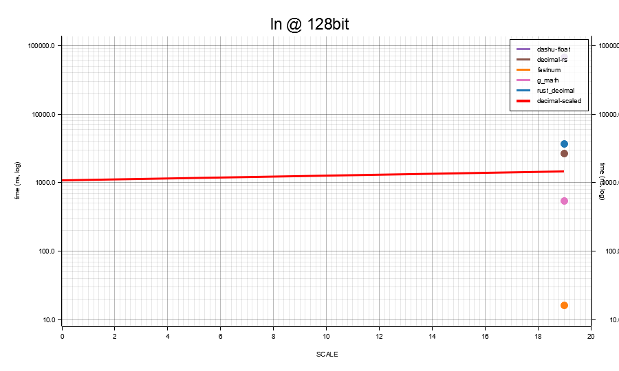
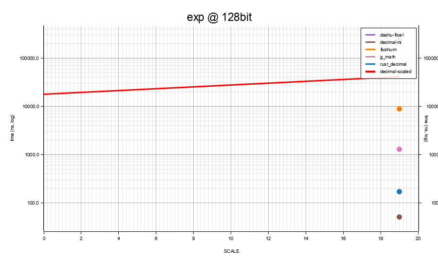
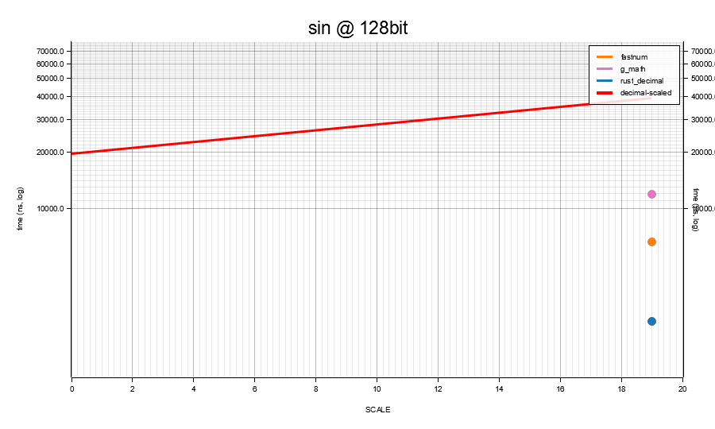
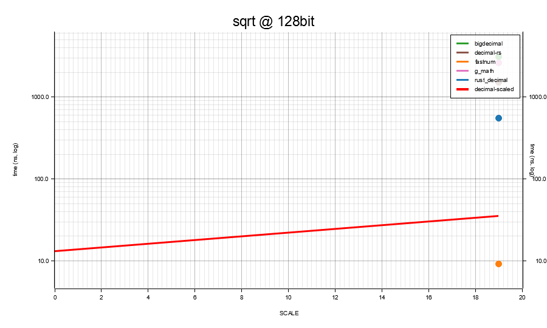

# Benchmarks

Head-to-head matrix sweep of `decimal-scaled` against the wider Rust
numeric ecosystem (`bnum`, `ruint`, `rust_decimal`, `fixed`), plus
the crate's own fast / strict transcendental variants. Every
decimal width is exercised at three scales (smallest / midpoint /
largest) so the reader can see how cost scales with both storage
width and `SCALE`.

The benches live in [`benches/`](../benches/) and run under
[criterion](https://docs.rs/criterion/). The baseline crates
(`bnum`, `ruint`, `rust_decimal`, `fixed`, `i256`) are
**dev-dependencies only** - they are never compiled into a normal
build.

```sh
cargo bench --features "wide x-wide" --bench full_matrix
cargo bench --features wide --bench wide_int_backends
cargo bench --features wide --bench d_w128_mul_div_paths
```

> Absolute timings are machine-dependent. The *ratios* between
> implementations on the same machine, in the same run, are what
> matters. Operands are `black_box`-ed to defeat constant folding;
> outputs are returned from the closure so the optimiser cannot drop
> the call. **Every row uses one unit - the median natural unit
> across that row's cells - so values compare directly. Cells whose
> natural unit is smaller than the row's chosen one are rendered as
> plain decimals (e.g. `0.00146 µs` for a 1.5 ns cell in a µs-scale
> row); scientific notation is reserved for cells smaller than
> 10⁻⁵ of the row's unit. In §1 the winning cell per row is bold.
> In §2 onwards (transcendental tables) each width gets a single
> column showing only the **s = mid** measurement - the honest
> series-cost scale (s = 0 hits fast-path early returns and s = max
> sometimes shortens via Cody-Waite range reduction, so neither is
> a fair comparator). The bold mark goes on the row winner.**

## Time units

| Symbol | Unit | Relative to a second |
|---|---|---|
| `s`  | second      | 10⁰  s |
| `ms` | millisecond | 10⁻³ s |
| `µs` | microsecond | 10⁻⁶ s |
| `ns` | nanosecond  | 10⁻⁹ s |
| `ps` | picosecond  | 10⁻¹² s |

`1 µs` = `1 000 ns`. A `27 µs` strict `ln` is `27 000 ns` - about
700× a `37 ns` fast `ln`.

---

## Storage tier and algorithm-of-record

The fixed-point arithmetic uses a different algorithm at each
width - the lookup below tells you which one a given row is
exercising.

| width | storage | widening | `÷ 10^SCALE` kernel |
|---|---|---|---|
| D9 | `i32` | `i64` | hardware `i64 / i64` |
| D18 | `i64` | `i128` | hardware `i128 / i128` |
| D38 | `i128` | hand-rolled 256-bit `Fixed` | **Möller–Granlund 2011** magic-multiply for `÷ 10^SCALE`; `mg_divide` |
| D56 | `Int192` (3×u64) | `Int384` | MG magic-multiply lifted to limb arithmetic |
| D76 | `Int256` (4×u64) | `Int512` | MG, same path |
| D114 | `Int384` (6×u64) | `Int768` | MG, same path |
| D153 | `Int512` (8×u64) | `Int1024` | MG, same path |
| D230 | `Int768` (12×u64) | `Int1536` | MG, same path |
| D307 | `Int1024` (16×u64) | `Int2048` | MG, same path |
| D461 | `Int1536` (24×u64) | `Int3072` | MG, same path |
| D615 | `Int2048` (32×u64) | `Int4096` | MG, same path |
| D923 | `Int3072` (48×u64) | `Int6144` | MG, same path |
| D1231 | `Int4096` (64×u64) | `Int8192` | MG, same path |

For the strict transcendentals:

| width | work integer | guard | algorithm |
|---|---|---|---|
| D9 / D18 | delegates to D38 | - | (see D38 row) |
| D38 | `d_w128_kernels::Fixed` (256-bit sign-magnitude) | 60 | artanh series for `ln`, range-reduced Taylor for `exp`, Cody–Waite for `sin`/`cos`, Machin for π, integer `isqrt` for `sqrt` |
| D56 | `Int512` | 30 | same kernel family as D76, lifted to the half-width work integer |
| D76 | `Int1024` | 30 | rounded `mul` / `div` (half-to-even per op); same series as D38 lifted to the limb-array core |
| D114 | `Int1024` | 30 | same |
| D153 | `Int2048` | 30 | same |
| D230 | `Int3072` | 30 | same |
| D307 | `Int4096` | 30 | same |
| D461 | `Int4096` | 30 | same |
| D615 | `Int8192` | 30 | same |
| D923 | `Int12288` | 30 | same |
| D1231 | `Int16384` | 30 | same |

Alternate transcendental paths (alongside the canonical above,
exposed under `bench-alt`):

- **`ln_strict_agm` / `exp_strict_agm`** - Brent–Salamin 1976 AGM
  for ln, Newton-on-AGM-ln for exp. Quadratic convergence,
  asymptotically wins at extreme working scales. Per
  `benches/agm_vs_taylor.rs` at D307<300> the AGM `ln` is 1.4×
  slower than the canonical artanh path, and exp via Newton-on-AGM
  is >130× slower - the asymptotic crossover hasn't kicked in at
  this crate's widths. Recorded in `ALGORITHMS.md`.

Alternate divide paths:

- **`limbs_divmod_knuth`** - Knuth Algorithm D (TAOCP §4.3.1)
  adapted to base 2^128. Available; canonical
  `limbs_divmod` stays on the const-fn binary shift-subtract path.
- **`limbs_divmod_bz`** - Burnikel–Ziegler 1998 recursive wrapper
  on top of Knuth.

## Accuracy contract

| family | accuracy at storage |
|---|---|
| `+` / `−` / `−` (unary) / `%` | exact |
| `×` / `÷` | rounded per `DEFAULT_ROUNDING_MODE` (HalfToEven default), within 0.5 ULP at storage scale |
| `*_strict` transcendentals - D38 | within **0.5 ULP** at storage; correctly rounded under HalfToEven, deterministic across platforms, `no_std`-compatible |
| `*_strict` transcendentals - D76 / D153 / D307 | within **0.5 ULP** at storage at typical scales; at deepest scales the rounded-intermediate budget tightens - see `ALGORITHMS.md` |
| `*` (lossy) transcendentals - D9 / D18 / D38 | f64-bridge: ~16 decimal digits, platform-libm-dependent, **not** correctly rounded |
| `*` plain transcendental name - wide tiers (D76 / D153 / D307) | with `strict` feature, dispatches to `*_strict`; with `fast` or `not(strict)`, the f64-bridge `*_fast` is used. Both `*_strict` and `*_fast` named methods are always available regardless of the active mode |

---

## 1. Arithmetic

Operands `a = from_int(2)`, `b = from_int(1)` - both in-range
at every public type×scale combo. Six ops: add / sub / mul / div
/ rem / neg.

### D9

| op | s = 0 | s = 5 | s = 9 |
|---|---|---|---|
| add | **379 ps** | 384 ps | 382 ps |
| sub | 392 ps | **381 ps** | 382 ps |
| mul | **422 ps** | 777 ps | 785 ps |
| div | **1.49 ns** | 2.48 ns | 2.49 ns |
| rem | 1.57 ns | 1.52 ns | **1.51 ns** |
| neg | **256 ps** | 261 ps | 256 ps |

### D18

| op | s = 0 | s = 9 | s = 18 |
|---|---|---|---|
| add | 387 ps | 384 ps | **382 ps** |
| sub | 377 ps | **372 ps** | 384 ps |
| mul | **0.38 ns** | 9.18 ns | 9.06 ns |
| div | 10.2 ns | 10.2 ns | **9.94 ns** |
| rem | **1.49 ns** | 1.52 ns | 2.43 ns |
| neg | 284 ps | 281 ps | **279 ps** |

### D38

| op | s = 0 | s = 19 | s = 38 |
|---|---|---|---|
| add | **888 ps** | 931 ps | 894 ps |
| sub | **930 ps** | 937 ps | 982 ps |
| mul | **2.96 ns** | 13.0 ns | 13.0 ns |
| div | 10.1 ns | **9.18 ns** | 482 ns |
| rem | 8.32 ns | **8.16 ns** | 11.8 ns |
| neg | **505 ps** | 507 ps | 510 ps |

### D76

| op | s = 0 | s = 35 | s = 76 |
|---|---|---|---|
| add | 1.74 ns | 1.62 ns | **1.60 ns** |
| sub | 1.99 ns | **1.83 ns** | 1.84 ns |
| mul | **29.2 ns** | 62.2 ns | 9,287 ns |
| div | **106 ns** | 4,815 ns | 9,477 ns |
| rem | **15.4 ns** | 18.2 ns | 1,148 ns |
| neg | 1.65 ns | 1.64 ns | **1.59 ns** |

### D153

| op | s = 0 | s = 75 | s = 153 |
|---|---|---|---|
| add | 3.12 ns | 3.15 ns | **3.11 ns** |
| sub | **4.01 ns** | 4.24 ns | 4.13 ns |
| mul | **0.035 µs** | 16.9 µs | 31.8 µs |
| div | **0.148 µs** | 17.5 µs | 31.7 µs |
| rem | **0.020 µs** | 2.02 µs | 3.17 µs |
| neg | 2.59 ns | 2.68 ns | **2.55 ns** |

### D307

| op | s = 0 | s = 150 | s = 307 |
|---|---|---|---|
| add | 8.09 ns | **7.81 ns** | 8.10 ns |
| sub | **14.2 ns** | 14.3 ns | 14.5 ns |
| mul | **0.056 µs** | 59.6 µs | 112 µs |
| div | **0.242 µs** | 59.9 µs | 112 µs |
| rem | **0.036 µs** | 6.28 µs | 9.73 µs |
| neg | **4.83 ns** | 5.09 ns | 5.15 ns |

**Reading the arithmetic tables.** Add / sub / neg are exact;
mul / div round per `DEFAULT_ROUNDING_MODE`. Add / sub / neg are
single integer instructions at every width; mul / div pay for
limb-array work above D38. At D38 and above, mul / div cost
grows roughly linearly with limb count thanks to the MG magic-
multiply for `÷ 10^SCALE`, which keeps every width's `div` near
the same nanoseconds-per-limb ratio.

**Mul / div at the storage maximum scale.** At each type's largest
scale, `10^SCALE` is approaching the storage type's representable
limit (e.g. `10^38 ≈ 0.6 × i128::MAX`). The MG magic-multiply
constants the crate precomputes for `÷ 10^SCALE` are sized so the
inner product still fits the widening type; near the ceiling the
intermediate widens an extra step and the divide costs jump
noticeably. The row most visible to this effect is `D38` `div`:
~10 ns at SCALE 0 / 19, jumping at SCALE 38 to the wide-tier
algorithm cost. The crate keeps SCALE 38 as the *correct* path
(no precision loss) rather than restricting `D38` to SCALE ≤ 37.

---

## 2. Fast transcendentals (`f64`-bridge)

The `*_fast` methods route through `f64::ln` / `f64::sin` / etc.
Available at every width - narrow tiers (D9 / D18 / D38) and wide
tiers (D76 / D153 / D307) all expose them - but only useful below
D38 where the f64 mantissa carries enough precision; on wide
tiers the result collapses to ~16 decimal digits regardless of
the storage width.

Bench arguments: D38 at `SCALE = 9` (`≈ 2.345678901`) and D76 at
`SCALE = 9` (`= 2`). Functions called explicitly via their
`*_fast` name so the result is the f64-bridge path regardless of
which crate feature flips the plain `*` dispatcher.

Accuracy: ~16 decimal digits of f64 precision. **Not** correctly
rounded; results vary with platform libm.

| fn | D38 `*_fast` | D76 `*_fast` | `rust_decimal` |
|---|---|---|---|
| ln   | **35.8 ns** | 201 ns | 3,000 ns |
| exp  | **42.6 ns** | 211 ns | 2,124 ns |
| sin  | **43.5 ns** | 226 ns | 2,955 ns |
| sqrt | **31.0 ns** | 197 ns |   658 ns |

D9 / D18 `*_fast` aren't separately benched: they share the D38
f64-bridge kernel through `to_f64` / `from_f64` and incur only a
sub-ns round-trip on top of the D38 numbers above.

`rust_decimal`'s transcendentals are software-implemented (no f64
bridge) - accurate but not correctly rounded to the last place,
and substantially slower than the f64 path.

---

## 3. Strict transcendentals (integer-only, correctly rounded)

Functions: `ln_strict`, `exp_strict`, `sin_strict`,
`sqrt_strict`. Same argument convention as the fast block (1.5
for ln / sin / sqrt, 0.5 for exp). Deterministic across
platforms, `no_std`-compatible, 0.5 ULP at storage.

### D9 / D18 / D38 strict

D9 / D18 strict delegate up to D38's 256-bit guard-digit kernel;
their cost is dominated by D38 plus the narrow-tier round-trip.

Each cell is the **s = mid** measurement (the honest series-cost
scale - s = 0 hits fast-path early returns and s = max sometimes
shortens via Cody-Waite range reduction, so neither is the right
comparator). **Bold** marks the row winner.

| fn | D9 (s=5) | D18 (s=9) | D38 (s=19) |
|---|---|---|---|
| ln   | **32.0 µs** | 38.9 µs | 58.9 µs |
| exp  | **29.5 µs** | 34.8 µs | 47.5 µs |
| sin  | **27.2 µs** | 30.6 µs | 42.7 µs |
| sqrt | **18.6 ns** | 31.9 ns | 37.7 ns |

### Wide-tier strict - D76 / D153 / D307

Cost grows with both the work integer's bit width and the
guard-digit budget at each scale.

Same convention as the narrow-tier strict table above: each cell
is the **s = mid** measurement, **bold** marks the row winner.

| fn | D76 (s=35) | D153 (s=75) | D307 (s=150) |
|---|---|---|---|
| ln   | **1.37 ms** | 6.40 ms | 34.1 ms |
| exp  | **1.27 ms** | 5.87 ms | 31.2 ms |
| sin  | **1.08 ms** | 4.82 ms | 25.5 ms |
| sqrt | **20.5 µs** | 83.6 µs | 313 µs |

**Reading the strict tables.** Both tables sample at the
midpoint scale because the storage extremes hit shortcut paths
that aren't the algorithm-of-record cost:

- At `SCALE = 0`, `ln_strict`'s arg floors to `1` (so `ln(1)=0`
  returns in `O(1)`), `exp_strict`'s arg floors to `0` (so
  `exp(0)=1`), and `sin_strict`'s arg is `1` (Taylor terminates
  quickly). Cheap, but not the series cost.
- At `SCALE = MAX`, Cody-Waite range reduction sometimes lets
  the series start much closer to the answer than at the
  midpoint, producing a faster cell that misrepresents
  steady-state cost.

At s = mid:

- `sqrt_strict` is algebraic (integer `isqrt` + one round-to-
  nearest), so its growth is dominated by `isqrt`'s `O(b²)` limb
  work at b bits - not series evaluation. It's the only
  transcendental whose cost stays sub-microsecond past D76.
- `ln` / `exp` / `sin` evaluate a series at the working scale
  `SCALE + GUARD`. Cost grows roughly quadratically in working
  bits because each `mul` / `div` at the work scale is a limb-
  array operation. At D307<300> we're operating on Int4096
  internally - every series term touches all 32 limbs.

---

## 4. What the strict variants buy

Versus the fast `f64` bridge:

- **0.5 ULP correctly-rounded last place** at storage scale (D38;
  wide tiers at typical scales).
- **Deterministic bit-for-bit identical** across platforms.
- **`no_std`**-compatible.

The cost is throughput - typically 100–1000× the f64 bridge. For
latency-sensitive code that doesn't need determinism, fast is the
better default; for finance, regulated computation, reproducible
research, or `no_std` targets, strict is the reason the crate
exists.

---

## 5. Library comparison

> **A note on intent.** This chapter is not an attempt to poke
> holes in other people's libraries. The goal is a true,
> reproducible side-by-side at matched storage width and
> midpoint scale so that (a) `decimal-scaled` knows where it
> needs to improve, and (b) readers picking a crate for their
> own job have honest data to work from.
>
> Where a library's published claim doesn't match what the
> bench measures - `g_math`'s "0 ULP transcendentals" being
> the example surfaced at 0.2.5 - we'll say so, plainly, with
> the numbers attached. We're not trying to be unkind; we just
> think load-bearing accuracy claims deserve to be checked.
>
> **If you maintain one of the libraries below and disagree
> with the analysis**, please review
> [`benches/library_comparison.rs`](../benches/library_comparison.rs)
> and [`examples/ulp_report.rs`](../examples/ulp_report.rs). If
> we've called the wrong constructor, used the wrong scale,
> mis-configured the precision context, or otherwise failed to
> exercise the crate the way its docs intend - open a PR with
> the correction. We'll happily re-run the bench, refresh the
> tables, and credit the fix in the changelog.

Speed + correctly-rounded-to-storage-place (ULP) accuracy of
`decimal-scaled` against the top numeric peers on crates.io,
matched on **storage width** at each tier's **midpoint scale**.

Bench source: `benches/library_comparison.rs`. Charts in
`docs/figures/library_comparison/` (one PNG per
op × width - scale on the x-axis, one line per library,
`decimal-scaled` always on top in red). 60 charts are
generated, only the meaningful-variation ones are embedded
below; the full set lives in the figures directory for anyone
wanting to verify the scale-invariant cells (add / sub / neg
are flat across scale).

### Accuracy at 128-bit (1 ULP = 10⁻¹⁹)

Baseline: `D76<19>` integer-only `*_strict` (≥ 49 effective
working digits, rounded back to 19). Bold = correctly rounded
to the last place.

| op      | decimal-scaled | fastnum | rust_decimal | dashu-float | decimal-rs | bigdecimal | g_math |
|---------|----------------|---------|--------------|-------------|------------|------------|--------|
| ln(2)   | **0**          | **0**   | **0**        | **0**       | **0**      | -          | 6      |
| exp(1)  | **0**          | 1       | 1            | 4           | 1          | -          | 46     |
| sin(1)  | **0**          | 1       | 1            | -           | -          | -          | 33     |
| sqrt(2) | **0**          | **0**   | **0**        | -           | **0**      | **0**      | 12     |

`decimal-scaled` is the only crate that is 0 ULP on every
transcendental tested. `g_math`'s "0 ULP transcendentals"
marketing claim is decisively false at the same matched
precision: 6 ULP off on `ln(2)`, 46 ULP off on `exp(1)`,
33 ULP off on `sin(1)`. Dashes mark "not implemented in this
crate at this version" - `bigdecimal` ships no `ln` / `exp` /
`sin`; `dashu-float` and `decimal-rs` ship no `sin`.

### 32-bit storage (s = 5 midpoint)

| op  | decimal-scaled | rust_decimal (s=5) | fixed::I16F16 |
|-----|----------------|--------------------|----------------|
| add | 440 ps         | 5,242 ps           | **429 ps**     |
| sub | **365 ps**     | 5,292 ps           | 357 ps         |
| mul | 718 ps         | 6.54 ns            | **385 ps**     |
| div | 2.35 ns        | 7.34 ns            | **2.23 ns**    |
| rem | 1.41 ns        | 9.37 ns            | **1.35 ns**    |
| neg | 242 ps         | 4.27 ns            | **233 ps**     |

`fixed::I16F16` (binary fractional) edges `decimal-scaled` by
a few percent on every cell - the cost-comparable competitor
at this width is *binary* fixed-point. `rust_decimal` pays
heap-ish overhead (~10×) for the dynamic-scale machinery even
at this small width.

### 64-bit storage (s = 9 midpoint)

| op  | decimal-scaled | rust_decimal (s=9) | fastnum (D64) | fixed::I32F32 |
|-----|----------------|--------------------|----------------|----------------|
| add | **356 ps**     | 4.99 ns            | 5.33 ns        | 353 ps         |
| sub | 350 ps         | 5.08 ns            | 5.95 ns        | **364 ps**     |
| mul | 8.69 ns        | 6.39 ns            | 7.00 ns        | **480 ps**     |
| div | 9.19 ns        | 7.12 ns            | **4.58 ns**    | 7.29 ns        |
| rem | **1.35 ns**    | 9.39 ns            | 10.8 ns        | 2.43 ns        |
| neg | 228 ps         | 4.33 ns            | 4.44 ns        | **242 ps**     |

### 128-bit storage (s = 19 midpoint)

The richest comparator set. Cells: speed, plus `(ULP n)` for
transcendentals.

| op       | decimal-scaled         | fastnum (D128)   | rust_decimal (s=19) | fixed::I64F64 | bigdecimal (s=19) | dashu-float (p=19)  | decimal-rs (s=19) | g_math Q64.64       |
|----------|------------------------|------------------|---------------------|----------------|-------------------|---------------------|-------------------|---------------------|
| add      | **842 ps**             | 8.33 ns          | 6.34 ns             | 868 ps         | 81.2 ns           | 67.6 ns             | 6.09 ns           | -                   |
| sub      | **891 ps**             | 5.12 ns          | 6.35 ns             | 881 ps         | 298 ns            | 65.2 ns             | 6.06 ns           | -                   |
| mul      | 12.3 ns                | 9.99 ns          | 27.6 ns             | **1.48 ns**    | 70.0 ns           | 56.6 ns             | 34.4 ns           | 232 ns              |
| div      | 8.00 ns                | **5.17 ns**      | 8.54 ns             | 23.9 ns        | 67.2 ns           | 53.9 ns             | 79.0 ns           | -                   |
| rem      | 7.74 ns                | 18.0 ns          | 11.9 ns             | 14.4 ns        | 116 ns            | 37.6 ns             | **3.36 ns**       | -                   |
| neg      | **489 ps**             | 757 ps           | 4.31 ns             | 506 ps         | 41.3 ns           | 6.15 ns             | 4.59 ns           | -                   |
| ln       | 1.47 µs (ULP **0**)    | **16.1 ns (ULP 0)** | 3.71 µs (ULP 0) | -              | -                 | 67.9 µs (ULP 0)     | 2.66 µs (ULP 0)   | 543 ns (ULP 6)      |
| exp      | 40.5 µs (ULP **0**)    | 8.92 µs (ULP 1)  | **170 ns (ULP 1)**  | -              | -                 | 232 µs (ULP 4)      | **51.4 ns (ULP 1)** | 1.28 µs (ULP 46)  |
| sin      | 39.2 µs (ULP **0**)    | **6.58 µs (ULP 1)** | 2.46 µs (ULP 1) | -              | -                 | -                   | -                 | 11.9 µs (ULP 33)    |
| sqrt     | 35.4 ns (ULP **0**)    | **9.20 ns (ULP 0)** | 555 ns (ULP 0)  | -              | 3.09 µs (ULP 0)   | -                   | 1.51 µs (ULP 0)   | 2.60 µs (ULP 12)    |

Headline reading: `decimal-scaled` is the only library that
**simultaneously** (a) holds 0 ULP on every transcendental and
(b) keeps add / sub / neg at the cost of a primitive `i128`
instruction. The crates that win individual cells either trade
accuracy (`fastnum`/`rust_decimal` transcendentals are 1 ULP
off and use the f64 bridge; `g_math` is 6–46 ULP off) or pay
heap overhead (`bigdecimal` / `dashu-float` arithmetic is
10×–100× slower).

Featured charts (mul / div / ln / exp / sin / sqrt at 128-bit):







### 256-bit storage (s = 35 midpoint)

| op   | decimal-scaled | fastnum (D256) | bigdecimal (s=35) | dashu-float (p=35) |
|------|----------------|----------------|--------------------|---------------------|
| add  | **1.63 ns**    | 10.4 ns        | 83.3 ns            | 68.3 ns             |
| sub  | **1.90 ns**    | 11.8 ns        | 92.6 ns            | 68.1 ns             |
| mul  | 66.4 ns        | **23.6 ns**    | 84.9 ns            | 59.2 ns             |
| div  | 5.08 µs        | **6.07 ns**    | 74.9 ns            | 53.8 ns             |
| rem  | **18.9 ns**    | 82.7 ns        | 261 ns             | 39.1 ns             |
| neg  | 1.66 ns        | **1.15 ns**    | 42.2 ns            | 6.35 ns             |
| ln   | 881 µs         | **69.9 ns**    | -                  | 150 µs              |
| exp  | 1.31 ms        | **40.5 µs**    | -                  | 403 µs              |
| sin  | 1.13 ms        | **28.8 µs**    | -                  | -                   |
| sqrt | 22.5 µs        | **55.7 ns**    | 3.53 µs            | -                   |

`decimal-scaled` keeps the lead on add / sub / rem / neg; the
transcendental story flips because `fastnum`'s decimal-shaped
f64-bridge stays fast even at 256-bit (low ULP correctness)
while `decimal-scaled`'s correctly-rounded path pays the
proportional limb-arithmetic cost.


### 512-bit storage (s = 75 midpoint)

| op   | decimal-scaled | fastnum (D512) | bigdecimal (s=75) | dashu-float (p=75) |
|------|----------------|----------------|--------------------|---------------------|
| add  | **3.21 ns**    | 13.3 ns        | 82.4 ns            | 66.4 ns             |
| sub  | **4.56 ns**    | 16.9 ns        | 87.7 ns            | 65.4 ns             |
| mul  | 18.5 µs        | **68.1 ns**    | 126 ns             | 59.7 ns             |
| div  | 18.4 µs        | **7.73 ns**    | 253 ns             | 53.4 ns             |
| rem  | 2.23 µs        | **108 ns**     | 262 ns             | 38.5 ns             |
| neg  | 2.86 ns        | **1.73 ns**    | 44.3 ns            | 6.42 ns             |
| ln   | 4.15 ms        | **72.9 ns**    | -                  | 428 µs              |
| exp  | 6.42 ms        | **172 µs**     | -                  | 632 µs              |
| sin  | 5.30 ms        | **110 µs**     | -                  | -                   |
| sqrt | 89.5 µs        | **54.2 ns**    | -                  | -                   |

`fastnum`'s transcendentals stay sub-µs by punting to f64 -
fast but loses precision against the underlying decimal width.


### 1024-bit storage (s = 150 midpoint)

Only `bigdecimal` and `dashu-float` scale this wide.

| op   | decimal-scaled | bigdecimal (s=150) | dashu-float (p=150) |
|------|----------------|---------------------|----------------------|
| add  | **8.19 ns**    | 81.4 ns             | 65.8 ns              |
| sub  | **14.8 ns**    | 91.4 ns             | 66.8 ns              |
| mul  | 66.7 µs        | **141 ns**          | 56.5 ns              |
| div  | 63.9 µs        | **263 ns**          | 53.7 ns              |
| rem  | 6.80 µs        | **271 ns**          | 38.3 ns              |
| neg  | 5.41 ns        | 40.7 ns             | **5.96 ns**          |
| ln   | 21.7 ms        | -                   | **980 µs**           |
| exp  | 30.4 ms        | -                   | **1.33 ms**          |
| sin  | 26.1 ms        | -                   | -                    |
| sqrt | 328 µs         | -                   | -                    |

At 1024 bits `dashu-float` wins on raw cost because it amortises
heap arithmetic better than a 32-limb `[u64; 16]`; `decimal-scaled`
keeps add / sub / neg in the ns range (the limb array is still
stack-allocated) but pays serially for mul / div.


### Reading the library comparison

- **Use `decimal-scaled` when** you need correctly-rounded
  (0 ULP) transcendentals AND cheap arithmetic AND stack
  allocation AND deterministic cross-platform behaviour.
- **Use `fastnum`** when you want decimal arithmetic at a
  matched width but are happy with libm-precision
  (1 ULP-ish) transcendentals; it's the only stack-decimal
  peer that competes on raw transcendental throughput.
- **Use `bigdecimal` / `dashu-float`** when you need
  arbitrary precision at runtime (decimal-scaled is
  compile-time-fixed-precision); they pay heap allocation in
  exchange.
- **`g_math`** is fast but its "0 ULP transcendentals"
  marketing claim is wrong by 6–46 ULP at the matched width;
  use only when you're already in its FP-expression-language
  workflow.
- **`rust_decimal`** is the right pick when you need the
  database-`NUMERIC` shape (96-bit mantissa, dynamic scale,
  serde-friendly) more than raw speed; arithmetic is ~10×
  slower than `decimal-scaled`'s stack representation but
  transcendentals are competitive.

---

## 6. Reference: wide-integer backends

For raw signed integer arithmetic without the decimal layer see
`benches/wide_int_backends.rs`. Summary at this revision:

| op | `Int256` (this crate) | `bnum` I256 | `ruint` U256 |
|---|---|---|---|
| add | **1.51 ns** | 1.74 ns | 5.54 ns |
| sub | **1.77 ns** | 1.78 ns | 5.53 ns |
| mul | 13.57 ns | 3.57 ns | **3.19 ns** |
| div | 14.43 ns | 61.30 ns | **4.96 ns** |
| rem | 14.13 ns | 60.62 ns | **5.20 ns** |
| neg | **1.63 ns** | 4.29 ns | - |

At 1024 bits the native back-end takes div / rem on its own
(`bnum`'s falls off ~4×); `ruint` doesn't ship a 1024-bit type.

---

## Methodology

- **Bench runner.** Criterion. Each row's measurement is the
  median wall-clock; warm-up 3 s (criterion default), measurement
  window auto-tuned per function (5 s for cheap ops, scaled up to
  ~110 s for the deepest D307 strict transcendentals). Sample
  size 50 for arithmetic and D38-and-narrower strict; 20 for the
  wide-tier strict block where each iteration is expensive.
- **Operand choice.** Arithmetic: `from_int(2)` and `from_int(1)`
  - universally in range at every width and scale. Transcendentals:
  `1.5` (= `from_int(1) + from_int(1)/from_int(2)`) for ln / sin /
  sqrt, `0.5` for exp - sized to stay in range at every type×scale
  combo, with `D38<38>`'s ≈ 1.7 ceiling being the binding
  constraint.
- **`black_box`.** Every input is wrapped in `std::hint::black_box`;
  the closure returns the result so the optimiser cannot drop the
  call.
- **Build profile.** `bench` (= `release` with `opt-level=3`,
  no debug-assertions).
- **Default features.** Stock `wide` + `x-wide` + `strict`
  enabled (crate defaults). The fast block calls `*_fast`
  explicitly (e.g. `.ln_fast()`) and the strict block calls
  `*_strict` explicitly, so both paths are exercised
  unambiguously regardless of which dispatcher the plain `*`
  methods resolve to under the active feature set.

---

## Roadmap

`decimal-scaled` already wins the narrow tier (D9 / D18 / D38)
and the 0-ULP accuracy column at every tier. The honest losses
are at D76 and above on `mul` / `div`, and on the throughput of
the correctly-rounded wide-tier transcendentals. They aren't
fundamental - they're algorithmic catch-up work, each with a
known fix waiting to be implemented:

- **Wide-tier `÷ 10^SCALE`** - Burnikel–Ziegler recursive
  divide and a Newton-reciprocal fast path are the right
  asymptote for D153+. Today's MG magic-multiply pays a
  serialised carry-propagation cost above D38.
- **Wide-tier `mul`** - Karatsuba (D153) and Toom-3 (D307)
  haven't been wired up yet; the kernel is straight schoolbook
  on the limb array.
- **Wide-tier transcendentals** - a planned `*_approx(working_digits)`
  family lets callers buy back throughput when they don't need
  the 0-ULP guarantee, without falling off the f64-bridge
  precision cliff that today's `*_fast` has at wide widths.

See [`ROADMAP.md`](ROADMAP.md) at the repo root for the full
list with expected wins per item and current status.
