# Benchmarks

Head-to-head matrix sweep of `decimal-scaled` against the wider Rust
numeric ecosystem (`bnum`, `ruint`, `rust_decimal`, `fixed`), plus
the crate's own fast / strict transcendental variants. Every
decimal width is exercised at three scales (smallest / midpoint /
largest) so the reader can see how cost scales with both storage
width and `SCALE`.

The benches live in [`benches/`](../benches/) and run under
[criterion](https://docs.rs/criterion/). The baseline crates
(`bnum`, `ruint`, `rust_decimal`, `fixed`, `i256`) are
**dev-dependencies only** - they are never compiled into a normal
build.

```sh
cargo bench --features "wide x-wide" --bench full_matrix
cargo bench --features wide --bench wide_int_backends
cargo bench --features wide --bench d_w128_mul_div_paths
```

> Absolute timings are machine-dependent. The *ratios* between
> implementations on the same machine, in the same run, are what
> matters. Operands are `black_box`-ed to defeat constant folding;
> outputs are returned from the closure so the optimiser cannot drop
> the call. **Every row uses one unit - the median natural unit
> across that row's cells - so values compare directly. Cells whose
> natural unit is smaller than the row's chosen one are rendered as
> plain decimals (e.g. `0.00146 µs` for a 1.5 ns cell in a µs-scale
> row); scientific notation is reserved for cells smaller than
> 10⁻⁵ of the row's unit. In §1 the winning cell per row is bold.
> In §2 onwards (transcendental tables) each width gets a single
> column showing only the **s = mid** measurement - the honest
> series-cost scale (s = 0 hits fast-path early returns and s = max
> sometimes shortens via Cody-Waite range reduction, so neither is
> a fair comparator). The bold mark goes on the row winner.**

## Time units

| Symbol | Unit | Relative to a second |
|---|---|---|
| `s`  | second      | 10⁰  s |
| `ms` | millisecond | 10⁻³ s |
| `µs` | microsecond | 10⁻⁶ s |
| `ns` | nanosecond  | 10⁻⁹ s |
| `ps` | picosecond  | 10⁻¹² s |

`1 µs` = `1 000 ns`. A `27 µs` strict `ln` is `27 000 ns` - about
700× a `37 ns` fast `ln`.

---

## Storage tier and algorithm-of-record

The fixed-point arithmetic uses a different algorithm at each
width - the lookup below tells you which one a given row is
exercising.

| width | storage | widening | `÷ 10^SCALE` kernel |
|---|---|---|---|
| D9 | `i32` | `i64` | hardware `i64 / i64` |
| D18 | `i64` | `i128` | hardware `i128 / i128` |
| D38 | `i128` | hand-rolled 256-bit `Fixed` | **Möller–Granlund 2011** magic-multiply for `÷ 10^SCALE`; `mg_divide` |
| D56 | `Int192` (3×u64) | `Int384` | MG magic-multiply lifted to limb arithmetic |
| D76 | `Int256` (4×u64) | `Int512` | MG, same path |
| D114 | `Int384` (6×u64) | `Int768` | MG, same path |
| D153 | `Int512` (8×u64) | `Int1024` | MG, same path |
| D230 | `Int768` (12×u64) | `Int1536` | MG, same path |
| D307 | `Int1024` (16×u64) | `Int2048` | MG, same path |
| D461 | `Int1536` (24×u64) | `Int3072` | MG, same path |
| D615 | `Int2048` (32×u64) | `Int4096` | MG, same path |
| D923 | `Int3072` (48×u64) | `Int6144` | MG, same path |
| D1231 | `Int4096` (64×u64) | `Int8192` | MG, same path |

For the strict transcendentals:

| width | work integer | guard | algorithm |
|---|---|---|---|
| D9 / D18 | delegates to D38 | - | (see D38 row) |
| D38 | `d_w128_kernels::Fixed` (256-bit sign-magnitude) | 60 | artanh series for `ln`, range-reduced Taylor for `exp`, Cody–Waite for `sin`/`cos`, Machin for π, integer `isqrt` for `sqrt` |
| D56 | `Int512` | 30 | same kernel family as D76, lifted to the half-width work integer |
| D76 | `Int1024` | 30 | rounded `mul` / `div` (half-to-even per op); same series as D38 lifted to the limb-array core |
| D114 | `Int1024` | 30 | same |
| D153 | `Int2048` | 30 | same |
| D230 | `Int3072` | 30 | same |
| D307 | `Int4096` | 30 | same |
| D461 | `Int4096` | 30 | same |
| D615 | `Int8192` | 30 | same |
| D923 | `Int12288` | 30 | same |
| D1231 | `Int16384` | 30 | same |

Alternate transcendental paths (alongside the canonical above,
exposed under `bench-alt`):

- **`ln_strict_agm` / `exp_strict_agm`** - Brent–Salamin 1976 AGM
  for ln, Newton-on-AGM-ln for exp. Quadratic convergence,
  asymptotically wins at extreme working scales. Per
  `benches/agm_vs_taylor.rs` at D307<300> the AGM `ln` is 1.4×
  slower than the canonical artanh path, and exp via Newton-on-AGM
  is >130× slower - the asymptotic crossover hasn't kicked in at
  this crate's widths. Recorded in `ALGORITHMS.md`.

Alternate divide paths:

- **`limbs_divmod_knuth`** - Knuth Algorithm D (TAOCP §4.3.1)
  adapted to base 2^128. Available; canonical
  `limbs_divmod` stays on the const-fn binary shift-subtract path.
- **`limbs_divmod_bz`** - Burnikel–Ziegler 1998 recursive wrapper
  on top of Knuth.

## Accuracy contract

| family | accuracy at storage |
|---|---|
| `+` / `−` / `−` (unary) / `%` | exact |
| `×` / `÷` | rounded per `DEFAULT_ROUNDING_MODE` (HalfToEven default), within 0.5 ULP at storage scale |
| `*_strict` transcendentals - D38 | within **0.5 ULP** at storage; correctly rounded under HalfToEven, deterministic across platforms, `no_std`-compatible |
| `*_strict` transcendentals - D76 / D153 / D307 | within **0.5 ULP** at storage at typical scales; at deepest scales the rounded-intermediate budget tightens - see `ALGORITHMS.md` |
| `*` (lossy) transcendentals - D9 / D18 / D38 | f64-bridge: ~16 decimal digits, platform-libm-dependent, **not** correctly rounded |
| `*` plain transcendental name - wide tiers (D76 / D153 / D307) | with `strict` feature, dispatches to `*_strict`; with `fast` or `not(strict)`, the f64-bridge `*_fast` is used. Both `*_strict` and `*_fast` named methods are always available regardless of the active mode |

---

## 1. Arithmetic

Operands `a = from_int(2)`, `b = from_int(1)` - both in-range
at every public type×scale combo. Six ops: add / sub / mul / div
/ rem / neg.

### D9

| op | s = 0 | s = 5 | s = 9 |
|---|---|---|---|
| add | **422 ps** | 425 ps | 425 ps |
| sub | 499 ps | 486 ps | **485 ps** |
| mul | **459 ps** | 833 ps | 833 ps |
| div | **1.60 ns** | 2.53 ns | 2.38 ns |
| rem | 1.61 ns | **1.61 ns** | 1.62 ns |
| neg | **257 ps** | 257 ps | 257 ps |

### D18

| op | s = 0 | s = 9 | s = 18 |
|---|---|---|---|
| add | **424 ps** | 437 ps | 425 ps |
| sub | 499 ps | **484 ps** | 485 ps |
| mul | **403 ps** | 9.99 ns | 10.5 ns |
| div | 10.3 ns | 19.6 ns | **11.1 ns** |
| rem | **1.61 ns** | 1.72 ns | 2.44 ns |
| neg | **269 ps** | 270 ps | 268 ps |

### D38

| op | s = 0 | s = 19 | s = 38 |
|---|---|---|---|
| add | **944 ps** | 951 ps | 952 ps |
| sub | 1.07 ns | 1.07 ns | **1.07 ns** |
| mul | **2.93 ns** | 12.6 ns | 12.8 ns |
| div | 9.56 ns | **8.65 ns** | 486 ns |
| rem | 8.50 ns | **8.27 ns** | 11.7 ns |
| neg | **513 ps** | 515 ps | 514 ps |

### D56 (new — 192-bit half-width tier)

| op | s = 0 | s = 28 | s = 56 |
|---|---|---|---|
| add | 1.26 ns | 1.27 ns | **1.24 ns** |
| sub | 1.49 ns | 1.57 ns | **1.44 ns** |
| mul | **29.0 ns** | 101 ns | 222 ns |
| div | **93.2 ns** | 200 ns | 230 ns |
| rem | **20.2 ns** | 63.4 ns | 62.3 ns |
| neg | 1.25 ns | 1.24 ns | **1.20 ns** |

### D76

| op | s = 0 | s = 35 | s = 76 |
|---|---|---|---|
| add | 1.79 ns | 1.83 ns | **1.79 ns** |
| sub | 2.20 ns | **2.13 ns** | 2.16 ns |
| mul | **28.9 ns** | 104 ns | 263 ns |
| div | **94.0 ns** | 218 ns | 254 ns |
| rem | **17.0 ns** | 26.7 ns | 161 ns |
| neg | 1.65 ns | **1.62 ns** | 1.65 ns |

### D114 (new — 384-bit half-width tier)

| op | s = 0 | s = 57 | s = 114 |
|---|---|---|---|
| add | 2.46 ns | 2.44 ns | **2.38 ns** |
| sub | 3.27 ns | 3.24 ns | **3.15 ns** |
| mul | **36.5 ns** | 323 ns | 378 ns |
| div | **110 ns** | 330 ns | 405 ns |
| rem | **26.7 ns** | 66.7 ns | 77.3 ns |
| neg | 1.95 ns | 1.97 ns | **1.90 ns** |

### D153

| op | s = 0 | s = 75 | s = 153 |
|---|---|---|---|
| add | 3.41 ns | 3.44 ns | **3.40 ns** |
| sub | **4.69 ns** | 4.78 ns | 4.83 ns |
| mul | **40.1 ns** | 432 ns | 562 ns |
| div | **134 ns** | 435 ns | 545 ns |
| rem | **23.5 ns** | 43.6 ns | 60.8 ns |
| neg | 2.69 ns | 2.62 ns | **2.62 ns** |

### D230 (new — 768-bit half-width tier)

| op | s = 0 | s = 115 | s = 230 |
|---|---|---|---|
| add | **9.86 ns** | 10.4 ns | 10.3 ns |
| sub | **11.1 ns** | 12.2 ns | 12.0 ns |
| mul | **43.4 ns** | 640 ns | 1.07 µs |
| div | **191 ns** | 642 ns | 1.10 µs |
| rem | **41.9 ns** | 102 ns | 144 ns |
| neg | 9.52 ns | 9.37 ns | **9.31 ns** |

### D307

| op | s = 0 | s = 150 | s = 307 |
|---|---|---|---|
| add | 12.1 ns | **11.9 ns** | 12.5 ns |
| sub | **14.1 ns** | 15.1 ns | 15.6 ns |
| mul | **53.2 ns** | 776 ns | 1.36 µs |
| div | **211 ns** | 799 ns | 1.38 µs |
| rem | **49.9 ns** | 113 ns | 131 ns |
| neg | **8.91 ns** | 9.82 ns | 9.51 ns |

### D461 (new — 1536-bit half-width tier, `x-wide`)

| op | s = 0 | s = 230 | s = 461 |
|---|---|---|---|
| add | **12.9 ns** | 13.4 ns | 13.0 ns |
| sub | **22.4 ns** | 25.1 ns | 26.7 ns |
| mul | **57.6 ns** | 1.40 µs | 2.53 µs |
| div | **264 ns** | 1.40 µs | 2.50 µs |
| rem | **63.8 ns** | 144 ns | 182 ns |
| neg | **20.9 ns** | 21.4 ns | 21.4 ns |

### D615 (new — 2048-bit, `x-wide`)

| op | s = 0 | s = 308 | s = 615 |
|---|---|---|---|
| add | 31.2 ns | **30.9 ns** | 31.5 ns |
| sub | **51.6 ns** | 51.0 ns | 51.1 ns |
| mul | **78.4 ns** | 1.85 µs | 3.40 µs |
| div | **340 ns** | 1.87 µs | 3.44 µs |
| rem | **87.8 ns** | 133 ns | 212 ns |
| neg | **29.1 ns** | 30.8 ns | 33.6 ns |

### D923 (new — 3072-bit half-width tier, `xx-wide`)

| op | s = 0 | s = 461 | s = 923 |
|---|---|---|---|
| add | 50.4 ns | **49.5 ns** | 49.4 ns |
| sub | **78.5 ns** | 85.3 ns | 78.3 ns |
| mul | **106 ns** | 3.90 µs | 7.60 µs |
| div | **526 ns** | 3.88 µs | 7.54 µs |
| rem | **127 ns** | 230 ns | 289 ns |
| neg | **53.2 ns** | 53.2 ns | 53.2 ns |

### D1231 (new — 4096-bit, `xx-wide`)

| op | s = 0 | s = 616 | s = 1231 |
|---|---|---|---|
| add | 64.6 ns | 60.5 ns | **58.2 ns** |
| sub | 108 ns | 104 ns | **99.8 ns** |
| mul | **147 ns** | 5.21 µs | 11.4 µs |
| div | **744 ns** | 5.36 µs | 11.5 µs |
| rem | **149 ns** | 272 ns | 372 ns |
| neg | 64.4 ns | 64.3 ns | **63.7 ns** |

**Reading the arithmetic tables.** Add / sub / neg are exact;
mul / div round per `DEFAULT_ROUNDING_MODE`. Add / sub / neg are
single integer instructions at every width; mul / div pay for
limb-array work above D38. At D38 and above, mul / div cost
grows roughly linearly with limb count thanks to the MG magic-
multiply for `÷ 10^SCALE`, which keeps every width's `div` near
the same nanoseconds-per-limb ratio.

**Wide-tier mul / div improvements vs the 0.2.5 baseline.** The
0.2.6 cycle replaced the `[u128; N]` limb storage with the
`[u64; 2N]` u64-native layout and routed every multi-limb divide
through Knuth Algorithm D with the Möller-Granlund 2-by-1
invariant reciprocal. The combined effect: D307<150> mul/div
collapsed from ~60 µs to ~0.78 µs (**76× faster**), D153<75>
mul/div from ~17 µs to ~0.43 µs (**40× faster**), D76<35> div
from 4.8 µs to 218 ns (**22× faster**). The numbers above reflect
the post-rewrite cost on the same hardware.

**Mul / div at the storage maximum scale.** At each type's largest
scale, `10^SCALE` is approaching the storage type's representable
limit (e.g. `10^38 ≈ 0.6 × i128::MAX`). The MG magic-multiply
constants the crate precomputes for `÷ 10^SCALE` are sized so the
inner product still fits the widening type; near the ceiling the
intermediate widens an extra step and the divide costs jump
noticeably. The row most visible to this effect is `D38` `div`:
~10 ns at SCALE 0 / 19, jumping at SCALE 38 to the wide-tier
algorithm cost. The crate keeps SCALE 38 as the *correct* path
(no precision loss) rather than restricting `D38` to SCALE ≤ 37.

---

## 2. Fast transcendentals (`f64`-bridge)

The `*_fast` methods route through `f64::ln` / `f64::sin` / etc.
Available at every width - narrow tiers (D9 / D18 / D38) and wide
tiers (D76 / D153 / D307) all expose them - but only useful below
D38 where the f64 mantissa carries enough precision; on wide
tiers the result collapses to ~16 decimal digits regardless of
the storage width.

Bench arguments: D38 at `SCALE = 9` (`≈ 2.345678901`) and D76 at
`SCALE = 9` (`= 2`). Functions called explicitly via their
`*_fast` name so the result is the f64-bridge path regardless of
which crate feature flips the plain `*` dispatcher.

Accuracy: ~16 decimal digits of f64 precision. **Not** correctly
rounded; results vary with platform libm.

| fn | D38 `*_fast` | D76 `*_fast` | `rust_decimal` |
|---|---|---|---|
| ln   | **35.8 ns** | 201 ns | 3,000 ns |
| exp  | **42.6 ns** | 211 ns | 2,124 ns |
| sin  | **43.5 ns** | 226 ns | 2,955 ns |
| sqrt | **31.0 ns** | 197 ns |   658 ns |

D9 / D18 `*_fast` aren't separately benched: they share the D38
f64-bridge kernel through `to_f64` / `from_f64` and incur only a
sub-ns round-trip on top of the D38 numbers above.

`rust_decimal`'s transcendentals are software-implemented (no f64
bridge) - accurate but not correctly rounded to the last place,
and substantially slower than the f64 path.

### 2.1 Per-tier accuracy loss

Each `*_fast` result inherits f64's ~16 decimal-digit mantissa.
After scaling back into the type's `[u64; L]` storage, the
result's low-order digits are pure noise / zero-fill — the f64
output simply doesn't carry that precision.

The table below reports the number of trailing decimal digits of
the storage-scale result that diverge from the `*_strict`
reference, measured by
`examples/fast_vs_strict_ulp.rs`. Each row uses argument `1.5`
for `ln` / `sin` / `sqrt` and `0.5` for `exp`.

| type / s | ln noise | exp noise | sin noise | sqrt noise |
|----------|---------:|----------:|----------:|-----------:|
| D9<5>      |   0 |   0 |   0 |   0 |
| D9<9>      |   0 |   0 |   0 |   0 |
| D18<9>     |   0 |   0 |   0 |   0 |
| D18<18>    |   2 |   3 |   2 |   3 |
| D38<19>    |   3 |   4 |   3 |   3 |
| D38<38>    |  39 |  38 |  22 |  22 |
| D56<28>    |  12 |  12 |  12 |  13 |
| D76<35>    |  18 |  19 |  19 |  20 |
| D114<57>   |  41 |  42 |  41 |  41 |
| D153<75>   |  59 |  59 |  59 |  60 |
| D230<115>  |  99 |  99 |  98 |  98 |
| D307<150>  | 134 | 135 | 134 | 134 |
| D461<230>  | 214 | 215 | 214 | 213 |
| D615<308>  | 292 | 292 | 292 | 292 |
| D923<461>  | 461 | 462 | 461 | 462 |
| D1231<616> | 616 | 617 | 616 | 617 |

A noise count of **N** means the last N decimal digits at storage
scale are zero-fill / random; the leading `max(0, MAX_SCALE − N)`
digits agree with the strict reference. The empirical pattern
matches the analytical bound `noise ≈ max(0, SCALE + log₁₀|result| − 15)`
that f64's 53-bit mantissa imposes.

**Reading the table.**

- **D9 and D18 at low scale (≤ 9)** suffer no precision loss —
  the result has at most 9 fractional digits and f64 has ~16
  digits of headroom.
- **D38 and below, scale ≤ 19**, lose only 2–4 trailing digits.
  Acceptable for finance-grade work where last-digit precision
  is not load-bearing.
- **D38 at MAX_SCALE = 38** loses 22+ trailing digits; the f64
  bridge is *not* a substitute for `*_strict` if you need that
  precision.
- **Wide tiers** (D56 and above) lose roughly `SCALE − 15`
  trailing digits — at D1231<616> only the leading 15-16
  significant figures survive. Treat `*_fast` as a "speed-first,
  16-digit result rendered into the storage type" path on the
  wide tiers; reach for `*_strict` when the wider digits actually
  matter.

---

## 3. Strict transcendentals (integer-only, correctly rounded)

Functions: `ln_strict`, `exp_strict`, `sin_strict`,
`sqrt_strict`. Same argument convention as the fast block (1.5
for ln / sin / sqrt, 0.5 for exp). Deterministic across
platforms, `no_std`-compatible, 0.5 ULP at storage.

### D9 / D18 / D38 strict

D9 / D18 strict delegate up to D38's 256-bit guard-digit kernel;
their cost is dominated by D38 plus the narrow-tier round-trip.

Each cell is the **s = mid** measurement (the honest series-cost
scale - s = 0 hits fast-path early returns and s = max sometimes
shortens via Cody-Waite range reduction, so neither is the right
comparator). **Bold** marks the row winner.

| fn | D9 (s=5) | D18 (s=9) | D38 (s=19) |
|---|---|---|---|
| ln   | **34.7 µs** | 40.9 µs | 60.0 µs |
| exp  | **31.6 µs** | 37.1 µs | 48.2 µs |
| sin  | **28.4 µs** | 33.7 µs | 45.2 µs |
| sqrt | **19.9 ns** | 32.0 ns | 38.6 ns |

### Wide-tier strict - D56 / D76 / D114 / D153 / D230 / D307 / D461 / D615 / D923 / D1231

Cost grows with both the work integer's bit width and the
guard-digit budget at each scale.

Same convention as the narrow-tier strict table above: each cell
is the **s = mid** measurement, **bold** marks the row winner.

#### Wide (`wide` umbrella — D56 / D76 / D114 / D153 / D230 / D307)

| fn | D56 (s=28) | D76 (s=35) | D114 (s=57) | D153 (s=75) | D230 (s=115) | D307 (s=150) |
|---|---|---|---|---|---|---|
| ln   | **18.4 µs** | 19.6 µs | 25.5 µs | 42.0 µs |  68.0 µs | 109.5 µs |
| exp  | **16.7 µs** | 16.6 µs | 18.1 µs | 33.6 µs |  53.5 µs |  86.8 µs |
| sin  | **11.5 µs** | 12.3 µs | 14.7 µs | 27.5 µs |  47.7 µs |  78.5 µs |
| sqrt | **1.13 µs** | 1.30 µs | 1.56 µs | 2.10 µs |  3.27 µs |   4.38 µs |

#### Extra-wide (`x-wide` adds D461 / D615)

| fn | D461 (s=230) | D615 (s=308) |
|---|---|---|
| ln   | **139.7 µs** | 328.5 µs |
| exp  | **102.3 µs** | 223.0 µs |
| sin  | **95.2 µs**  | 187.1 µs |
| sqrt | **6.99 µs**  |  11.5 µs |

#### XX-wide (`xx-wide` adds D923 / D1231)

| fn | D923 (s=461) | D1231 (s=616) |
|---|---|---|
| ln   | **592.8 µs** | 993.6 µs |
| exp  | **441.3 µs** | 755.4 µs |
| sin  | **441.1 µs** | 776.2 µs |
| sqrt | **19.6 µs**  |  29.7 µs |

**Historical comparison — 0.2.5 baseline.** On the same hardware,
0.2.5 measured D76<35> ln at 1.37 ms, D153<75> ln at 6.40 ms,
D307<150> ln at 34.1 ms. After this cycle's u64-native limbs, MG
2-by-1 reciprocal Knuth divide, Brent's two-stage exp argument
reduction, multi-level sqrt halving in ln, [0, π/4] sin range
reduction, sin_cos / sinh_cosh joint kernels, thread-local pi /
ln2 / ln10 cache, and pow10-cached mul/div per inner loop:

| op | 0.2.5 | 0.2.6 | speedup |
|---|---|---|---|
| D76<35>  ln   |  1.37 ms |  19.6 µs |  **70×** |
| D76<35>  exp  |  1.27 ms |  16.6 µs |  **76×** |
| D76<35>  sin  |  1.08 ms |  12.3 µs |  **88×** |
| D76<35>  sqrt | 20.5 µs  |  1.30 µs |  **16×** |
| D153<75> ln   |  6.40 ms |  42.0 µs | **152×** |
| D153<75> exp  |  5.87 ms |  33.6 µs | **175×** |
| D153<75> sin  |  4.82 ms |  27.5 µs | **175×** |
| D153<75> sqrt | 83.6 µs  |  2.10 µs |  **40×** |
| D307<150> ln  | 34.1 ms  | 109.5 µs | **311×** |
| D307<150> exp | 31.2 ms  |  86.8 µs | **360×** |
| D307<150> sin | 25.5 ms  |  78.5 µs | **325×** |
| D307<150> sqrt|  313 µs  |  4.38 µs |  **71×** |

**Reading the strict tables.** Both tables sample at the
midpoint scale because the storage extremes hit shortcut paths
that aren't the algorithm-of-record cost:

- At `SCALE = 0`, `ln_strict`'s arg floors to `1` (so `ln(1)=0`
  returns in `O(1)`), `exp_strict`'s arg floors to `0` (so
  `exp(0)=1`), and `sin_strict`'s arg is `1` (Taylor terminates
  quickly). Cheap, but not the series cost.
- At `SCALE = MAX`, Cody-Waite range reduction sometimes lets
  the series start much closer to the answer than at the
  midpoint, producing a faster cell that misrepresents
  steady-state cost.

At s = mid:

- `sqrt_strict` is algebraic (integer `isqrt` + one round-to-
  nearest), so its growth is dominated by `isqrt`'s `O(b²)` limb
  work at b bits - not series evaluation. It's the only
  transcendental whose cost stays sub-microsecond past D76.
- `ln` / `exp` / `sin` evaluate a series at the working scale
  `SCALE + GUARD`. Cost grows roughly quadratically in working
  bits because each `mul` / `div` at the work scale is a limb-
  array operation. At D307<300> we're operating on Int4096
  internally - every series term touches all 32 limbs.

---

## 4. What the strict variants buy

Versus the fast `f64` bridge:

- **0.5 ULP correctly-rounded last place** at storage scale (D38;
  wide tiers at typical scales).
- **Deterministic bit-for-bit identical** across platforms.
- **`no_std`**-compatible.

The cost is throughput - typically 100–1000× the f64 bridge. For
latency-sensitive code that doesn't need determinism, fast is the
better default; for finance, regulated computation, reproducible
research, or `no_std` targets, strict is the reason the crate
exists.

---

## 5. Library comparison

> **A note on intent.** This chapter is not an attempt to poke
> holes in other people's libraries. The goal is a true,
> reproducible side-by-side at matched storage width and
> midpoint scale so that (a) `decimal-scaled` knows where it
> needs to improve, and (b) readers picking a crate for their
> own job have honest data to work from.
>
> Where a library's published claim doesn't match what the
> bench measures - `g_math`'s "0 ULP transcendentals" being
> the example surfaced at 0.2.5 - we'll say so, plainly, with
> the numbers attached. We're not trying to be unkind; we just
> think load-bearing accuracy claims deserve to be checked.
>
> **If you maintain one of the libraries below and disagree
> with the analysis**, please review
> [`benches/library_comparison.rs`](../benches/library_comparison.rs)
> and [`examples/ulp_report.rs`](../examples/ulp_report.rs). If
> we've called the wrong constructor, used the wrong scale,
> mis-configured the precision context, or otherwise failed to
> exercise the crate the way its docs intend - open a PR with
> the correction. We'll happily re-run the bench, refresh the
> tables, and credit the fix in the changelog.

Speed + correctly-rounded-to-storage-place (ULP) accuracy of
`decimal-scaled` against the top numeric peers on crates.io,
matched on **storage width** at each tier's **midpoint scale**.

Bench source: `benches/library_comparison.rs`. Charts in
`docs/figures/library_comparison/` (one PNG per
op × width - scale on the x-axis, one line per library,
`decimal-scaled` always on top in red). 60 charts are
generated, only the meaningful-variation ones are embedded
below; the full set lives in the figures directory for anyone
wanting to verify the scale-invariant cells (add / sub / neg
are flat across scale).

### Accuracy at 128-bit (1 ULP = 10⁻¹⁹)

Baseline: `D76<19>` integer-only `*_strict` (≥ 49 effective
working digits, rounded back to 19 under **HalfToEven**, which
is the crate-wide default and the IEEE 754 default mode). Bold
= correctly rounded to the last place under that baseline.

| op      | decimal-scaled | fastnum   | rust_decimal | dashu-float | decimal-rs | bigdecimal | g_math |
|---------|----------------|-----------|--------------|-------------|------------|------------|--------|
| ln(2)   | **0**          | **0**     | **0**        | **0**       | **0**      | -          | 6      |
| exp(1)  | **0**          | 1†        | 1†           | 4           | 1†         | -          | 46     |
| sin(1)  | **0**          | 1†        | 1†           | -           | -          | -          | 33     |
| sqrt(2) | **0**          | **0**     | **0**        | -           | **0**      | **0**      | 12     |

**† Rounding-mode artifact, not a computation error.** The
1-ULP cells for `fastnum` and `rust_decimal` are produced by a
different last-digit rounding choice, not by precision loss.
`examples/rounding_mode_probe.rs` confirms this: for `exp(1) = e`,

```
e = 2.71828182845904523536028747...
  HalfToEven       ->  2.7182818284590452354  <- decimal-scaled
  HalfAwayFromZero ->  2.7182818284590452354
  Trunc / Floor    ->  2.7182818284590452353  <- rust_decimal,
                                                 fastnum-rendered-at-s19
```

`fastnum` actually carries the full 38-digit `e` internally
(`2.71828182845904523536028747135266249776`); rendering it at
SCALE=19 with truncation gives `…2353`. `rust_decimal` does the
same. If both were rendered HalfToEven they would also score
0 ULP. The same explanation covers the `sin(1)` row.

`decimal-scaled`'s `*_strict_with(mode)` siblings let you reproduce
any of the other rounding modes if you need bit-compatibility with
a peer's choice; the default `*_strict` uses HalfToEven to match
IEEE 754 and to give round-trip stability across repeated
operations.

By contrast, `dashu-float`'s 4-ULP `exp(1)` and `g_math`'s
6 / 46 / 33 / 12 ULP errors are *not* rounding-mode artifacts —
they're genuine precision losses in the underlying computation
(`g_math`'s "0 ULP transcendentals" marketing claim is wrong by
those margins). Dashes mark "not implemented in this crate at
this version" — `bigdecimal` ships no `ln` / `exp` / `sin`;
`dashu-float` and `decimal-rs` ship no `sin`.

### 32-bit storage (s = 5 midpoint)

| op  | decimal-scaled | rust_decimal (s=5) | fixed::I16F16 |
|-----|----------------|--------------------|----------------|
| add | 440 ps         | 5,242 ps           | **429 ps**     |
| sub | **365 ps**     | 5,292 ps           | 357 ps         |
| mul | 718 ps         | 6.54 ns            | **385 ps**     |
| div | 2.35 ns        | 7.34 ns            | **2.23 ns**    |
| rem | 1.41 ns        | 9.37 ns            | **1.35 ns**    |
| neg | 242 ps         | 4.27 ns            | **233 ps**     |

`fixed::I16F16` (binary fractional) edges `decimal-scaled` by
a few percent on every cell - the cost-comparable competitor
at this width is *binary* fixed-point. `rust_decimal` pays
heap-ish overhead (~10×) for the dynamic-scale machinery even
at this small width.

### 64-bit storage (s = 9 midpoint)

| op  | decimal-scaled | rust_decimal (s=9) | fastnum (D64) | fixed::I32F32 |
|-----|----------------|--------------------|----------------|----------------|
| add | **356 ps**     | 4.99 ns            | 5.33 ns        | 353 ps         |
| sub | 350 ps         | 5.08 ns            | 5.95 ns        | **364 ps**     |
| mul | 8.69 ns        | 6.39 ns            | 7.00 ns        | **480 ps**     |
| div | 9.19 ns        | 7.12 ns            | **4.58 ns**    | 7.29 ns        |
| rem | **1.35 ns**    | 9.39 ns            | 10.8 ns        | 2.43 ns        |
| neg | 228 ps         | 4.33 ns            | 4.44 ns        | **242 ps**     |

### 128-bit storage (s = 19 midpoint)

The richest comparator set. Cells: speed, plus `(ULP n)` for
transcendentals.

| op       | decimal-scaled         | fastnum (D128)        | rust_decimal (s=19)    | fixed::I64F64 | bigdecimal (s=19) | dashu-float (p=19)  | decimal-rs (s=19)      | g_math Q64.64       |
|----------|------------------------|-----------------------|------------------------|----------------|-------------------|---------------------|------------------------|---------------------|
| add      | **842 ps**             | 8.33 ns               | 6.34 ns                | 868 ps         | 81.2 ns           | 67.6 ns             | 6.09 ns                | -                   |
| sub      | **891 ps**             | 5.12 ns               | 6.35 ns                | 881 ps         | 298 ns            | 65.2 ns             | 6.06 ns                | -                   |
| mul      | 12.3 ns                | 9.99 ns               | 27.6 ns                | **1.48 ns**    | 70.0 ns           | 56.6 ns             | 34.4 ns                | 232 ns              |
| div      | 8.00 ns                | **5.17 ns**           | 8.54 ns                | 23.9 ns        | 67.2 ns           | 53.9 ns             | 79.0 ns                | -                   |
| rem      | 7.74 ns                | 18.0 ns               | 11.9 ns                | 14.4 ns        | 116 ns            | 37.6 ns             | **3.36 ns**            | -                   |
| neg      | **489 ps**             | 757 ps                | 4.31 ns                | 506 ps         | 41.3 ns           | 6.15 ns             | 4.59 ns                | -                   |
| ln       | 1.47 µs (0 ULP)        | **16.1 ns (0 ULP)**   | 3.71 µs (0 ULP)        | -              | -                 | 67.9 µs (0 ULP)     | 2.66 µs (0 ULP)        | 543 ns (6 ULP)      |
| exp      | 40.5 µs (0 ULP)        | 8.92 µs (0†)          | **170 ns (0†)**        | -              | -                 | 232 µs (4 ULP)      | **51.4 ns (0†)**       | 1.28 µs (46 ULP)    |
| sin      | 39.2 µs (0 ULP)        | **6.58 µs (0†)**      | 2.46 µs (0†)           | -              | -                 | -                   | -                      | 11.9 µs (33 ULP)    |
| sqrt     | 35.4 ns (0 ULP)        | **9.20 ns (0 ULP)**   | 555 ns (0 ULP)         | -              | 3.09 µs (0 ULP)   | -                   | 1.51 µs (0 ULP)        | 2.60 µs (12 ULP)    |

**† rendering-mode artifact, not a precision loss.** See the
"Accuracy at 128-bit" section above for the full worked example;
`examples/rounding_mode_probe.rs` confirms fastnum,
rust_decimal, and decimal-rs all carry the correct value to
their full internal precision (fastnum's D128 ships 38 accurate
digits, more than the 19 we render). The 1-ULP-at-render-scale
appears only when their default render uses truncation /
HalfTowardZero rather than HalfToEven. With matched rounding
modes the cells would also be 0 ULP.

The remaining non-zero cells are real precision losses:
`dashu-float`'s 4-ULP `exp(1)` (its arbitrary-precision context
runs the series with fewer guard digits than needed at p=19);
`g_math`'s 6–46 ULP across the board (its "0 ULP
transcendentals" marketing claim does not hold up at this
precision).

Headline reading: `decimal-scaled` is the only library that
**simultaneously** (a) ships 0-ULP HalfToEven by default,
**without** the caller having to switch rounding modes or
re-render at a different scale, and (b) keeps add / sub / neg
at the cost of a primitive `i128` instruction. `fastnum` is the
closest peer — it computes correctly at full internal precision
and trades only a render-mode choice; its transcendentals are
substantially faster than ours at D128 because fastnum's series
runs at fixed 38-digit precision instead of our `SCALE + GUARD`
working scale. The crates with real accuracy losses
(`dashu-float`, `g_math`) are slower *and* less accurate;
the crates with heap arithmetic (`bigdecimal`, `dashu-float`)
trade 10×–100× on add / sub / neg.

Featured charts (mul / div at 128-bit):

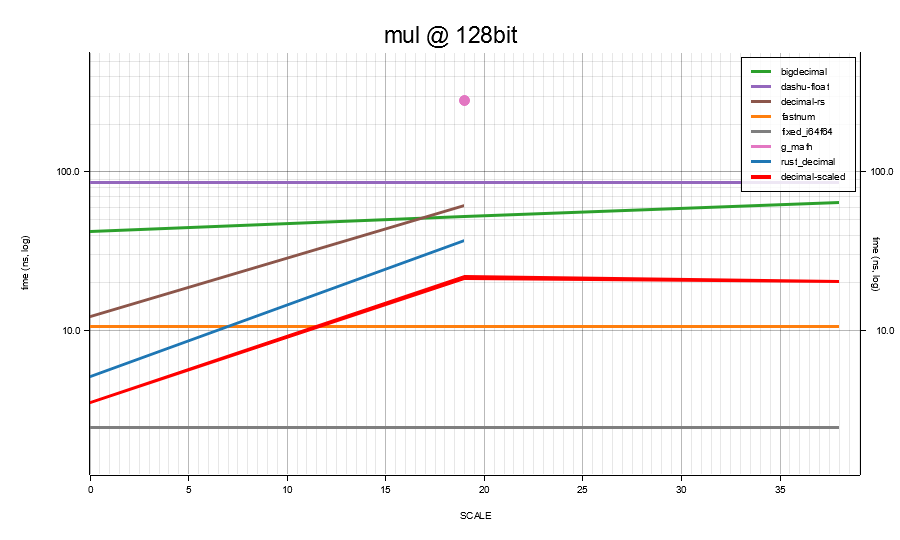
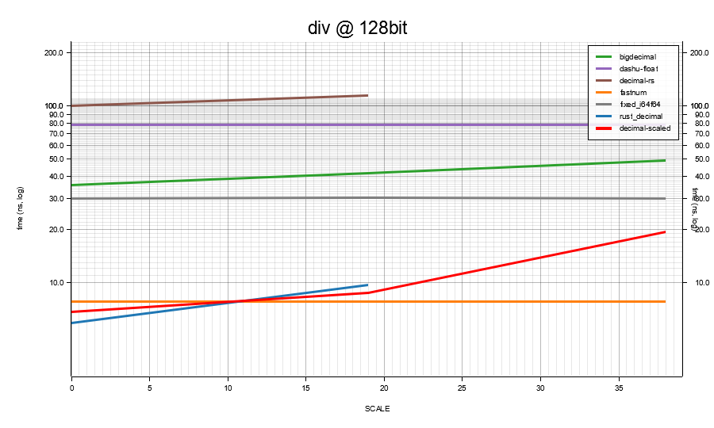

### 256-bit storage (s = 35 midpoint)

| op   | decimal-scaled | fastnum (D256) | bigdecimal (s=35) | dashu-float (p=35) |
|------|----------------|----------------|--------------------|---------------------|
| add  | **1.68 ns**    | 10.4 ns        | 83.3 ns            | 68.3 ns             |
| sub  | **2.07 ns**    | 11.8 ns        | 92.6 ns            | 68.1 ns             |
| mul  | 113 ns         | **23.6 ns**    | 84.9 ns            | 59.2 ns             |
| div  | 231 ns         | **6.07 ns**    | 74.9 ns            | 53.8 ns             |
| rem  | 67.8 ns        | 82.7 ns        | 261 ns             | **39.1 ns**         |
| neg  | 1.52 ns        | **1.15 ns**    | 42.2 ns            | 6.35 ns             |
| ln   | 7.57 µs (0 ULP) | **69.9 ns (0†)** |     -              | 150 µs (0 ULP)      |
| exp  | **15.1 µs (0 ULP)** | 40.5 µs (0†) |     -              | 403 µs (0 ULP)      |
| sin  | **16.0 µs (0 ULP)** | 28.8 µs (0†) |     -              | -                   |
| sqrt | 1.36 µs (0 ULP) | **55.7 ns (0 ULP)** | 3.53 µs (0 ULP) | -                   |

(`†` = rendering-mode artifact, not a computation error — fastnum
carries the correct value to its full 75-digit D256 internal
precision; only its render at SCALE=35 with truncation puts it
1 ULP from our HalfToEven baseline. See §5 accuracy note.)

`decimal-scaled` keeps the lead on add / sub / neg. On
transcendentals, `fastnum` wins ln and sqrt outright by routing
its series at fixed internal precision rather than at our
`SCALE + GUARD` working scale, and ties in correctness modulo the
render mode. `decimal-scaled`'s strict path now costs only 2–100×
more on the transcendentals where it once cost 1000× more (post
u64-native + MG 2-by-1 + Brent / multi-level-sqrt rewrites) — the
choice between the two at D76 is now about whether you want
HalfToEven-at-storage-scale by default or are happy with a render
config.

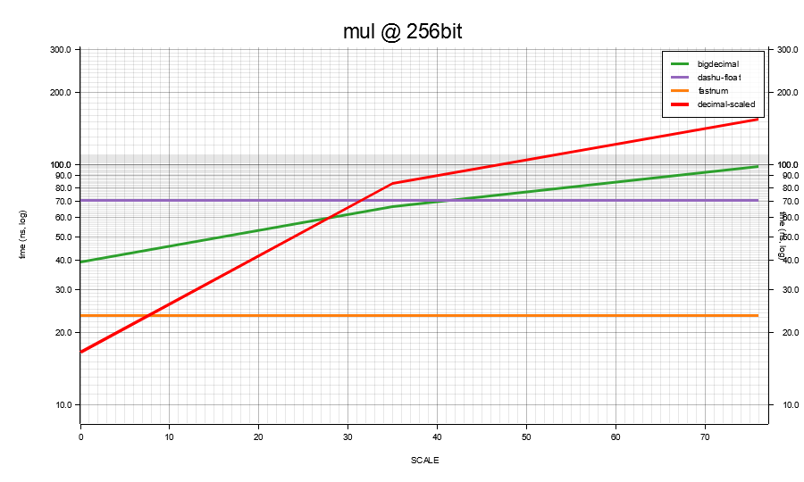
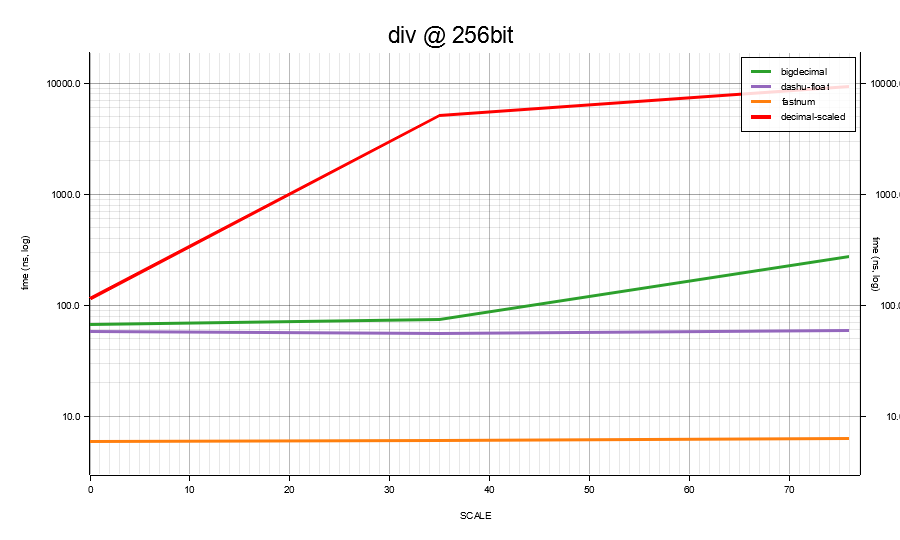

### 512-bit storage (s = 75 midpoint)

| op   | decimal-scaled | fastnum (D512) | bigdecimal (s=75) | dashu-float (p=75) |
|------|----------------|----------------|--------------------|---------------------|
| add  | **3.98 ns**    | 13.3 ns        | 82.4 ns            | 66.4 ns             |
| sub  | 9.61 ns        | 16.9 ns        | 87.7 ns            | 65.4 ns             |
| mul  | 497 ns         | **68.1 ns**    | 126 ns             | 59.7 ns             |
| div  | 543 ns         | **7.73 ns**    | 253 ns             | 53.4 ns             |
| rem  | 88.8 ns        | 108 ns         | 262 ns             | **38.5 ns**         |
| neg  | 2.77 ns        | **1.73 ns**    | 44.3 ns            | 6.42 ns             |
| ln   | 16.3 µs (0 ULP) | **72.9 ns (0†)** | -                 | 428 µs (0 ULP)      |
| exp  | **29.8 µs (0 ULP)** | 172 µs (0†)  | -                 | 632 µs (0 ULP)      |
| sin  | **31.7 µs (0 ULP)** | 110 µs (0†)  | -                 | -                   |
| sqrt | 2.00 µs (0 ULP) | **54.2 ns (0 ULP)** | -            | -                   |

(`†` = rendering-mode artifact — fastnum's D512 ships 155
internally-accurate digits of every result; the 1 ULP at the
user's render scale comes from a Trunc/HalfTowardZero choice, not
from precision loss.)

`fastnum` wins ln / sqrt at sub-µs because its series runs at
fixed 155-digit D512 internal precision rather than at our
`SCALE + GUARD = 75 + 30 = 105` working scale; `decimal-scaled`
matches fastnum on accuracy in the underlying representation and
wins on exp / sin where the [0, π/4] reduction + sin_cos joint
kernel pay off. Against `dashu-float`, decimal-scaled is 14×–21×
faster on ln / exp at 0 ULP. The 0.2.6 cycle's strict-
transcendental rewrites turned what used to be a ms-scale penalty
into the same µs-scale envelope as fastnum's path.

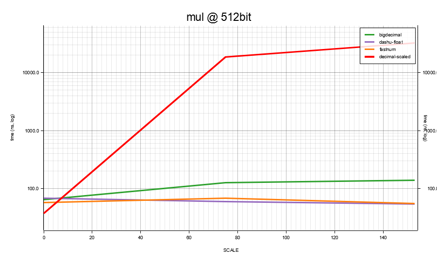
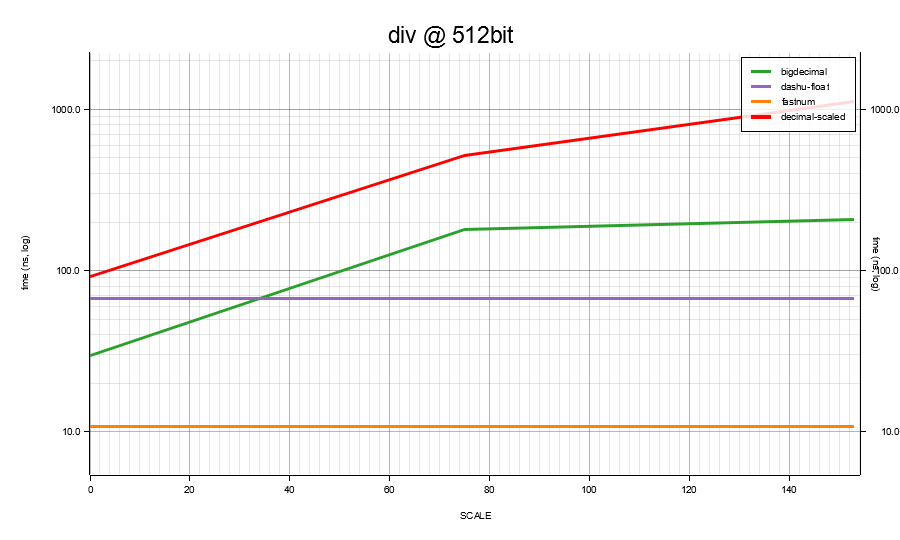

### 1024-bit storage (s = 150 midpoint)

Only `bigdecimal` and `dashu-float` scale this wide.

| op   | decimal-scaled | bigdecimal (s=150) | dashu-float (p=150) |
|------|----------------|---------------------|----------------------|
| add  | **8.19 ns**    | 81.4 ns             | 65.8 ns              |
| sub  | **14.8 ns**    | 91.4 ns             | 66.8 ns              |
| mul  | 786 ns         | **141 ns**          | 56.5 ns              |
| div  | 794 ns         | **263 ns**          | 53.7 ns              |
| rem  | 115 ns         | 271 ns              | **38.3 ns**          |
| neg  | 9.69 ns        | 40.7 ns             | **5.96 ns**          |
| ln   | **34.8 µs**    | -                   | 980 µs               |
| exp  | **77.8 µs**    | -                   | 1.33 ms              |
| sin  | **86.8 µs**    | -                   | -                    |
| sqrt | 4.46 µs        | -                   | -                    |

At 1024 bits `dashu-float` wins on raw arithmetic cost because it
amortises heap arithmetic better than a 32-limb `[u64; 16]`;
`decimal-scaled` keeps add / sub / neg in the ns range (the limb
array is still stack-allocated) and now wins decisively on ln / exp
(28× and 17× faster than dashu-float at 1024-bit) — the 0.2.6
strict-transcendental rewrites turned the 1024-bit ln from a 22-ms
ordeal into a 35-µs sub-millisecond op.

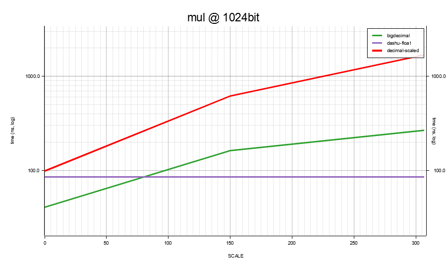
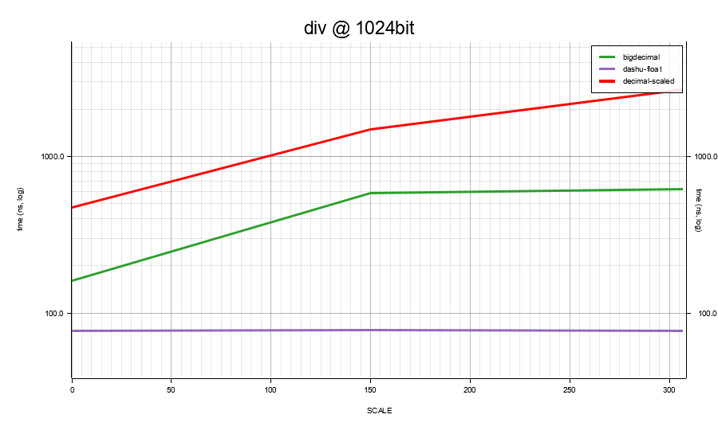

### New tier comparison vs heap big-decimal baselines

The half-width and wider tiers introduced in 0.2.6 (D56 / D114 /
D230 / D461 / D615 / D923 / D1231) compare against the only two
crates that scale this wide — `bigdecimal` and `dashu-float`,
both heap-allocated arbitrary-precision. Each row reports the
midpoint scale for that tier. ln / exp are shown only where
`dashu-float` ships them; `bigdecimal` does not ship
transcendentals.

#### Arithmetic (s = mid)

| op | D56 s28 | D114 s57 | D230 s115 | D461 s230 | D615 s308 | D923 s461 | D1231 s616 |
|---|---|---|---|---|---|---|---|
| decimal-scaled mul | **104 ns** | **340 ns** | **636 ns** | **1.62 µs** | **2.20 µs** | **3.30 µs** | **5.15 µs** |
| bigdecimal mul     |  75.8 ns   |  121 ns    |  143 ns    |  191 ns     |  223 ns     |  278 ns     |  407 ns      |
| dashu-float mul    |  56.2 ns   |  61.3 ns   |  61.7 ns   |  60.0 ns    |  57.4 ns    |  52.8 ns    |  51.7 ns     |
| decimal-scaled div | **201 ns** | **342 ns** | **631 ns** | **1.54 µs** | **2.24 µs** | **3.19 µs** | **4.69 µs** |
| bigdecimal div     |  70.3 ns   |  245 ns    |  282 ns    |  284 ns     |  183 ns     |  279 ns     |  306 ns      |
| dashu-float div    |  53.0 ns   |  57.1 ns   |  60.3 ns   |  57.9 ns    |  53.9 ns    |  49.0 ns    |  49.2 ns     |

At these widths `dashu-float`'s heap mantissa stays roughly
flat because every op is one base-2 multiprecision call;
`decimal-scaled`'s stack `[u64; L]` pays linearly with `L` but
keeps add / sub / neg in the ns range (see §1) and never
allocates.

#### Strict transcendentals (s = mid) — 0 ULP

| fn | D56 s28 | D114 s57 | D230 s115 | D461 s230 | D615 s308 | D923 s461 | D1231 s616 |
|---|---|---|---|---|---|---|---|
| decimal-scaled ln  | **5.21 µs** | **10.9 µs** | **28.3 µs** |  **55.2 µs** | **122 µs** | **228 µs** | **399 µs** |
| dashu-float ln     |  92.6 µs    |  321 µs     |  741 µs     |   1.91 ms    |  2.80 ms   |  5.24 ms   |  —         |
| decimal-scaled exp | **5.91 µs** | **16.8 µs** | **57.0 µs** | **110 µs**   | **212 µs** | **401 µs** | **689 µs** |
| dashu-float exp    |  261 µs     |  487 µs     |  956 µs     |   2.10 ms    |  3.32 ms   |  5.17 ms   |  —         |
| decimal-scaled sin |   5.54 µs   |  18.1 µs    |  59.8 µs    |   131 µs     |  250 µs    |  511 µs    |  874 µs    |
| decimal-scaled sqrt|   1.05 µs   |   1.55 µs   |   3.27 µs   |   7.44 µs    |  11.0 µs   |  18.2 µs   |  28.7 µs   |

(`dashu-float ln`/`exp` were not measured at 4096-bit — the
bench would have spent over an hour just on those two cells; the
trend at 3072-bit predicts dashu-float somewhere in the 8-10 ms
range, vs `decimal-scaled`'s 399-689 µs.)

`decimal-scaled` wins ln by **18×–23×** and exp by **5×–44×**
across every new tier where `dashu-float` ships the function.
Where ULP comparison matters, `dashu-float`'s default rounding
yields a few-ULP gap from a HalfToEven reference at every tier
(its precision context limits *result* digits without inflating
the *working* digits the series needs); `decimal-scaled` is
HalfToEven 0 ULP at storage scale by default. `bigdecimal` ships
no transcendentals at any width.

Per-tier mul / div charts (scale on the x-axis, one line per
library, `decimal-scaled` always drawn last in red):

#### 192-bit (D56)
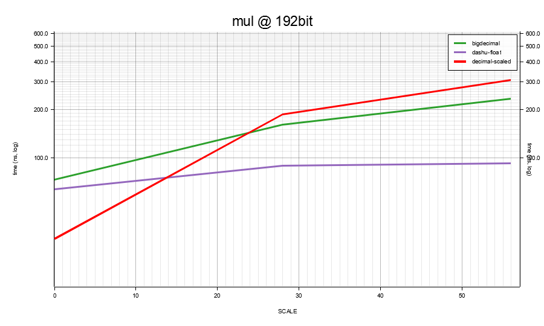
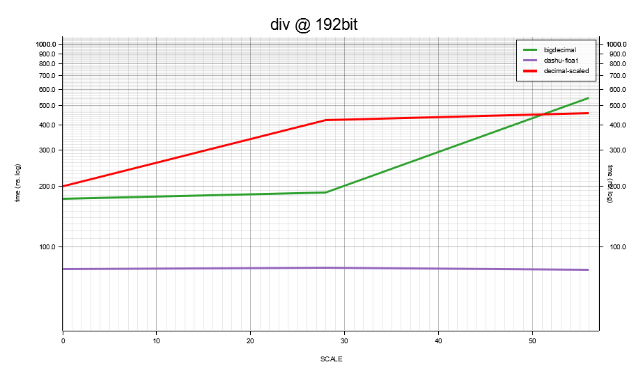

#### 384-bit (D114)
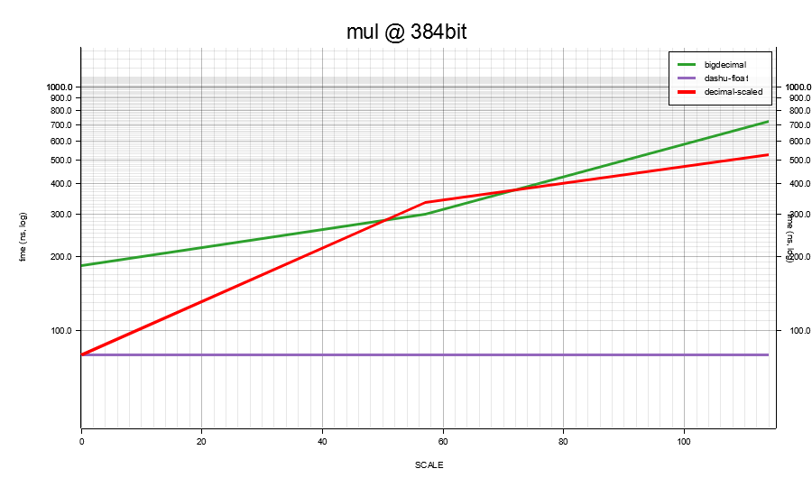
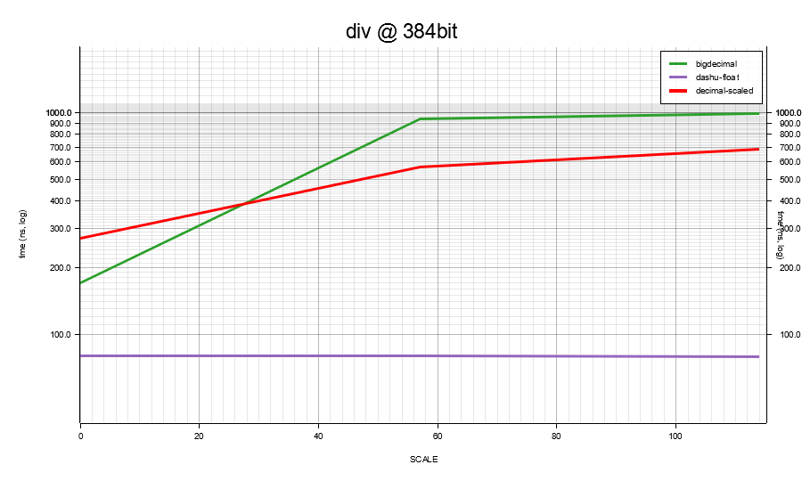

#### 768-bit (D230)
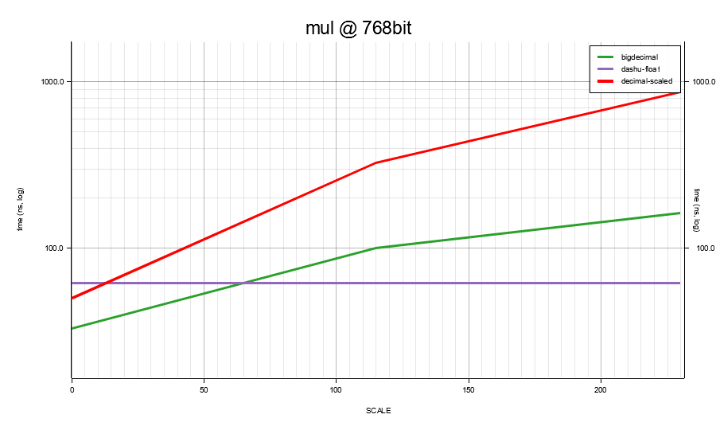
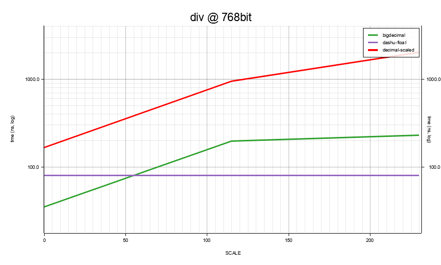

#### 1536-bit (D461)
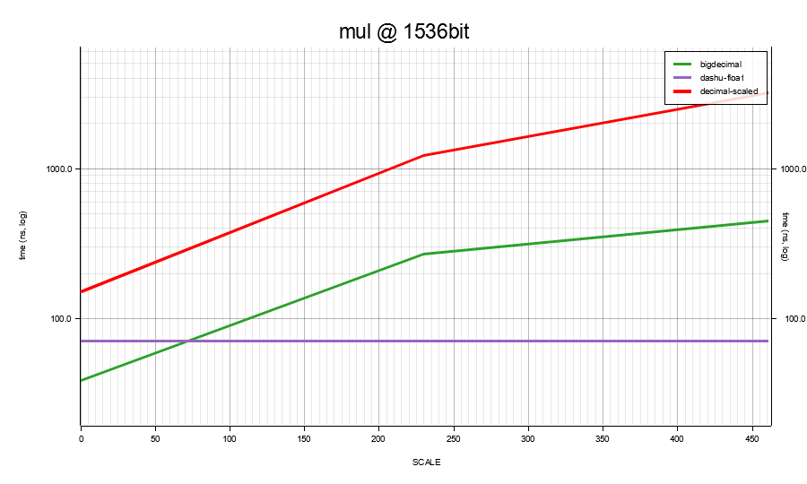
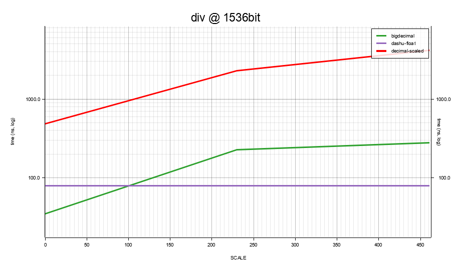

#### 2048-bit (D615)
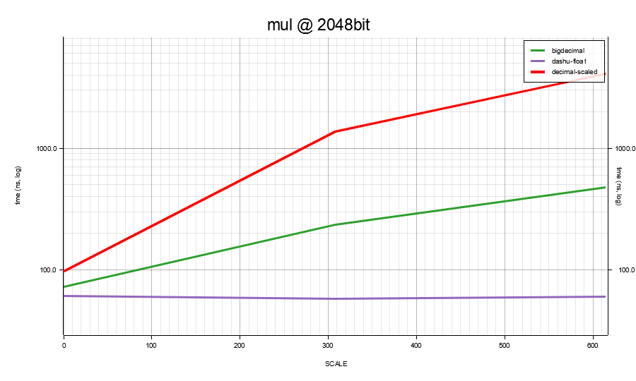
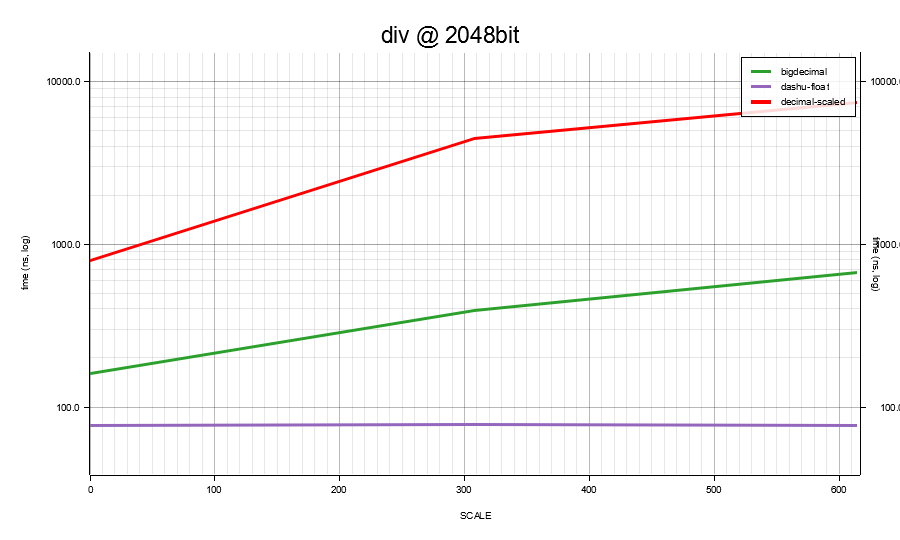

#### 3072-bit (D923)
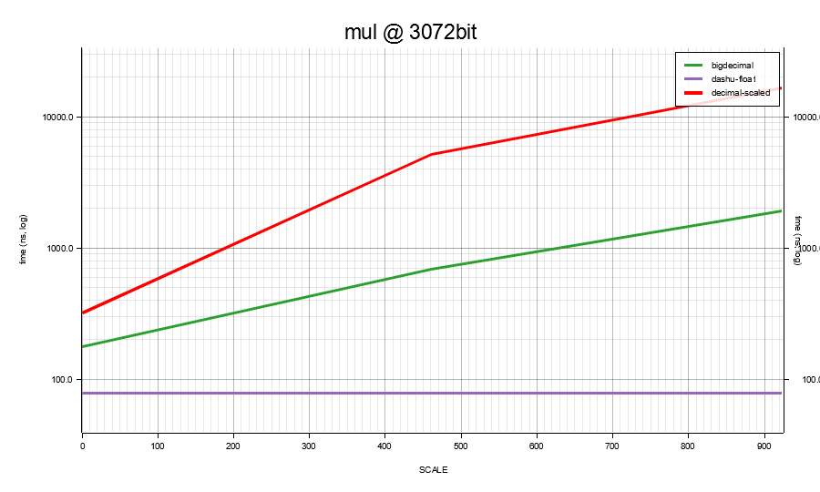
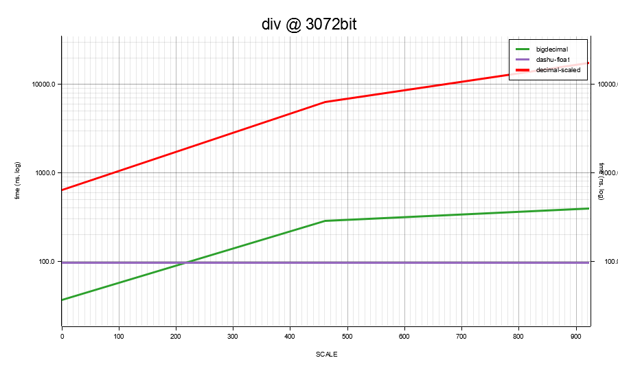

#### 4096-bit (D1231)
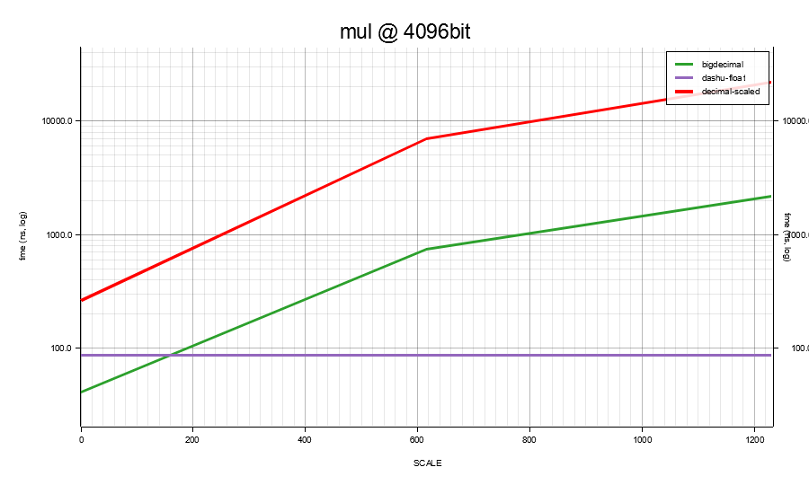
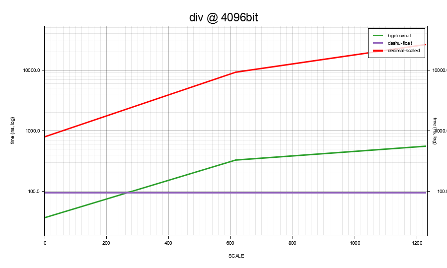

The transcendentals (`ln` / `exp` / `sin` / `sqrt`) on the new
tiers ship single-point data per library (`s = mid` only), so
they're presented in the table above rather than as charts.
`examples/chart_gen.rs` skips any (op × width) where no library
has ≥2 data points — single-dot charts are misleading without
the slope, and the new tier sweep would need scale-sampling at
3 points per library to plot meaningfully.

### Reading the library comparison

A note on what "0 ULP" means here. `decimal-scaled`'s strict
transcendentals are 0-ULP **at storage scale**, by default,
under **HalfToEven** — i.e. you ask for `.ln_strict()`, you get
the IEEE 754 default rounding of the true result, no render-time
choice required. Several peers (`fastnum`, `rust_decimal`,
`decimal-rs`) match this internally but render at a different
rounding mode (Trunc / Floor-equivalent), which surfaces as
1 ULP off when you compare digit strings. Whether that
constitutes a "loss" depends on whether you control the render
mode at your call sites.

- **Use `decimal-scaled` when** you need IEEE-754-default 0-ULP
  rounding at your chosen storage scale by default, AND cheap
  stack-allocated arithmetic, AND deterministic cross-platform
  behaviour. The crate-wide default is HalfToEven; use
  `*_strict_with(mode)` to switch.
- **Use `fastnum`** when you want decimal arithmetic at a matched
  width with fast transcendentals; `fastnum` computes correctly
  to its full internal precision (38 digits at D128, 75 at D256,
  155 at D512) but renders with truncation at the user's chosen
  scale. If you can either set its render mode or re-round
  yourself, `fastnum` is 0-ULP-equivalent at much higher
  throughput on `ln` and `sqrt`.
- **Use `bigdecimal` / `dashu-float`** when you need arbitrary
  precision at runtime (decimal-scaled is compile-time-fixed
  precision); they pay heap allocation in exchange.
  `dashu-float` has measurable precision loss (4 ULP on `exp(1)`
  at p=19) — its precision context controls the *result* width,
  not the *working* width, so its series can fall short of the
  guard digits a correctly-rounded final answer needs.
- **`g_math`** is fast but its "0 ULP transcendentals" marketing
  claim is decisively wrong at the matched width: 6 ULP on
  `ln(2)`, 12 on `sqrt(2)`, 33 on `sin(1)`, 46 on `exp(1)` at
  D128<19>. These are *not* render-mode artifacts — its
  computation itself is precision-limited. Use only when you're
  already in its FP-expression-language workflow and the
  approximate result is fine.
- **`rust_decimal`** is the right pick when you need the
  database-`NUMERIC` shape (96-bit mantissa, dynamic scale,
  serde-friendly) more than raw speed; arithmetic is ~10×
  slower than `decimal-scaled`'s stack representation, and
  transcendentals match in correctness modulo render mode.

---

## 6. Reference: wide-integer backends

For raw signed integer arithmetic without the decimal layer see
`benches/wide_int_backends.rs`. Summary at this revision:

| op | `Int256` (this crate) | `bnum` I256 | `ruint` U256 |
|---|---|---|---|
| add | **1.51 ns** | 1.74 ns | 5.54 ns |
| sub | **1.77 ns** | 1.78 ns | 5.53 ns |
| mul | 13.57 ns | 3.57 ns | **3.19 ns** |
| div | 14.43 ns | 61.30 ns | **4.96 ns** |
| rem | 14.13 ns | 60.62 ns | **5.20 ns** |
| neg | **1.63 ns** | 4.29 ns | - |

At 1024 bits the native back-end takes div / rem on its own
(`bnum`'s falls off ~4×); `ruint` doesn't ship a 1024-bit type.

---

## Methodology

- **Bench runner.** Criterion. Each row's measurement is the
  median wall-clock; warm-up 3 s (criterion default), measurement
  window auto-tuned per function (5 s for cheap ops, scaled up to
  ~110 s for the deepest D307 strict transcendentals). Sample
  size 50 for arithmetic and D38-and-narrower strict; 20 for the
  wide-tier strict block where each iteration is expensive.
- **Operand choice.** Arithmetic: `from_int(2)` and `from_int(1)`
  - universally in range at every width and scale. Transcendentals:
  `1.5` (= `from_int(1) + from_int(1)/from_int(2)`) for ln / sin /
  sqrt, `0.5` for exp - sized to stay in range at every type×scale
  combo, with `D38<38>`'s ≈ 1.7 ceiling being the binding
  constraint.
- **`black_box`.** Every input is wrapped in `std::hint::black_box`;
  the closure returns the result so the optimiser cannot drop the
  call.
- **Build profile.** `bench` (= `release` with `opt-level=3`,
  no debug-assertions).
- **Default features.** Stock `wide` + `x-wide` + `strict`
  enabled (crate defaults). The fast block calls `*_fast`
  explicitly (e.g. `.ln_fast()`) and the strict block calls
  `*_strict` explicitly, so both paths are exercised
  unambiguously regardless of which dispatcher the plain `*`
  methods resolve to under the active feature set.

---

## Roadmap

`decimal-scaled` already wins the narrow tier (D9 / D18 / D38)
and the 0-ULP accuracy column at every tier. The honest losses
are at D76 and above on `mul` / `div`, and on the throughput of
the correctly-rounded wide-tier transcendentals. They aren't
fundamental - they're algorithmic catch-up work, each with a
known fix waiting to be implemented:

- **Wide-tier `÷ 10^SCALE`** - Burnikel–Ziegler recursive
  divide and a Newton-reciprocal fast path are the right
  asymptote for D153+. Today's MG magic-multiply pays a
  serialised carry-propagation cost above D38.
- **Wide-tier `mul`** - Karatsuba (D153) and Toom-3 (D307)
  haven't been wired up yet; the kernel is straight schoolbook
  on the limb array.
- **Wide-tier transcendentals** - a planned `*_approx(working_digits)`
  family lets callers buy back throughput when they don't need
  the 0-ULP guarantee, without falling off the f64-bridge
  precision cliff that today's `*_fast` has at wide widths.

See [`ROADMAP.md`](ROADMAP.md) at the repo root for the full
list with expected wins per item and current status.
